# WIS LMS Platform Design

> Tài liệu thiết kế **single source of truth** cho WIS LMS — tích hợp Frappe ERP + SIS, tham chiếu **Canvas LMS**, hướng tới **LMS toàn diện hiện đại** (Phase 0–12).  
> Bao gồm: nghiệp vụ core, media HLS self-hosted, Live class, AI, SCORM/H5P, Mobile, Credentials, K-12 Wellspring.

---

## Mục lục

0. [Tổng quan nền tảng LMS](#0-tổng-quan-nền-tảng-lms)
1. [Module map Canvas → WIS](#1-module-map-canvas--wis)
2. [Kiến trúc & stack](#2-kiến-trúc--stack)
   - [2.4 Redis — hạ tầng dùng chung](#24-redis--hạ-tầng-dùng-chung)
3. [Data model tổng hợp](#3-data-model-tổng-hợp)
4. [Roles & permissions](#4-roles--permissions)
5. [Tích hợp SIS](#5-tích-hợp-sis)
6. [Grade sync → Report Card / Class Log](#6-grade-sync--report-card--class-log)
7. [Chi tiết từng module](#7-chi-tiết-từng-module)
   - [7.15 Proctoring & exam integrity](#715-proctoring--exam-integrity)
8. [Frontend IA](#8-frontend-ia)
9. [Media & video streaming (self-hosted)](#9-media--video-streaming-self-hosted)
10. [Roadmap triển khai (Phase 0–12)](#10-roadmap-triển-khai-phase-012)
11. [Phụ lục](#11-phụ-lục)
12. [Live Virtual Classroom](#12-live-virtual-classroom)
13. [AI Layer](#13-ai-layer)
14. [Content Standards — SCORM, xAPI, H5P](#14-content-standards--scorm-xapi-h5p)
15. [Mobile App](#15-mobile-app)
16. [Accessibility & i18n](#16-accessibility--i18n)
17. [Credentials, Catalog & ePortfolio](#17-credentials-catalog--eportfolio)
18. [K-12 Specific (Wellspring)](#18-k-12-specific-wellspring)
19. [Assessment nâng cao](#19-assessment-nâng-cao)
20. [Quyết định kiến trúc (Q1–Q8)](#20-quyết-định-kiến-trúc-q1q8)
21. [Hạng mục nền (cross-cutting)](#21-hạng-mục-nền-cross-cutting)
22. [Tài liệu liên quan](#22-tài-liệu-liên-quan)
23. [Compliance & Data Governance](#23-compliance--data-governance)
24. [Wellbeing & SEL](#24-wellbeing--sel)

---

## 0. Tổng quan nền tảng LMS

### 0.1. Vision

**WIS LMS** là lớp học số nằm trên hệ thống SIS hiện có: giáo viên xây khóa học theo module (như Canvas), học sinh học nội dung đa dạng (video HLS, bài đọc, bài tập, quiz), theo dõi tiến độ và điểm; một phần điểm LMS **đồng bộ ngược** vào bảng điểm chính thức SIS (Report Card / Class Log) sau quy trình duyệt.

### 0.2. Tham chiếu Canvas LMS

Canvas được dùng làm **benchmark chức năng**, không copy UI. Các khái niệm cốt lõi giữ nguyên:

- **Course** + **Section** (lớp học phần)
- **Modules** — chuỗi nội dung có thứ tự, prerequisite, publish theo ngày
- **Assignments / Quizzes** — nộp bài, chấm điểm, hạn nộp
- **Gradebook** — cột điểm, trọng số, mute, excused
- **Rubrics / Outcomes / Mastery paths**
- **Discussions, Announcements, Calendar, Groups**
- **Blueprint courses** — khóa mẫu nhân bản sang nhiều section
- **Observer** — phụ huynh xem read-only trên **LMS Portal** (`/observer`)

### 0.3. Quyết định kiến trúc đã chốt

| Hạng mục | Lựa chọn |
|----------|----------|
| Business logic | **Frappe ERP** (`apps/erp`) — DocType `LMS *` |
| **LMS Frontend** | App React riêng — **`https://lms.wellspring.edu.vn`** (Student Portal + Teacher + Observer) |
| **SIS Frontend** | **`frappe-sis-frontend`** — **thuần SIS**, không chứa route/UI LMS |
| Đăng nhập LMS | **Microsoft SSO** (Azure AD / Entra ID) → session Frappe |
| Điều hướng sau login | Theo **Frappe Role** → landing route (vd. học sinh `/student/dashboard`, GV `/teacher`) |
| Video | **Self-hosted** MinIO + FFmpeg + Nginx + `lms-media-service` (xem [§9](#9-media--video-streaming-self-hosted)) |
| Gradebook → SIS | **Sync có chọn lọc** + approval + audit log |
| Enrollment | **Sync** từ `SIS Class Student` |
| Namespace | `LMS *` — **không** nhầm `CRM Admission Course` |
| Discussion / Inbox | **LMS native** trong Frappe (không dùng social-service cho course content) |
| Phạm vi Canvas | **Roadmap đầy đủ** — triển khai theo phase |
| **Redis** | Máy chủ Redis riêng `172.16.20.120:6379` — dùng chung toàn hệ thống (xem [§2.4](#24-redis--hạ-tầng-dùng-chung)) |

### 0.4. Bối cảnh codebase

- Module LMS trong `apps/erp/erp/lms/` — Phase 0–4 đã triển khai (xem [§0.6](#06-trạng-thái-triển-khai-2026-05-20)).
- SIS đã có: lớp, học sinh, môn, TKB, điểm danh, Report Card — xem [§5](#5-tích-hợp-sis).
- Media hiện tại (Frappe File, social-service) **không** dùng cho LMS video.
- Redis: Frappe + `notification-service` + `social-service` đã dùng chung host `172.16.20.120` — LMS/media thêm workload trên cùng server, **tách DB index** (§2.4).

### 0.5. Nguyên tắc thiết kế

1. **Single source of truth** — Roster và học sinh master từ SIS; LMS giữ bản sao enrollment có `sync_version`.
2. **SIS Report Card authoritative** sau khi sync điểm — LMS không ghi đè PDF học bạ.
3. **Tách media plane** — byte video và **file LMS** không qua Frappe worker; lưu **100% MinIO** (bucket `lms-files`, `lms-raw`, …).
4. **Feature flag** theo campus / năm học / môn cho grade sync và module nâng cao.
5. **Audit mọi sync điểm** — `LMS Grade Sync Log`.
6. **Tách frontend** — mọi UX LMS nằm trên `lms.wellspring.edu.vn`; SIS và parent-portal chỉ deep-link (nếu cần), không nhúng module LMS.

### 0.6. Trạng thái triển khai (2026-05-20)

| Phase | Thiết kế | Code BE | DocTypes | API | Ghi chú |
|-------|----------|---------|----------|-----|---------|
| **0** Media | ✅ | ✅ | 1 | media, internal | HLS, transcode, playback JWT |
| **1** Course | ✅ | ✅ | 10 | course, module, content, sync | Enrollment sync cron 15 phút; **Module Builder UI full** trên lms-frontend |
| **2** Assignment | ✅ | ✅ | 6 | assignment, gradebook | Auto grade column |
| **3** Quiz | ✅ | ✅ | 5 | quiz, question | 6 loại câu hỏi, auto-grade |
| **3b** Proctoring | ✅ §7.15 | ❌ | 0 | 0 | Sau Phase 3 FE QuizTaker |
| **4** Collaboration | ✅ | ✅ | 7 | discussion, group, calendar, outcome, mastery | Merge SIS TKB, mastery unlock sau quiz |
| **4b** SEB | ✅ §7.15 | ❌ | 0 | 0 | |
| **5** Grade sync + Blueprint | ✅ §6 | ✅ | 5 | grade_sync, blueprint | Rule, log, finalize, push/approve, blueprint sync |
| **6** Analytics, Inbox, LTI | ✅ | ❌ | 0 | 0 | |
| **7–12** Mở rộng | ✅ §12–§19 | ❌ | 0 | 0 | Live, AI, SCORM, Mobile, … |

**MVP hiện tại:** Phase 0–3 — đủ dạy-học cơ bản (video, module, bài tập, quiz, gradebook).  
**Khuyến nghị:** Hoàn Phase 4 → 5 → 6 trước Phase 7+, trừ nhu cầu khẩn Live class.

### 0.7. Tầm nhìn LMS toàn diện — 11 nhóm bổ sung

So với Canvas/Moodle/Brightspace 2026, WIS bổ sung 11 nhóm (chi tiết §12–§19, §23–§24):

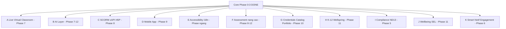

| Nhóm | Mục tiêu | Phase |
|------|---------|-------|
| **A** Live class | Teams/Zoom/Jitsi, recording, attendance | 7 |
| **B** AI | Tutor RAG, auto-caption, grade suggest, plagiarism | 7–12 |
| **C** Chuẩn nội dung | SCORM, xAPI LRS, H5P, Caliper | 8 |
| **D** Mobile | RN student/teacher/parent, offline | 9 |
| **E** A11y + i18n | WCAG AA, VN/EN, captions | 1→11 |
| **F** Assessment+ | 15+ question types, peer review, CAT | 8–12 |
| **G** Credentials | Certificate, Badge, Catalog, ePortfolio | 10 |
| **H** K-12 | Mastery scale, reading log, pacing, gamification | 11 |
| **I** Compliance | ND13 consent, retention, export, audit log | 5 — [§23](#23-compliance--data-governance) |
| **J** Wellbeing | Pulse, safeguarding, counselor — SEL K-12 | 11 — [§24](#24-wellbeing--sel) |
| **K** Smart notif | Digest, preferences, engagement score | 6 — [§7.9](#79-announcements), [§7.12](#712-analytics) |

---

## 1. Module map Canvas → WIS

```mermaid
flowchart TB
  subgraph canvas [Canvas LMS reference]
    Account[Account Hierarchy]
    Course[Course and Sections]
    Modules[Modules and Items]
    Assign[Assignments]
    Quiz[Quizzes and Banks]
    Grade[Gradebook and SpeedGrader]
    Rubric[Rubrics]
    Outcome[Outcomes Mastery]
    Discuss[Discussions]
    Ann[Announcements]
    Pages[Pages and Syllabus]
    Files[Files]
    Cal[Calendar]
    Inbox[Inbox]
    Groups[Groups]
    Analytics[Analytics]
    Blueprint[Blueprint Courses]
    LTI[LTI Tools]
    Observer[Observer Parent]
  end

  subgraph wis [WIS LMS on Frappe]
    LMSAccount[LMS Program Term Campus]
    LMSCourse[LMS Course Section]
    LMSMod[LMS Module Item]
    LMSAssign[LMS Assignment Submission]
    LMSQuiz[LMS Quiz Question Bank]
    LMSGrade[LMS Gradebook Entry]
    LMSSync[LMS Grade Sync Rule]
    LMSDiscuss[LMS Discussion]
    LMSSIS[SIS Class Student Report Card]
  end

  Course --> LMSCourse
  Modules --> LMSMod
  Assign --> LMSAssign
  Quiz --> LMSQuiz
  Grade --> LMSGrade
  Grade --> LMSSync
  LMSSync --> LMSSIS
  Observer --> LMSCourse
```

### 1.1. Bảng map chi tiết

| Canvas | WIS LMS (Frappe `LMS *`) | Tích hợp SIS |
|--------|--------------------------|--------------|
| Account / Sub-account | `LMS Program` + `SIS Campus`, `SIS School Year` | Phân quyền campus |
| Course | `LMS Course` | Link `SIS Subject`, `SIS Actual Subject` |
| Section | `LMS Course Section` | 1:1 hoặc N:1 `SIS Class` |
| People / Roster | `LMS Enrollment` | Sync `SIS Class Student` |
| Modules | `LMS Module` | sequence, prerequisite, unlock |
| Module items | `LMS Module Item` | polymorphic content ref |
| Pages | `LMS Page` | Rich text Markdown/HTML |
| Syllabus | `LMS Page` (`page_type=syllabus`) | |
| Files | `LMS File` | Non-video; video → `LMS Video Asset` |
| Assignments | `LMS Assignment`, `LMS Submission` | due, late, group |
| Quizzes | `LMS Quiz`, `LMS Question`, `LMS Question Bank` | timed, attempts |
| Gradebook | `LMS Grade Column`, `LMS Grade Entry` | weighted groups |
| SpeedGrader | LMS Portal `/teacher` | rubric, annotation |
| Rubrics | `LMS Rubric`, `LMS Rubric Criterion` | |
| Outcomes | `LMS Outcome` | align `SIS Sub Curriculum` |
| Mastery Paths | `LMS Mastery Rule` | conditional release |
| Discussions | `LMS Discussion`, `LMS Discussion Entry` | graded → grade column |
| Announcements | `LMS Announcement` | → notification-service |
| Calendar | `LMS Calendar Event` | merge `SIS Student Timetable` |
| Inbox | `LMS Conversation`, `LMS Message` | Phase 6 |
| Groups | `LMS Group`, `LMS Group Membership` | group submit |
| Blueprint | `LMS Blueprint Course`, `LMS Blueprint Sync` | template |
| Publish workflow | `course_state`: Draft / Published / Concluded | |
| Analytics | `LMS Activity Log` | aggregates |
| Observer (Parent) | `LMS Enrollment.role=Observer` | LMS Portal `/observer` |
| LTI 1.3 | `LMS External Tool` | Phase 6 |
| Proctoring / exam integrity | `LMS Proctoring *`, SEB, LTI tool | Phase 3b–6b — [§7.15](#715-proctoring--exam-integrity) |
| Live class / Conferences | `LMS Live Session`, Teams/Zoom/Jitsi | Phase 7 — [§12](#12-live-virtual-classroom) |
| AI assist / tutor | `LMS AI *`, `lms-ai-service` | Phase 7–12 — [§13](#13-ai-layer) |
| SCORM / H5P / xAPI | `LMS SCORM Package`, `LMS H5P Content`, LRS | Phase 8 — [§14](#14-content-standards--scorm-xapi-h5p) |
| Mobile | `LMS Device Registration`, RN apps | Phase 9 — [§15](#15-mobile-app) |
| Captions / a11y | `LMS Caption Track`, i18n | Phase 7+ — [§16](#16-accessibility--i18n) |
| Certificates / Badges | `LMS Certificate *`, `LMS Badge *` | Phase 10 — [§17](#17-credentials-catalog--eportfolio) |
| Catalog / self-enroll | `LMS Catalog Entry` | Phase 10 |
| ePortfolio | `LMS Portfolio` | Phase 10 |
| K-12 reading log / pacing | `LMS Reading Log`, `LMS Pacing Guide` | Phase 11 — [§18](#18-k-12-specific-wellspring) |
| Compliance / ND13 | `LMS Data Consent`, `LMS Audit Log`, export request | Phase 5 — [§23](#23-compliance--data-governance) |
| Wellbeing / SEL | `LMS Wellbeing Pulse`, `LMS Safeguarding Report` | Phase 11 — [§24](#24-wellbeing--sel) |
| Smart notifications | `LMS Notification Preference`, `LMS Notification Digest` | Phase 6 — [§7.9](#79-announcements) |
| Engagement analytics | `LMS Engagement Score` | Phase 6 — [§7.12](#712-analytics) |
| Admin | Frappe Desk + SIS routes | |

**Tránh nhầm:** [`CRM Admission Course`](apps/erp/erp/crm/doctype/crm_admission_course/) ≠ `LMS Course`.

---

## 2. Kiến trúc & stack

### 2.1. Sơ đồ ứng dụng

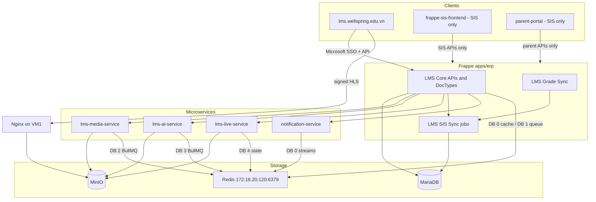

### 2.2. Phân tách trách nhiệm

| Layer | Công nghệ | Trách nhiệm |
|-------|-----------|------------|
| **Frappe `LMS *`** | Python / MariaDB | Toàn bộ nghiệp vụ Canvas-like trừ byte video |
| **lms-media-service** | Node / Express | Upload, transcode HLS, validate playback — Redis DB `/2` |
| **lms-ai-service** | Python / FastAPI | Transcribe, RAG, gen questions, grade suggest, plagiarism — Redis DB `/3`, Qdrant |
| **lms-live-service** | Node / Express (optional) | Jitsi/BBB orchestration, recording pipeline — Redis DB `/4` |
| **LMS SIS Sync** | Frappe scheduled job | Roster, section mapping |
| **LMS Grade Sync** | Frappe + approval | Push điểm → Report Card / Class Log |
| **notification-service** | Node / **Redis Stream** trên `172.16.20.120` | Announcement, due, grade posted |
| **Redis** | Server riêng, multi-DB | Cache, Frappe queue, Socket.IO, streams, LMS transcode queue |
| **MinIO + Nginx** | Self-hosted VM | Object storage + HLS delivery |
| **LMS Portal** | React (repo riêng) | Student / Teacher / Observer — `lms.wellspring.edu.vn` |
| **SIS Frontend** | React | Hành chính, TKB, điểm danh, Report Card — **không LMS** |
| **parent-portal** | React | Phụ huynh SIS — **không LMS** (link sang LMS Observer nếu cần) |

### 2.3. Vị trí code dự kiến

```
frappe-backend/
  apps/erp/erp/
    lms/doctype/...
    lms/sync/                         # enrollment, grade sync jobs
    api/lms/                          # API cho LMS Portal (tách khỏi erp_sis)
      student.py
      teacher.py
      observer.py
      common.py                       # auth, me, roles
  lms-media-service/                  # VM2 — :5020, Redis DB /2
  lms-ai-service/                     # VM AI — :5030, Redis DB /3 (Phase 7)
  lms-live-service/                   # VM Live — :5040, Redis DB /4 (optional)
  notification-service/
  LMS-Design.md                       # ★ Tài liệu thiết kế (file này)
  lms-api.md                          # API contract
  lms.md                              # Brochure người dùng (GV, BGH)
  LMS-DECISIONS.md                    # Q1–Q8 (tóm tắt, trùng §20)
  LMS-PHASE-REVIEW.md                 # Review Phase 4–6

lms-portal/                           # repo frontend — lms.wellspring.edu.vn
lms-mobile/                           # React Native monorepo (Phase 9)
  src/
    apps/student/                     # Student Portal
    apps/teacher/
    apps/observer/
    apps/admin/
    auth/microsoft/                   # MSAL / OAuth callback
```

**Lưu ý:** Không thêm route `/teaching/lms` hay `/learning/lms` trong `frappe-sis-frontend`.

### 2.4. Redis — hạ tầng dùng chung

Hệ thống dùng **một máy chủ Redis riêng** (private network). Cấu hình Frappe tham chiếu [`sites/common_site_config.json`](sites/common_site_config.json):

```json
{
  "redis_cache": "redis://:***@172.16.20.120:6379/0",
  "redis_queue": "redis://:***@172.16.20.120:6379/1",
  "redis_socketio": "redis://:***@172.16.20.120:6379/0"
}
```

> Mật khẩu thực tế lưu trong config server — **không** commit vào tài liệu hay repo công khai.

#### Phân bổ database index

| DB | Consumer | Mục đích |
|----|----------|----------|
| **/0** | Frappe `redis_cache`, `redis_socketio`; `social-service`; `notification-service` (pub/sub, streams) | Cache, Socket.IO adapter, Redis Streams notification |
| **/1** | Frappe `redis_queue` | Background jobs RQ (enrollment sync, grade sync, email, …) |
| **/2** | **`lms-media-service`** | BullMQ queue transcode video — prefix `lms:transcode:*` |
| **/3** | **`lms-ai-service`** | BullMQ AI jobs — transcription, embedding, grading |
| **/4** | **`lms-live-service`** (optional) | Live session state, recording pipeline |

**Nguyên tắc:**

- **Không** dùng chung DB `/1` với Frappe RQ cho BullMQ media — tránh xung đột key và khó debug.
- **Không** cần VM Redis mới cho LMS — chỉ thêm index `/2` (hoặc index khác chưa dùng) trên server hiện có.
- Các service Node (`social-service`, `notification-service`) kết nối qua `REDIS_HOST=172.16.20.120`, `REDIS_PORT=6379` — mặc định logical DB **0**.

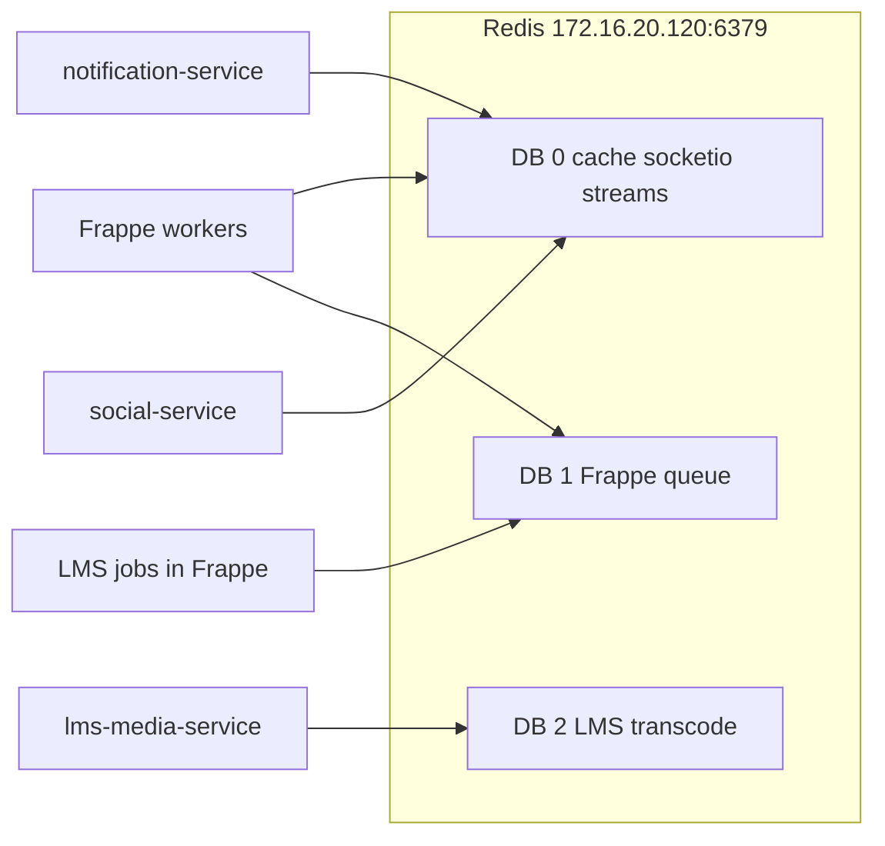

#### LMS sử dụng Redis như thế nào

| Use case | Cơ chế | Redis |
|----------|--------|-------|
| Transcode video | BullMQ job `transcode.job` | **DB /2** — `lms-media-service` |
| AI jobs (transcribe, embed, grade) | BullMQ | **DB /3** — `lms-ai-service` |
| Live session state / recording queue | BullMQ hoặc state key | **DB /4** — `lms-live-service` |
| Enrollment sync, grade sync | Frappe `enqueue` / scheduled job | **DB /1** — `redis_queue` Frappe |
| Push thông báo LMS | Publish envelope lên Redis Stream | **DB /0** — cùng bus `notification-service` |
| Cache API nóng (tùy chọn) | Frappe cache key `lms:*` | **DB /0** — `redis_cache` |

**Notification stream (LMS → notification-service):**

- Frappe hoặc `lms-media-service` publish event theo pattern hiện có (`EVENT_BUS_STREAM_PREFIX=events`, service name `erp` hoặc đăng ký `lms-media-service` trong `STREAM_DELIVERY_WHITELIST_SERVICES`).
- Ví dụ event: `lms.announcement.posted`, `lms.assignment.due_soon`, `lms.grade.posted`, `lms.transcode.completed`.
- Consumer: [`notification-service/src/bus/streamConsumer.js`](notification-service/src/bus/streamConsumer.js) — không cần duplicate pipeline.

#### Biến môi trường gợi ý

**Frappe** — đã cấu hình trong `common_site_config.json` (không đổi).

**lms-media-service:**

```env
REDIS_HOST=172.16.20.120
REDIS_PORT=6379
REDIS_PASSWORD=***
REDIS_DB=2
REDIS_URL=redis://:***@172.16.20.120:6379/2
```

**notification-service / social-service** (đã có):

```env
REDIS_HOST=172.16.20.120
REDIS_PORT=6379
REDIS_PASSWORD=***
```

#### Vận hành & giám sát

| Metric | Ghi chú |
|--------|---------|
| Memory | Stream + cache DB/0 — alert > 80% `maxmemory` |
| Queue depth DB/2 | BullMQ `waiting` + `active` transcode jobs |
| Queue depth DB/3 | AI jobs backlog (transcribe, embedding) |
| Queue depth DB/4 | Live recording pipeline |
| Frappe queue DB/1 | RQ failed job count cho LMS sync |
| Latency | Private network tới `172.16.20.120` — media worker và Frappe cùng VPC |

**HA:** hiện single Redis node — nếu cần HA sau này (Redis Sentinel/Cluster), LMS và media queue migrate theo cùng cluster; thiết kế key prefix giữ nguyên.

---

## 3. Data model tổng hợp

### 3.1. ER diagram (core)

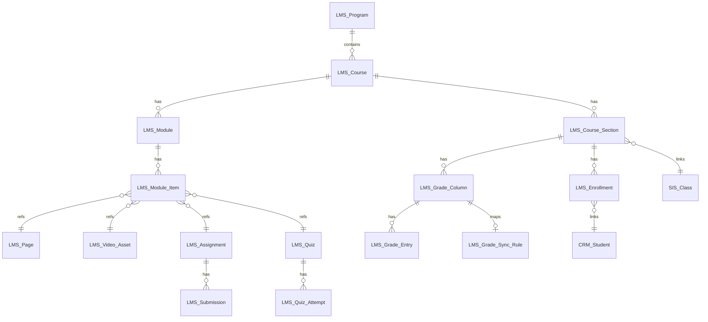

### 3.2. DocTypes — Account & Course

| DocType | Field quan trọng |
|---------|------------------|
| `LMS Program` | `campus_id`, `school_year_id`, `title`, `is_active` |
| `LMS Course` | `program`, `title`, `code`, `sis_subject_id`, `sis_actual_subject_id`, `description`, `course_state`, `is_blueprint`, `blueprint_course_id` |
| `LMS Course Section` | `course`, `sis_class_id`, `section_name`, `start_date`, `end_date`, `enrollment_limit` |
| `LMS Enrollment` | `section`, `student_id` (CRM Student), `role`, `status`, `sis_sync_version`, `last_synced_at` |

**`course_state`:** `draft` | `published` | `concluded`

**`LMS Enrollment.role`:** `student` | `teacher` | `ta` | `designer` | `observer`

### 3.3. DocTypes — Content

| DocType | Field quan trọng |
|---------|------------------|
| `LMS Module` | `course`, `title`, `position`, `unlock_at`, `require_sequential_progress` |
| `LMS Module Item` | `module`, `title`, `position`, `item_type`, `content_ref` (Dynamic Link), `published`, `mastery_required_score` |
| `LMS Page` | `html_content`, `page_type` (page/syllabus), `course` |
| `LMS File` | `file_url`, `folder`, `course`, `section` (optional) |
| `LMS Video Asset` | `asset_id`, `raw_object_key`, `hls_prefix`, `duration_sec`, `status` — xem [§9](#9-media--video-streaming-self-hosted) |
| `LMS Module Prerequisite` | `module`, `required_module`, `minimum_score` |

**`item_type` (Phase 1):** `page` | `video` | `assignment` | `quiz` | `file` | `external_url` | `discussion` | `subheader` | `text`

**`item_type` mở rộng (Phase 7+):** + `scorm` | `h5p` | `lti_tool` | `live_session` | `survey` | `peer_review`

### 3.4. DocTypes — Assessment

| DocType | Field quan trọng |
|---------|------------------|
| `LMS Assignment` | `course`, `title`, `points_possible`, `due_at`, `lock_at`, `submission_types`, `allowed_attempts`, `group_assignment` |
| `LMS Submission` | `assignment`, `student`, `submitted_at`, `body`, `attachments`, `score`, `graded_at`, `grader`, `workflow_state` |
| `LMS Quiz` | `course`, `title`, `time_limit`, `allowed_attempts`, `shuffle_questions`, `show_correct_answers` |
| `LMS Question Bank` | `course`, `title`, `campus` (shared bank optional) |
| `LMS Question` | `bank`, `question_type`, `prompt_html`, `answers_json`, `points` |
| `LMS Quiz Question` | `quiz`, `question`, `position`, `points_override` |
| `LMS Quiz Attempt` | `quiz`, `student`, `started_at`, `finished_at`, `score`, `responses_json` |

### 3.5. DocTypes — Grading

| DocType | Field quan trọng |
|---------|------------------|
| `LMS Grade Column` | `section`, `title`, `position`, `points_possible`, `column_type`, `assignment_id` / `quiz_id`, `sync_to_sis`, `muted` |
| `LMS Grade Entry` | `column`, `student`, `score`, `excused`, `late_policy_applied`, `entered_by` |
| `LMS Grade Group` | `section`, `title`, `weight`, `drop_lowest` |
| `LMS Rubric` | `course`, `title`, `criteria` (child) |
| `LMS Rubric Assessment` | `submission` / `attempt`, `rubric`, `scores_json` |

### 3.6. DocTypes — Collaboration & misc

| DocType | Field quan trọng |
|---------|------------------|
| `LMS Discussion` | `course`, `section`, `title`, `graded`, `points_possible`, `due_at` |
| `LMS Discussion Entry` | `discussion`, `author`, `parent_entry`, `body`, `pinned` |
| `LMS Announcement` | `course`, `section`, `title`, `message`, `posted_at` |
| `LMS Calendar Event` | `course`, `section`, `title`, `start`, `end`, `event_type` |
| `LMS Group` | `section`, `name`, `max_members` |
| `LMS Group Membership` | `group`, `student` |
| `LMS Outcome` | `course`, `title`, `mastery_points`, `sis_sub_curriculum_id` |
| `LMS Mastery Rule` | `module`, `outcome`, `mastery_threshold`, `next_module` |
| `LMS Blueprint Course` | `template_course`, `sync_settings_json` |
| `LMS Blueprint Sync Log` | `blueprint`, `child_section`, `synced_at`, `diff_json` |
| `LMS Activity Log` | `user`, `course`, `verb`, `object_type`, `object_id`, `timestamp` |
| `LMS External Tool` | `course`, `launch_url`, `client_id`, `deployment_id` (LTI) |
| `LMS Conversation` | `course`, `subject`, `participants` (child) |
| `LMS Message` | `conversation`, `sender`, `body`, `sent_at` |

### 3.7. DocTypes — Grade sync & progress

| DocType | Field quan trọng |
|---------|------------------|
| `LMS Grade Sync Rule` | `grade_column`, `target_type`, `sis_report_card_component`, `class_log_score_type`, `requires_approval`, `campus`, `active` |
| `LMS Grade Sync Log` | `rule`, `student`, `score_sent`, `status`, `sis_document`, `error`, `approved_by` |
| `LMS Content Progress` | `student`, `module_item`, `completed`, `last_position` (video sec) |
| `LMS Course Progress` | `student`, `section`, `percent_complete`, `last_activity_at` |

### 3.8. DocTypes — Proctoring (quiz & assignment thi)

| DocType | Field quan trọng |
|---------|------------------|
| `LMS Proctoring Profile` | `title`, `level` (native/seb/lti/hybrid), `settings_json`, campus default |
| `LMS Quiz Proctoring` | `quiz`, `profile`, `require_seb`, `browser_exam_keys` (text), `access_code`, `ip_allowlist` |
| `LMS Assignment Proctoring` | `assignment`, `profile` — khi bài tập ở chế độ timed exam |
| `LMS Proctoring Session` | `attempt` (quiz/assignment), `student`, `started_at`, `ended_at`, `client_type` (browser/seb/lti) |
| `LMS Proctoring Event` | `session`, `event_type`, `severity`, `payload_json`, `timestamp` |
| `LMS Proctoring Flag` | `session`, `event`, `status` (open/reviewed/dismissed), `reviewer`, `notes` |
| `LMS Proctoring Recording` | `session`, `kind` (webcam/screen), `storage_key` (MinIO), `duration_sec`, retention |

### 3.9. DocTypes — Phase 7–12 (mở rộng toàn diện)

| Phase | DocTypes mới |
|-------|----------------|
| **5** | `LMS Data Consent`, `LMS Data Retention Policy`, `LMS Data Export Request`, `LMS Audit Log` — [§23](#23-compliance--data-governance) |
| **6** | `LMS Notification Preference`, `LMS Notification Digest`, `LMS Engagement Score` — [§7.9](#79-announcements), [§7.12](#712-analytics) |
| **7** | `LMS Live Session`, `LMS Live Attendance`, `LMS Live Provider Config`, `LMS Caption Track`, `LMS Transcript`, `LMS AI Job`, `LMS AI Tutor Conversation`, `LMS AI Tutor Message` |
| **8** | `LMS SCORM Package`, `LMS SCORM Tracking`, `LMS xAPI Statement`, `LMS H5P Content`, `LMS Peer Review Assignment`, `LMS Peer Review Submission`, `LMS Late Policy`, `LMS Item Analysis` |
| **9** | `LMS Device Registration`, `LMS Offline Sync Log` |
| **10** | `LMS Certificate Template`, `LMS Certificate Issuance`, `LMS Badge Class`, `LMS Badge Assertion`, `LMS Catalog Entry`, `LMS Enrollment Request`, `LMS Portfolio`, `LMS Portfolio Item`, `LMS Reflection Journal` |
| **11** | `LMS Mastery Scale`, `LMS Reading Log`, `LMS Pacing Guide`, `LMS Substitute Access Grant`, `LMS Conference Booking`, `LMS Achievement Definition`, `LMS Student Achievement`, `LMS Homework Hint Request`, `LMS Wellbeing Pulse`, `LMS Wellbeing Resource`, `LMS Safeguarding Report`, `LMS Counselor Session` — [§24](#24-wellbeing--sel) |
| **12** | `LMS AI Feedback Suggestion`, `LMS Plagiarism Report`, `LMS Content Translation` |

### 3.10. Mở rộng field DocTypes hiện có (Phase 7+)

| DocType | Fields bổ sung | Mục đích |
|---------|----------------|----------|
| `LMS Course` | `language`, `time_zone`, `pace`, `catalog_visible`, `self_enroll`, `certificate_template`, `default_mastery_scale`, `enable_gamification`, `engagement_threshold_at_risk` (default 30) | Catalog, cert, gamification, at-risk |
| `LMS Announcement` | `priority` (low\|normal\|high), `digest_eligible` (default 1) | Smart digest — high bypass digest |
| `LMS Module Item` | `item_type` + `scorm`, `h5p`, `lti_tool`, `live_session`, `survey`, `peer_review` | Nội dung đa dạng |
| `LMS Quiz` | `survey_mode`, `late_policy_id`, `randomize_pool_count`, `accommodations_json` | Survey, late, accessibility |
| `LMS Assignment` | `late_policy_id`, `peer_review_required`, `originality_check_required`, `accommodations_json` | Peer review, plagiarism |
| `LMS Video Asset` | `default_captions_track`, `transcript_id`, `chapters_json` | Captions, chapters |
| `LMS Enrollment` | `accommodations_json`, `parent_observer_note` | Extra time, PH note |
| `LMS Activity Log` | `caliper_event_type`, `caliper_payload_json` | Analytics chuẩn IMS |

**`question_type` mở rộng (Phase 8–12):** `hotspot`, `drag_drop`, `fill_blank_multi`, `ordering`, `cloze`, `file_upload_response`, `audio_response`, `video_response`, `formula`, `code_answer`.

### 3.11. API namespace theo phase (tóm tắt)

| Module | Prefix | Phase |
|--------|--------|-------|
| Core | `erp.api.lms.course`, `module`, `content`, `assignment`, `quiz` | 0–3 ✅ |
| Collaboration | `discussion`, `group`, `calendar`, `outcome`, `mastery` | 4 |
| Proctoring | `proctoring` | 3b, 4b |
| Grade sync | `grade_sync`, `blueprint` | 5 |
| Compliance | `compliance` | 5 |
| Analytics / LTI | `analytics`, `inbox`, `lti` | 6 |
| Notifications / Engagement | `notifications`, `engagement` | 6 |
| Live / AI | `live`, `captions`, `ai` | 7 |
| Standards | `scorm`, `xapi`, `h5p` | 8 |
| Mobile | `mobile` | 9 |
| Credentials | `credentials`, `catalog`, `portfolio` | 10 |
| K-12 | `k12.reading_log`, `k12.pacing`, `k12.conference` | 11 |
| Wellbeing | `wellbeing` | 11 |

Chi tiết endpoint: [`lms-api.md`](lms-api.md) §9.

---

## 4. Roles & permissions

### 4.1. Role matrix (theo section)

| Quyền | Admin | Teacher | TA | Designer | Student | Observer | Counselor | Compliance Officer |
|-------|:-----:|:-------:|:--:|:--------:|:-------:|:--------:|:---------:|:------------------:|
| Quản lý blueprint / sync rules | ✓ | | | | | |
| Sửa course settings | ✓ | ✓ | | | | |
| Module / content | ✓ | ✓ | ✓ | ✓ | | read |
| Assignment / quiz CRUD | ✓ | ✓ | ✓ | ✓ | | |
| Chấm điểm | ✓ | ✓ | ✓ | | | |
| Submit bài | | | | | ✓ | |
| Xem điểm published | ✓ | ✓ | ✓ | | ✓ | ✓ |
| Announcement | ✓ | ✓ | ✓ | | read | read |
| Discussion post | ✓ | ✓ | ✓ | | ✓ | |
| Grade sync approve | ✓ | ✓* | | | | | | |
| Wellbeing pulse / safeguarding | | | | | ✓ submit | | ✓ full | |
| Consent grant/revoke (con) | | | | | ✓ (≥16) | ✓ PH | | |
| Data export approve | ✓ | | | | | | | ✓ |
| Audit log (compliance) | ✓ | | | | | | | ✓ |

\* Teacher approve nếu được cấu hình trong `LMS Grade Sync Rule`; HOD/GVCN theo workflow SIS.

**Roles mới:** `LMS Counselor`, `LMS Compliance Officer` — Frappe Role + campus scope. Chi tiết: [§23.6](#236-roles), [§24.6](#246-roles).

### 4.2. Implementation

- Frappe Role: `LMS Admin`, `LMS Instructor`, … hoặc tái sử dụng role SIS + check `LMS Enrollment.role` per request.
- Mọi API LMS: `validate_enrollment(section, user, min_role)`.
- Observer: user đăng nhập Microsoft trên LMS Portal; map ↔ `CRM Student` (con) qua quan hệ phụ huynh SIS; enrollment `role=observer`.

---

## 5. Tích hợp SIS

### 5.1. Nguồn dữ liệu SIS

| Nhu cầu LMS | DocType / API SIS |
|-------------|-------------------|
| Học sinh master | `CRM Student` — [`crm_student`](apps/erp/erp/crm/doctype/crm_student/) |
| Roster lớp | `SIS Class Student` — [`sis_class_student`](apps/erp/erp/sis/doctype/sis_class_student/) |
| Lớp | `SIS Class` — API [`sis_class.py`](apps/erp/erp/api/erp_sis/sis_class.py) |
| Môn | `SIS Subject`, `SIS Actual Subject`, `SIS Student Subject` |
| GV phân công | `SIS Subject Assignment` |
| TKB | `SIS Student Timetable`, `SIS Timetable Instance Row` |
| Điểm danh (tham chiếu) | `SIS Class Attendance`, `SIS Class Log` |
| Bảng điểm chính thức | `SIS Student Report Card` — API [`report_card/`](apps/erp/erp/api/erp_sis/report_card/) |

### 5.2. Enrollment sync

**Job:** `lms.sync_enrollment_from_sis` (cron mỗi 15 phút + on-demand khi đổi lớp)

```text
FOR EACH LMS Course Section WHERE auto_sync_enrollment = 1:
  LOAD SIS Class Students WHERE class_id = section.sis_class_id
  FOR EACH student IN class:
    UPSERT LMS Enrollment (role=student, status=active, sync_version++)
  DEACTIVATE enrollments NOT IN class (status=inactive, không xóa cứng)
  FOR EACH SIS Subject Assignment teacher:
    UPSERT LMS Enrollment (role=teacher|ta)
```

**Pseudocode API trigger:** sau `class_student.assign_student` → enqueue `sync_section(section_id)`.

### 5.3. Course ↔ môn SIS

- Tạo `LMS Course` thủ công hoặc wizard: chọn `SIS Actual Subject` + `SIS School Year` → auto tạo sections theo `SIS Class` đang học môn đó (`SIS Student Subject`).
- Một `LMS Course` có thể có nhiều `LMS Course Section` (mỗi lớp một section).

### 5.4. Calendar merge

- `LMS Calendar Event`: due assignment, quiz, live session.
- API `get_merged_calendar(student, week)` trả về:
  - Events từ `LMS Calendar Event` (enrolled courses)
  - Tiết học từ `SIS Student Timetable` (read-only, `source=sis`)
- LMS Portal: `/student/calendar` và `/teacher` calendar tab — một view, filter theo loại.

### 5.5. Outcomes ↔ curriculum SIS

- `LMS Outcome.sis_sub_curriculum_id` link tới [`SIS Sub Curriculum`](apps/erp/erp/sis/doctype/sis_sub_curriculum/).
- Import tiêu chí từ `SIS Curriculum Evaluation Criteria` (optional wizard).

---

## 6. Grade sync → Report Card / Class Log

### 6.1. Mục tiêu

Cho phép cột điểm LMS (assignment, quiz, discussion graded) **đẩy điểm đã chốt** sang hệ thống điểm chính thức SIS, có duyệt và nhật ký.

### 6.2. DocTypes

- **`LMS Grade Sync Rule`** — cấu hình map
- **`LMS Grade Sync Log`** — audit từng lần push

| `target_type` | Đích SIS |
|---------------|----------|
| `report_card_component` | Field trong `SIS Student Report Card.data_json` theo template |
| `class_log_score` | [`SIS Class Log Score`](apps/erp/erp/sis/doctype/sis_class_log_score/) |
| `homeroom_score` | [`SIS Homeroom Score Record`](apps/erp/erp/sis/doctype/sis_homeroom_score_record/) |

### 6.3. Luồng sync

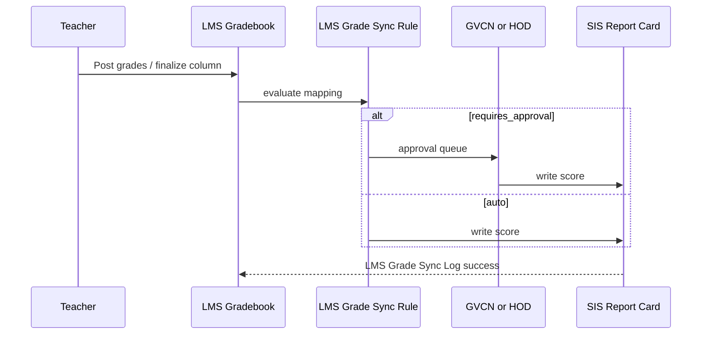

### 6.4. Nguyên tắc

1. **`LMS Grade Column.sync_to_sis = 1`** mới được sync.
2. Chỉ sync khi column **finalized** (không mute, không draft).
3. **Conflict:** nếu SIS đã có điểm tay cho cùng component → log `conflict`, không ghi đè trừ khi `force_override` bởi Admin.
4. **Feature flag:** `LMS Settings.enable_grade_sync` per campus.
5. **Consent:** `check_consent(student, grade_sync_sis)` trước mỗi lần push — không sync khi consent revoked hoặc chưa ký (HS < 16 cần PH). Xem [§23](#23-compliance--data-governance).
6. Tham chiếu API: [`class_log.py`](apps/erp/erp/api/erp_sis/class_log.py), [`homeroom_score.py`](apps/erp/erp/api/erp_sis/homeroom_score.py), [`report_card/student_report.py`](apps/erp/erp/api/erp_sis/report_card/student_report.py).

### 6.5. Pseudocode sync job

```text
ON finalize_grade_column(column_id):
  rule = GET LMS Grade Sync Rule WHERE grade_column = column_id AND active
  IF NOT rule: RETURN
  FOR EACH entry IN column WHERE NOT excused:
    IF NOT check_consent(entry.student, grade_sync_sis):
      LOG skip reason=consent_revoked; CONTINUE
    IF rule.requires_approval:
      CREATE approval request
    ELSE:
      CALL push_score_to_sis(entry, rule)
      WRITE LMS Grade Sync Log

FUNCTION push_score_to_sis(entry, rule):
  SWITCH rule.target_type:
    CASE report_card_component:
      PATCH Student Report Card data_json[path]
    CASE class_log_score:
      INSERT/UPDATE SIS Class Log Score
    CASE homeroom_score:
      INSERT/UPDATE Homeroom Score Record
```

---

## 7. Chi tiết từng module

### 7.1. Modules & Module Items (Canvas Modules)

**Hành vi:**

- Drag-drop sắp xếp `position`.
- **Publish:** module/item có `published` + `unlock_at`.
- **Sequential progress:** học sinh phải hoàn thành item trước mới mở item sau (nếu bật).
- **Mastery path:** sau khi đạt `mastery_required_score` trên quiz/outcome → unlock module tiếp theo (`LMS Mastery Rule`).

**API gợi ý:**

- `get_module_tree(section_id)` — cây module + items + completion state cho user hiện tại
- `mark_item_complete(module_item_id)` — student

### 7.2. Pages & Syllabus

- Editor rich text (Markdown hoặc TipTap).
- Syllabus = `LMS Page` gắn course, hiển thị tab riêng trên course home.
- Versioning (phase sau): `LMS Page Revision`.

### 7.3. Files (MinIO `lms-files` — quyết định 2026-05)

| Hạng mục | Lựa chọn |
|----------|----------|
| **Storage** | **100% MinIO** bucket `lms-files` — **không** dùng Frappe `upload_file` / disk site |
| **Upload** | Browser presigned **PUT** qua `lms-media-service` → `files/{course}/{section}/{fileId}/{name}` |
| **Download** | Presigned **GET** (TTL ~15 phút) sau khi Frappe kiểm tra enrollment |
| **Giới hạn** | ≤ 50MB/file; PDF, Office, ảnh, zip |
| **Metadata** | `attachments_json` trên `LMS Submission`; optional `LMS File` (catalog course) |

- Video dài → `lms-raw` / HLS (§9), **không** bucket `lms-files`.
- Backup/DR: mirror `lms-files` cùng policy MinIO VM1 (xem `media-setup-vm1.md`).

### 7.4. Assignments

| Tính năng | Mô tả |
|-----------|--------|
| Submission types | text, file upload, URL, media comment |
| Due / lock dates | `due_at`, `lock_at`, late policy % trừ điểm |
| Attempts | unlimited / N lần |
| Group assignment | submit theo `LMS Group` |
| Timed exam mode | Giống quiz có thời gian — gắn [proctoring §7.15](#715-proctoring--exam-integrity) |
| Peer review | Phase 4+ |
| Plagiarism | Phase 6+ (integration) |

**Workflow submission:** `unsubmitted` → `submitted` → `graded` | `needs_revision`

**SpeedGrader (UI):** danh sách submission trái, preview phải, rubric panel, điền điểm → tạo `LMS Grade Entry`.

### 7.5. Quizzes

| Tính năng | Mô tả |
|-----------|--------|
| Question types | multiple_choice, true_false, short_answer, essay, matching, numerical |
| Question banks | random N câu từ bank |
| Timed quiz | `time_limit`, auto-submit |
| Attempts | giới hạn, giữ điểm cao nhất / trung bình |
| Auto-grade | MCQ, T/F; essay cần chấm tay |
| Show answers | after_submit / after_due / never |
| Exam mode | `is_high_stakes`, gắn `LMS Proctoring Profile` |

Chi tiết giám sát thi: [§7.15](#715-proctoring--exam-integrity).

### 7.6. Gradebook

- Cột từ assignment/quiz/discussion hoặc cột thủ công.
- **Grade groups** với trọng số (vd. Homework 30%, Exam 70%).
- **Drop lowest** trong group.
- Mute column — học sinh chưa thấy điểm.
- Export CSV.
- Final grade: calculated vs override.

### 7.7. Rubrics

- Criteria + ratings (levels) + points.
- Gắn vào assignment/quiz.
- `LMS Rubric Assessment` lưu điểm từng tiêu chí → tổng hợp vào submission score.

### 7.8. Discussions

- Threaded replies, pin, lock.
- Graded discussion → tạo `LMS Grade Column` tự động.
- Moderation: TA/Teacher xóa/ẩn entry.
- **Quyết định:** LMS native — không merge vào social class feed.

### 7.9. Announcements

- Post tới course hoặc section.
- Publish Redis Stream trên `172.16.20.120:6379/0` → `notification-service` (push + in-app) tới enrolled users.
- Email optional (Frappe email queue).

**Smart digest & preferences (Phase 6 — G7):**

| Tính năng | Mô tả |
|-----------|--------|
| `LMS Notification Preference` | Per user: `channel`, `digest_frequency` (instant/daily/weekly), `quiet_hours`, `mute_until`, `categories_muted_json` |
| `LMS Announcement.priority` | `high` → bypass digest, push instant; `normal`/`low` → theo preference |
| `LMS Announcement.digest_eligible` | Default 1; GV có thể tắt cho thông báo khẩn |
| Daily digest cron | `generate_daily_digest` — 7:00 theo `user.time_zone`; gom events 24h trước |
| Quiet hours | Không push trong khoảng; queue vào digest sáng hôm sau |

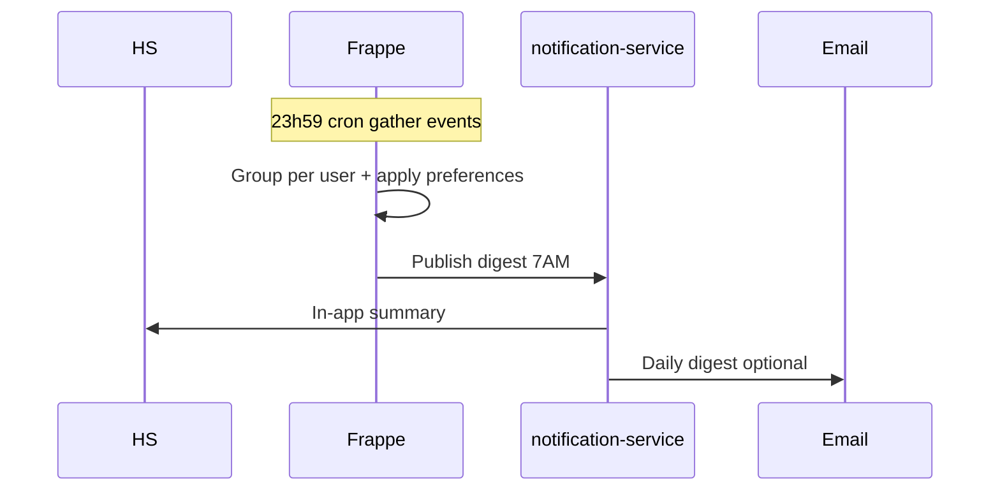

API: `erp.api.lms.notifications.get_preferences`, `update_preferences`.

### 7.10. Groups

- Teacher chia nhóm thủ công hoặc auto random.
- Group assignment: một submission / group.

### 7.11. Blueprint courses

- `LMS Course.is_blueprint = 1` — khóa mẫu.
- **Sync:** content, assignments, rubrics → child sections; không sync enrollment/grades.
- `LMS Blueprint Sync Log` ghi diff mỗi lần sync.
- Lock content trên child (optional).

### 7.12. Analytics

| Metric | Nguồn |
|--------|-------|
| Page views | `LMS Activity Log` |
| Video watch % | `LMS Content Progress` |
| Submission rate | assignments |
| Grade distribution | gradebook aggregate |
| At-risk students | rule: inactive > N ngày, score < threshold |
| **Engagement Score** | `LMS Engagement Score` — 0–100, tính hàng đêm |
| **Async attendance** | % HS active trong tuần (login + content + submit) — không chỉ live |

**Engagement Score (Phase 6 — G7):**

| Signal | Trọng số gợi ý |
|--------|----------------|
| Login days / tuần | 15% |
| Video watch % trung bình | 25% |
| On-time submission rate | 30% |
| Discussion posts | 15% |
| Quiz attempts completed | 15% |

- DocType `LMS Engagement Score`: `student_id`, `section`, `period`, `score`, `signals_json`, `computed_at`
- Cron `compute_engagement_score` — mỗi đêm; so sánh `LMS Course.engagement_threshold_at_risk` (default 30) → flag at-risk
- API `erp.api.lms.engagement.get_score` — HS xem của mình; Teacher xem section
- API `erp.api.lms.engagement.async_attendance(section, week)` — % active tuần

API `get_course_analytics(section_id)` — Teacher/Admin only (gồm engagement + async attendance).

### 7.13. Inbox (Phase 6)

- `LMS Conversation` giữa users trong course.
- Khác social chat lớp — chỉ trong phạm vi LMS course.

### 7.14. LTI 1.3 (Phase 6)

- `LMS External Tool` — launch URL, OIDC.
- Placement: module item type `external_tool`, **proctoring tool** (1EdTech Proctoring Service).

### 7.15. Proctoring & exam integrity

LMS dùng cho **assignment** và **quiz/test** có tính chất kiểm tra (đặc biệt high-stakes). Phần này nghiên cứu các lớp tính năng proctor (tham chiếu Canvas + thị trường), và đề xuất lộ trình phù hợp **self-hosted** + `lms.wellspring.edu.vn`.

#### 7.15.1. Canvas làm gì (benchmark)

| Công cụ / tính năng | Mô tả | Ghi chú |
|---------------------|--------|---------|
| **Quiz settings** | Time limit, 1 câu/lần, shuffle, lockdown câu hỏi, access code, IP filter (tùy tích hợp) | Native Canvas |
| **Respondus LockDown Browser (LDB)** | Trình duyệt khoá: chặn tab khác, copy/paste, print, app khác | Tích hợp sẵn nhiều LMS; có **SDK** cho LMS custom |
| **Respondus Monitor** | Webcam + AI flag (rời khung hình, nhiều người, …) | Phí theo lượt thi; thường chỉ online course |
| **Proctorio** | Extension + AI (gaze, mic, screen) | Canvas enterprise đang thu hẹp; không phải lựa chọn mặc định |
| **Honorlock / ProctorU / Examity** | LTI proctoring — live hoặc automated | Phí cao, K-12 ít dùng trừ thi chuẩn hóa |
| **LTI Proctoring Service** | Chuẩn 1EdTech — LMS launch tool proctor | Hướng tích hợp chuẩn cho LMS tự xây |

Canvas **không** tự build AI proctor — chủ yếu **kết hợp** quiz engine + partner.

#### 7.15.2. Phân lớp bảo mật thi (defense in depth)

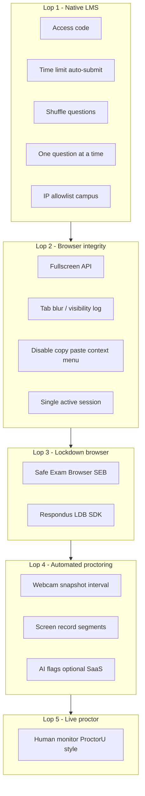

| Lớp | Mục tiêu | Độ tin cậy | Chi phí / độ phức tạp |
|-----|----------|------------|------------------------|
| **L1 Native** | Giảm gian lận cơ bản, quản lý thời gian | Thấp–trung bình | Thấp — build trong WIS |
| **L2 Browser** | Phát hiện chuyển tab, thoát fullscreen | Trung bình | Thấp — không chặn được máy thứ hai |
| **L3 Lockdown** | Khoá OS/app — chỉ thi trong SEB/LDB | Cao cho môi trường máy trường | Trung bình — SEB miễn phí; Respondus license |
| **L4 Automated** | Bằng chứng video + cảnh báo AI | Cao hơn nhưng false positive | Cao — storage + privacy; SaaS theo đầu người |
| **L5 Live** | Thi có giám thị từ xa | Rất cao | Rất cao |

**Khuyến nghị WIS (K-12, self-hosted):** triển khai **L1 + L2** sớm; **L3 SEB** cho thi chính thức tại phòng máy; **L4** chỉ bài thi quan trọng (cuối kỳ); **L5** tùy chọn ngoài.

#### 7.15.3. Catalog tính năng proctor (checklist nghiệp vụ)

**A. Trước khi thi (pre-exam)**

| Tính năng | Mô tả | Native | SEB | LTI/SaaS |
|-----------|--------|:------:|:---:|:--------:|
| Access code / mật khẩu vào đề | GV phát code tại lớp | ✓ | ✓ | ✓ |
| Lịch mở đề (`available_from` / `until`) | | ✓ | ✓ | ✓ |
| Chỉ IP campus / subnet trường | | ✓ | ✓ | ✓ |
| Yêu cầu cài SEB / LDB trước | Download link + practice quiz | | ✓ | ✓ |
| Đồng ý quy chế thi (honor statement) | Checkbox bắt buộc | ✓ | ✓ | ✓ |
| Xác minh danh tính (ảnh CMND / face match) | | | ○ | ✓ |
| Kiểm tra môi trường (webcam test, mic) | | ○ | ○ | ✓ |

**B. Trong khi thi (in-exam)**

| Tính năng | Mô tả | Native | SEB | LTI/SaaS |
|-----------|--------|:------:|:---:|:--------:|
| Timer + auto-submit | | ✓ | ✓ | ✓ |
| Chế độ 1 câu / không quay lại | | ✓ | ✓ | ✓ |
| Xáo trộn câu / đáp án | | ✓ | ✓ | ✓ |
| Chặn copy/paste | Mức JS (không tuyệt đối) | ○ | ✓ | ✓ |
| Chặn tab / app khác | | | ✓ | ○ |
| Fullscreen bắt buộc | | ○ | ✓ | ✓ |
| Log `visibilitychange` / blur | Ghi `LMS Proctoring Event` | ✓ | ✓ | ✓ |
| Webcam snapshot định kỳ | Lưu MinIO, TTL | ○ | ○ | ✓ |
| Ghi màn hình | | | | ✓ |
| Phát hiện nhiều khuôn mặt / rời ghế | AI | | | ✓ |
| Phát hiện giọng nói / thiết bị thứ hai | AI / proctor | | | ✓ |
| Chat với giám thị | | | | ✓ (live) |

**C. Sau thi (post-exam)**

| Tính năng | Mô tả |
|-----------|--------|
| Integrity report | Timeline events + flags theo học sinh |
| Review queue | GV/Admin: dismissed / confirmed violation |
| Export bằng chứng | Link recording (quyền hạn chế) |
| Khoá điểm sau khi review | Liên kết gradebook + sync SIS |

○ = một phần hoặc tùy cấu hình.

#### 7.15.4. Các hướng tích hợp cho WIS LMS

| Phương án | Mô tả | Phù hợp | Nhược điểm |
|-----------|--------|---------|------------|
| **P1 — Built-in integrity** | L1+L2 trong `lms-portal` + Frappe | Mọi quiz/assignment; chi phí 0 | Không khoá OS; dễ bypass trên máy cá nhân |
| **P2 — Safe Exam Browser (SEB)** | Học sinh mở file `.seb` hoặc config URL; server validate `X-SafeExamBrowser-RequestHash` / Config Key | **Phòng máy trường**, thi chuẩn — **open source**, không phí/per seat | Cần IT cài SEB; iPad có bản SEB riêng; GV training |
| **P3 — Respondus LDB SDK** | License SDK, custom launch từ LMS Portal | Tương đương Canvas nếu đã quen Respondus | Chi phí license; phụ thuộc vendor |
| **P4 — LTI 1.3 Proctoring** | Tool như Honorlock launch từ quiz; chuẩn [1EdTech Proctoring Service](https://www.imsglobal.org/spec/lti/v1p3) | Thi online tại nhà, cần AI + identity | Phí SaaS; data ra ngoài; cần LTI Advantage |
| **P5 — Hybrid** | SEB tại trường + native log; LTI chỉ final exam online | **Đề xuất dài hạn** | Hai pipeline cấu hình |

**Self-hosted video bằng chứng (tùy chọn P1 mở rộng):** snapshot/webcam lưu MinIO bucket `lms-proctor-evidence/` — TTL 90 ngày, chỉ role Teacher/Admin xem — **không** thay AI proctor đầy đủ nhưng đủ audit nội bộ.

#### 7.15.5. Safe Exam Browser — tích hợp kỹ thuật (ưu tiên P2)

SEB phù hợp mô hình **tự chủ** của trường (không per-exam fee).

**Luồng:**

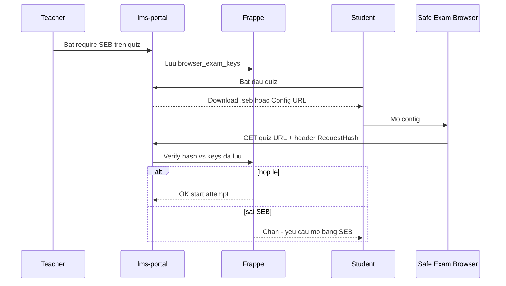

**Backend (Frappe / Nginx):**

- Field `LMS Quiz Proctoring.browser_exam_keys` — nhiều dòng SHA256 (Windows/macOS/iOS).
- Middleware kiểm tra header `X-SafeExamBrowser-RequestHash` hoặc JS API `SafeExamBrowser.security` (SEB ≥ 3.0 WKWebView).
- API `generate_seb_config(quiz_id)` → file `.seb` hoặc link `seb://` (teacher download phát cho HS).

**Tài liệu kỹ thuật:** [SEB Browser Exam Key spec](https://safeexambrowser.org/developer/documents/SEB-Specification-BrowserExamKey.pdf), [Config Key](https://www.safeexambrowser.org/developer/seb-config-key.html).

**SEB Server (tùy chọn sau):** quản lý tập trung phòng thi — [SEB Server docs](https://seb-server.readthedocs.io/) — phase sau nếu nhiều phòng máy.

#### 7.15.6. LTI Proctoring (P4 — phase sau)

Khi `LMS External Tool` (§7.14) sẵn sàng:

1. Đăng ký tool (Honorlock, Meazure, …) — OIDC, JWKS.
2. Quiz `proctoring_mode = lti` → student launch → tool fullscreen → callback complete.
3. Tool gửi **flags** qua LTI Assignment and Grade Service hoặc custom line item.
4. WIS lưu `LMS Proctoring Flag` + link recording URL (nếu vendor cung cấp).

Chuẩn tham chiếu: [1EdTech LTI Proctoring Service](https://www.imsglobal.org/spec/lti/v1p3).

#### 7.15.7. Built-in integrity (P1) — spec triển khai

**QuizTaker / AssignmentExam** (`lms-portal`) gửi heartbeat mỗi 15–30s:

```json
{
  "attempt_id": "...",
  "events": [
    { "type": "tab_hidden", "at": "2026-05-19T10:01:00Z" },
    { "type": "fullscreen_exit", "at": "..." },
    { "type": "paste_attempt", "at": "..." }
  ]
}
```

**Frappe:** `POST erp.api.lms.student.record_proctoring_events` → append `LMS Proctoring Event`.

**Cấu hình GV trên quiz:**

| Setting | Field |
|---------|--------|
| Bật integrity log | `enable_integrity_log` |
| Bắt fullscreen | `require_fullscreen` |
| Số lần rời tab tối đa | `max_tab_switch` → auto-flag |
| Yêu cầu SEB | `require_seb` → kết hợp §7.15.5 |
| Gắn profile | `proctoring_profile` |

**Assignment timed exam:** assignment type `timed_exam` + cùng `LMS Assignment Proctoring` — UI giống quiz (một lần nộp trong thời gian).

#### 7.15.8. UI LMS Portal (bổ sung route)

| Route | Role | Màn hình |
|-------|------|----------|
| `/student/courses/:id/quizzes/:id/start` | Student | Pre-check (SEB download, access code, honor) |
| `/student/courses/:id/quizzes/:id/attempt` | Student | QuizTaker + integrity hooks |
| `/teacher/courses/:id/quizzes/:id/proctoring` | Teacher | Cấu hình profile, SEB keys, xem flags |
| `/teacher/courses/:id/proctoring/review` | Teacher | Hàng đợi review session có flag |
| `/admin/proctoring/profiles` | Admin | Template profile theo campus |

#### 7.15.9. Quyền riêng tư & K-12 (Việt Nam)

| Chủ đề | Thực hành đề xuất |
|--------|-------------------|
| Thông báo phụ huynh | High-stakes có webcam → thông báo + consent trong handbook |
| Lưu trữ recording | TTL tối đa (vd. 90 ngày); bucket riêng; không public |
| Quyền xem | Chỉ GV môn + Admin; Observer **không** xem recording |
| Học sinh vị thành niên | Chính sách rõ theo khối; có thể tắt AI proctor cấp tiểu học |
| Máy cá nhân vs phòng máy | SEB + IP trường cho thi tập trung; thi nhà chỉ formative hoặc LTI có consent |

Tham chiếu: Nghị định bảo vệ dữ liệu cá nhân — lưu metadata sự kiện tối thiểu, ảnh/video có mục đích rõ.

#### 7.15.10. So sánh nhanh giải pháp lockdown / proctor

| Tiêu chí | Native WIS | SEB | Respondus LDB | LTI AI Proctor |
|----------|------------|-----|---------------|----------------|
| Chi phí | Thấp | **Miễn phí** (OSS) | License | Per exam / seat |
| Khoá trình duyệt khác | Không | **Có** | **Có** | Không (extension) |
| Tích hợp LMS custom | Native | **Spec công khai** | SDK partner | LTI chuẩn |
| Webcam / AI | Tùy build | Không | Monitor add-on | **Có** |
| iPad | Web | SEB iOS | Hỗ trợ | Tùy vendor |
| Data residency | **On-prem** | **On-prem** | Vendor | Thường cloud US/EU |
| Độ effort WIS | 2–3 tuần | 3–4 tuần | 4–6 tuần + contract | 6–8 tuần (LTI trước) |

#### 7.15.11. Lộ trình proctoring đề xuất (gắn roadmap §10)

| Sub-phase | Nội dung | Phụ thuộc |
|-----------|----------|-----------|
| **3b** | Native integrity (events, fullscreen, tab log, access code, IP); UI review cơ bản | Phase 3 Quizzes |
| **4b** | SEB: generate config, validate RequestHash, practice quiz | Phase 3b |
| **5b** | Assignment `timed_exam` + proctoring; báo cáo integrity export | Phase 2 Assignments |
| **6b** | LTI proctoring tool (1 vendor); tùy chọn webcam → MinIO | Phase 6 LTI |
| **7** | SEB Server / AI flag tích hợp / Respondus SDK (nếu trường mua) | Nhu cầu thực tế |

#### 7.15.12. Rủi ro proctoring

| Rủi ro | Giảm thiểu |
|--------|------------|
| False positive AI | Không auto-fail; chỉ flag + review GV |
| HS không cài SEB | Practice quiz; IT phòng máy image chuẩn |
| Mạng yếu khi upload webcam | Chỉ snapshot; không stream realtime phase đầu |
| Gian lận trên mobile | High-stakes bắt SEB/desktop; mobile chỉ formative |
| Rò rỉ đề | Access code + time window ngắn + question bank |

---

## 8. Frontend IA

### 8.1. Tách ứng dụng (quyết định kiến trúc)

| Ứng dụng | Domain | Phạm vi |
|----------|--------|---------|
| **LMS Portal** | `https://lms.wellspring.edu.vn` | Toàn bộ LMS (Student Portal, Teacher, Observer, Admin) |
| **SIS** | domain SIS hiện tại | Thuần quản trị trường — **không** route/component LMS |
| **parent-portal** | domain phụ huynh hiện tại | TKB, điểm danh, học bạ — **không** module LMS; có thể **link** sang LMS Observer |

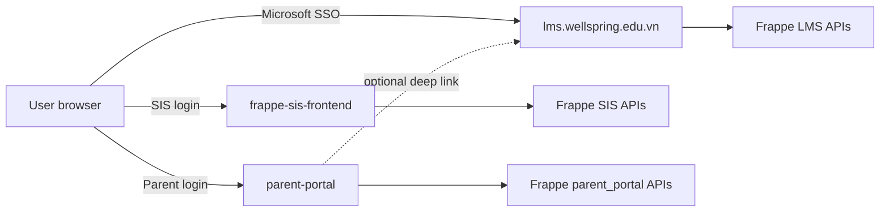

### 8.2. LMS Portal — đăng nhập & routing

**Auth:** Microsoft Entra ID (OAuth 2.0 / OpenID Connect) → backend Frappe tạo/ánh xạ `User` → cookie/session hoặc JWT cho SPA.

**Sau login:** API `erp.api.lms.common.get_me` trả `roles[]` + `default_landing_path` → React Router redirect.

| Frappe Role / ngữ cảnh LMS | Landing mặc định | Prefix route |
|----------------------------|------------------|--------------|
| Học sinh (`Student` / enrollment student) | `/student/dashboard` | `/student/*` |
| Giáo viên (`Teacher`, `LMS Instructor`) | `/teacher` hoặc `/teacher/dashboard` | `/teacher/*` |
| Trợ giảng (`TA`) | `/teacher` (menu giới hạn) | `/teacher/*` |
| Instructional Designer | `/teacher` (chỉ content) | `/teacher/*` |
| LMS Admin | `/admin` | `/admin/*` |
| Phụ huynh (Observer) | `/observer/dashboard` | `/observer/*` |

**Route guard:** mỗi prefix chỉ cho role tương ứng; mismatch → 403 hoặc redirect `default_landing_path`.

**Routes công khai:** `/login`, `/auth/callback` (Microsoft redirect URI).

### 8.3. Student Portal (`/student/*`)

Giao diện học sinh — tương đương Canvas student view.

| Route | Màn hình |
|-------|----------|
| `/student/dashboard` | Tổng quan: khóa đang học, deadline sắp tới, tiến độ |
| `/student/courses` | Danh sách khóa (enrollment) |
| `/student/courses/:sectionId` | Course home — modules, announcements |
| `/student/courses/:sectionId/modules/:itemId` | Module item player (video HLS, page, …) |
| `/student/courses/:sectionId/assignments` | Danh sách bài tập |
| `/student/courses/:sectionId/assignments/:id` | Chi tiết + nộp bài |
| `/student/courses/:sectionId/quizzes/:id` | Làm quiz |
| `/student/courses/:sectionId/discussions` | Thảo luận |
| `/student/courses/:sectionId/discussions/:id` | Thread |
| `/student/courses/:sectionId/grades` | Điểm đã publish (không thấy cột mute) |
| `/student/calendar` | Lịch merge LMS + tiết SIS (read-only TKB) |

**Components:** `StudentDashboard`, `CourseCard`, `ModuleTree`, `LessonPlayer` (hls.js), `AssignmentSubmit`, `QuizTaker`, `DiscussionThread`.

### 8.4. Teacher workspace (`/teacher/*`)

| Route | Màn hình |
|-------|----------|
| `/teacher` hoặc `/teacher/dashboard` | Khóa đang dạy, việc cần chấm |
| `/teacher/courses/:sectionId` | Course home |
| `/teacher/courses/:sectionId/modules` | Module builder |
| `/teacher/courses/:sectionId/assignments` | CRUD assignment |
| `/teacher/courses/:sectionId/quizzes` | Quiz builder |
| `/teacher/courses/:sectionId/gradebook` | Gradebook |
| `/teacher/courses/:sectionId/speed-grader/:id` | SpeedGrader |
| `/teacher/courses/:sectionId/discussions` | Moderation |
| `/teacher/courses/:sectionId/people` | Roster (sync SIS) |
| `/teacher/courses/:sectionId/settings` | Settings, blueprint, sync |
| `/teacher/courses/:sectionId/analytics` | Analytics (phase 6) |

**Components:** `GradebookGrid`, `SpeedGraderPanel`, `ModuleBuilder`, + dùng chung `LessonPlayer` cho preview.

### 8.5. Observer — phụ huynh (`/observer/*`)

| Route | Màn hình |
|-------|----------|
| `/observer/dashboard` | Chọn con (nếu nhiều HS) + khóa quan sát |
| `/observer/courses/:sectionId` | Read-only modules, announcements |
| `/observer/courses/:sectionId/progress` | Tiến độ học |
| `/observer/calendar` | Lịch khóa học của con |

**Không** submit, không post discussion, không thấy điểm nếu policy mute.

**parent-portal:** mục "Học tập LMS" → mở tab `https://lms.wellspring.edu.vn/observer/dashboard` (SSO cùng tenant Microsoft nếu cùng email).

### 8.6. Admin (`/admin/*`)

| Route | Màn hình |
|-------|----------|
| `/admin` | Dashboard LMS toàn campus |
| `/admin/blueprints` | Blueprint courses |
| `/admin/grade-sync-rules` | Cấu hình sync điểm → SIS |
| `/admin/programs` | `LMS Program` theo năm học |

### 8.7. frappe-sis-frontend & parent-portal

| Ứng dụng | Thay đổi |
|----------|----------|
| **frappe-sis-frontend** | **Xóa / không tạo** mọi route `/teaching/lms`, `/learning/lms`. Menu "LMS" → link ngoài `https://lms.wellspring.edu.vn` (mở tab mới). |
| **parent-portal** | **Xóa / không tạo** route `/lms/*`. Thay bằng link "Xem khóa học LMS" → LMS Observer. |

### 8.8. API & CORS

**Base API** (qua Frappe, cùng backend SIS):

```
/api/method/erp.api.lms.student.*
/api/method/erp.api.lms.teacher.*
/api/method/erp.api.lms.observer.*
/api/method/erp.api.lms.common.*
```

**Env LMS Portal:**

```
VITE_FRAPPE_URL=https://api.school.vn
VITE_LMS_URL=https://lms.wellspring.edu.vn
VITE_AZURE_CLIENT_ID=...
VITE_AZURE_TENANT_ID=...
VITE_AZURE_REDIRECT_URI=https://lms.wellspring.edu.vn/auth/callback
```

**CORS Frappe + Nginx media:** allow origin `https://lms.wellspring.edu.vn` (thay vì chỉ SIS origin).

**Cấu trúc service (lms-portal):**

```
src/services/lms/
  authService.ts
  studentService.ts
  teacherService.ts
  observerService.ts
```

---

## 9. Media & video streaming (self-hosted)

> Phần này giữ thiết kế media đã chốt. Business video (`LMS Video Asset`) liên kết `LMS Module Item` (`item_type=video`).

### 9.1. Tóm tắt quyết định media

| Hạng mục | Lựa chọn |
|----------|----------|
| Loại video | VOD, HLS adaptive |
| Hạ tầng | Self-hosted MinIO + FFmpeg + Nginx |
| Business metadata | Frappe |
| Pipeline | `lms-media-service` + Redis **DB /2** (`172.16.20.120`) |

### 9.2. Topology VM

| VM | Thành phần | Public IP |
|----|------------|-----------|
| **VM1 — media-storage-gateway** | MinIO (`172.16.20.93:9000`) + Nginx | **Có** (Nginx :443) |
| **VM2 — lms-media** | lms-media-service + FFmpeg workers (`172.16.20.21:5020`) | Không |
| **Frappe Core** | API + webhook | Có (API) |

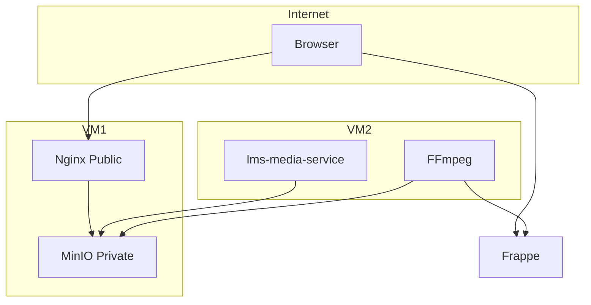

### 9.3. MinIO buckets & sizing

| Bucket | Mục đích |
|--------|----------|
| `lms-raw` | Video gốc upload (transcode → HLS) |
| `lms-hls` | Manifest + segments |
| `lms-thumbs` | Thumbnail |
| **`lms-files`** | **Tài liệu LMS** — bài nộp, file khóa học, đính kèm (<50MB) |
| `lms-proctor-evidence` | Snapshot webcam / clip (TTL, private) — [§7.15](#715-proctoring--exam-integrity) |
| `lms-recordings` | Live class recordings (Teams/Zoom/Jitsi) — Phase 7 |
| `lms-scorm` | SCORM packages — Phase 8 |
| `lms-h5p` | H5P interactive content — Phase 8 |
| `lms-transcripts` | VTT/SRT, AI transcription — Phase 7 |
| `lms-portfolio` | ePortfolio artifacts — Phase 10 |
| `lms-certificates` | PDF certificates — Phase 10 |

**Tier M (mặc định):** 8 vCPU, 16–32GB RAM, 2–4TB NVMe. MinIO **không** Public IP — chỉ Nginx.

```
GB_total = (GB_raw × 0.3) + GB_hls + GB_thumb;  order = GB_total × 1.35
```

### 9.4. Luồng upload & playback

- Upload: Browser → `upload.school.vn` (Nginx) → MinIO; presigned URL từ `lms-media-service`.
- Transcode: BullMQ trên Redis `172.16.20.120:6379/2` → FFmpeg → webhook Frappe `transcode.done`.
- Playback: `get_playback_token` (enrollment check) → signed `media.school.vn/.../master.m3u8`.

Chi tiết sequence diagram và API: `init_lesson_upload`, `get_playback_token`, `save_lesson_progress` / `LMS Content Progress`.

### 9.5. lms-media-service

| Endpoint | Mô tả |
|----------|--------|
| `POST /uploads/init` | Presigned multipart |
| `POST /uploads/complete` | Enqueue transcode (BullMQ → Redis DB /2) |
| `POST /internal/validate-playback` | Nginx auth_request |
| `GET /health` | MinIO + Redis DB /2 connectivity |

**Redis:** cùng host `172.16.20.120` với Frappe và notification-service; queue transcode **riêng DB index /2** — xem [§2.4](#24-redis--hạ-tầng-dùng-chung).

### 9.6. FFmpeg profile

| Tham số | Giá trị |
|---------|---------|
| Ladder | 360p / 720p / 1080p |
| Segment | 6s, H.264 + AAC |
| Output | `lms-hls/{asset_id}/master.m3u8` |

### 9.7. Bảo mật media

- Hai lớp: Frappe token + Nginx `secure_link` / `auth_request`.
- MinIO deny anonymous; CORS Nginx: `https://lms.wellspring.edu.vn` (LMS Portal là client chính cho playback/upload).

### 9.8. VM3 (tùy chọn)

Thêm **media-worker** khi transcode backlog > 2h hoặc >20–30 video/ngày.

---

## 10. Roadmap triển khai (Phase 0–12)

### Phase 0 — Media stack

| Hạng mục | Deliverable |
|----------|-------------|
| Infra | VM1 MinIO+Nginx, VM2 media-service+worker, private network; Redis `172.16.20.120` DB /2 — xem [media-setup-vm1.md](./media-setup-vm1.md) |
| Frappe | `LMS Video Asset`, webhook transcode |
| Test | 1 video upload → HLS playback end-to-end |

### Phase 1 — Course shell & content

| DocTypes | `LMS Program`, `Course`, `Course Section`, `Enrollment`, `Module`, `Module Item`, `Page`, `File` |
| APIs | CRUD course, module tree, enrollment sync job |
| UI | **lms-portal** scaffold: Microsoft login, `/student/dashboard`, `/teacher`, course home |
| SIS | Link `SIS Class`, auto enrollment sync; **không** UI LMS trên frappe-sis-frontend |

### Phase 2 — Assignments & gradebook cơ bản

| DocTypes | `Assignment`, `Submission`, `Grade Column`, `Grade Entry`, `Announcement` |
| APIs | submit, grade, gradebook grid |
| UI | Assignment editor, submit, gradebook, announcements |
| Notif | Due date reminders |

### Phase 3 — Quizzes & rubrics

| DocTypes | `Quiz`, `Question`, `Question Bank`, `Quiz Attempt`, `Rubric` |
| APIs | auto-grade MCQ, manual essay grade |
| UI | Quiz builder/taker, SpeedGrader v1, rubric panel |

### Phase 3b — Proctoring native (integrity)

| DocTypes | `Proctoring Profile`, `Quiz Proctoring`, `Proctoring Session`, `Event`, `Flag` |
| APIs | `record_proctoring_events`, review queue |
| UI | QuizTaker hooks (tab/fullscreen), teacher review — [§7.15.7](#7157-built-in-integrity-p1--spec-triển-khai) |

### Phase 4 — Collaboration & outcomes

| DocTypes | `Discussion`, `Group`, `Calendar Event`, `Outcome`, `Mastery Rule` |
| APIs | merged calendar, mastery unlock job |
| UI | Discussions, groups, calendar tab, outcomes align wizard |

### Phase 4b — Safe Exam Browser (SEB)

| Features | Generate `.seb` / config URL, validate `X-SafeExamBrowser-RequestHash`, practice quiz |
| UI | Pre-exam SEB download, error khi không đúng browser — [§7.15.5](#7155-safe-exam-browser--tích-hợp-kỹ-thuật-ưu-tiên-p2) |

### Phase 5 — Grade sync SIS & blueprint

| DocTypes | `Grade Sync Rule`, `Grade Sync Log`, `Blueprint Course`, `Blueprint Sync Log`, `LMS Data Consent`, `LMS Data Retention Policy`, `LMS Data Export Request`, `LMS Audit Log` |
| APIs | sync push, approval workflow, `compliance.*` (consent, export, audit) |
| UI | Sync rules admin, approval queue, blueprint sync, PH consent center |
| SIS | Integration Report Card / Class Log — **check consent** trước push |
| Compliance | ND13 — [§23](#23-compliance--data-governance) |

### Phase 6 — Analytics, inbox, LTI, polish

| Features | Analytics dashboard, Inbox, LTI tools, Observer `/observer` polish trên LMS Portal |
| Smart notif | `LMS Notification Preference`, `LMS Notification Digest`, cron `generate_daily_digest` |
| Engagement | `LMS Engagement Score`, `async_attendance`, cron `compute_engagement_score` |
| Hardening | Load test, DR MinIO mirror |

### Phase 6b — LTI proctoring (tùy chọn)

| Features | 1 vendor LTI proctor (Honorlock / tương đương); assignment `timed_exam` + proctor export |
| Ghi chú | Chỉ high-stakes + consent — [§7.15.6](#7156-lti-proctoring-p4--phase-sau) |

### Phase 7 — Live + Captions + AI v1

| Hạng mục | Deliverable |
|----------|-------------|
| Live | Teams/Zoom/Meet/Jitsi — `LMS Live Session`, attendance |
| Captions | `LMS Caption Track`, Whisper auto-transcribe |
| AI v1 | `lms-ai-service`, AI Tutor RAG, smart search |
| Infra | Redis DB `/3`, Qdrant, bucket `lms-recordings` |

### Phase 8 — Content Standards

| Hạng mục | Deliverable |
|----------|-------------|
| SCORM | 1.2/2004 import, `LMS SCORM Package`, tracking |
| xAPI | LRS endpoint `LMS xAPI Statement` |
| H5P | `LMS H5P Content`, interactive embed |
| Caliper | Events từ `LMS Activity Log` |

### Phase 9 — Mobile App MVP

| Hạng mục | Deliverable |
|----------|-------------|
| Apps | React Native student/teacher/parent |
| Backend | `mobile.register_device`, offline sync |
| Push | FCM/APNs qua notification-service |

### Phase 10 — Credentials + Catalog + Portfolio

| Hạng mục | Deliverable |
|----------|-------------|
| Certs | `LMS Certificate Template`, ECDSA verify URL |
| Badges | Open Badges 2.0 |
| Catalog | Self-enroll, waitlist, `LMS Enrollment Request` |
| Portfolio | `LMS Portfolio`, share link |

### Phase 11 — K-12 Specific

| Hạng mục | Deliverable |
|----------|-------------|
| Mastery | `LMS Mastery Scale`, standards-based grading UI |
| Reading log | `LMS Reading Log` |
| Pacing | `LMS Pacing Guide` |
| Conference | Parent-teacher booking (Microsoft Bookings) |
| Gamification | Opt-in achievements |
| Wellbeing | Pulse check-in, Safeguarding workflow, Counselor booking — [§24](#24-wellbeing--sel) |

### Phase 12 — AI nâng cao + Predictive Analytics

| Hạng mục | Deliverable |
|----------|-------------|
| AI | Auto-grade essay (suggest only), plagiarism |
| Analytics | At-risk prediction, custom report builder |
| Assessment | Peer review, item analysis, CAT (optional) |

**Phase ngang:** i18n + Accessibility — [§16](#16-accessibility--i18n).

**Thời lượng ước tính (1 team full-stack):**

| Phase | Tuần |
|-------|------|
| 4 | 6–8 |
| 4b | 2–3 |
| 5 | 6–8 |
| 6 | 6–8 |
| 6b | 3–4 |
| 7 | 8–10 |
| 8 | 8–10 |
| 9 | 10–12 |
| 10 | 6–8 |
| 11 | 8–10 |
| 12 | 8–12 |

**Tham chiếu bổ sung:** [§20](#20-quyết-định-kiến-trúc-q1q8) Q1–Q8 · [`LMS-PHASE-REVIEW.md`](LMS-PHASE-REVIEW.md) checklist Phase 4–6 · [`lms-phase-specs.md`](lms-phase-specs.md) schema/API chi tiết.

### MVP gate mỗi phase

Mỗi phase chỉ đóng khi: DocTypes migrated, APIs documented, UI smoke test, enrollment permission test, và (nếu có) sync job chạy ổn định 1 tuần staging.

---

## 12. Live Virtual Classroom

> **Phase 7** · **Q1:** đa provider — Teams chính (Microsoft SSO), Zoom/Meet LTI, Jitsi self-host tùy chọn.

Canvas có Conferences (BBB) và Zoom; WIS bổ sung lớp học đồng bộ tích hợp SIS Calendar.

### 12.1. Tính năng

| Tính năng | Mô tả |
|-----------|--------|
| Teams Meeting | Tạo từ `LMS Calendar Event`, attendance qua Graph API |
| Zoom / Google Meet | OAuth/LTI per campus |
| Jitsi self-host | `lms-live-service` — không per-seat fee |
| BigBlueButton | Optional phase sau — whiteboard, breakout |
| Auto-record | MinIO `lms-recordings/` → transcode HLS → `LMS Video Asset` |
| Live attendance | `LMS Live Attendance` → optional sync `SIS Class Attendance` |
| Live polls / Q&A | Phase sau (native) |

### 12.2. DocTypes

| DocType | Field quan trọng |
|---------|------------------|
| `LMS Live Session` | `course`, `section`, `provider` (teams\|zoom\|meet\|jitsi\|bbb), `scheduled_at`, `duration_min`, `meeting_url`, `external_meeting_id`, `host_user`, `recording_asset_id`, `status` |
| `LMS Live Attendance` | `session`, `student_id`, `joined_at`, `left_at`, `duration_sec`, `source` |
| `LMS Live Provider Config` | `provider`, `campus`, `credentials_encrypted`, `default_settings_json` |

### 12.3. Luồng

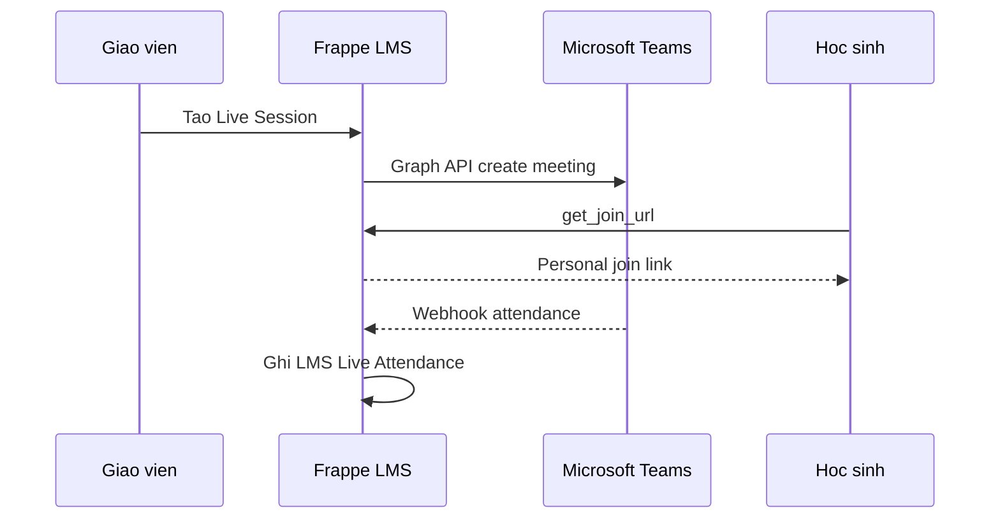

### 12.4. API & UI

- API: `erp.api.lms.live.create_session`, `get_join_url`, `list_sessions`, `internal.live_webhook`
- UI Teacher: `/teacher/courses/:id/live`
- UI Student: `/student/courses/:id/live/:sessionId/join`

---

## 13. AI Layer

> **Phase 7–12** · **Q2:** Hybrid — LLM local (RAG, transcribe) + cloud proxy có audit (essay grading).

### 13.1. Tính năng theo phase

| Tính năng | Phase | Mô tả |
|-----------|-------|--------|
| Auto-caption / transcription | 7 | Whisper → VTT MinIO, player CC |
| AI Tutor chatbot (RAG) | 7 | Hỏi đáp theo syllabus, page, transcript |
| Smart search | 7 | Semantic search toàn course |
| AI gen câu hỏi | 8 | Từ video/page → Question Bank |
| AI grade suggest (essay) | 12 | Rubric-based — **GV duyệt**, không auto-post điểm |
| Plagiarism similarity | 12 | Embedding nội bộ — không upload Turnitin |
| AI summary / flashcards | 12 | Ôn tập từ page/video |
| At-risk hint | 12 | Cảnh báo HS chậm so với cohort |

### 13.2. Microservice `lms-ai-service`

| Thành phần | Công nghệ |
|-----------|-----------|
| Runtime | Python FastAPI, port `5030` |
| Queue | BullMQ Redis DB `/3` |
| Vector DB | Qdrant — collection `lms_course_{course_id}` |
| Transcription | Whisper.cpp self-host hoặc API |
| LLM | Local Llama/Qwen via vLLM; cloud proxy optional |

**Endpoints internal:** `/jobs/transcribe`, `/jobs/embed`, `/jobs/gen-questions`, `/jobs/grade-suggest`, `/jobs/plagiarism`, `/tutor/chat`, `/search`

### 13.3. DocTypes

| DocType | Mục đích |
|---------|----------|
| `LMS AI Job` | `job_type`, `status`, `model`, `tokens_used` |
| `LMS AI Feedback Suggestion` | Essay suggest — `accepted_by`, `accepted_at` |
| `LMS Transcript` | `video_asset`, `vtt_url`, `auto_generated` |
| `LMS Plagiarism Report` | `similarity_score`, `matches_json` |
| `LMS AI Tutor Conversation` / `Message` | Per-course chat history |

### 13.4. Privacy & K-12

- Opt-in per campus (`LMS Settings.enable_ai`)
- Consent phụ huynh cho HS dưới 16 tuổi khi dùng cloud LLM
- Audit log mọi prompt/response cloud
- **Không** auto-post điểm từ AI

---

## 14. Content Standards — SCORM, xAPI, H5P

> **Phase 8** · **Q4:** SCORM Engine OSS self-host + H5P open-source.

LMS chuyên nghiệp cần nhập package thương mại và tracking chuẩn ngành.

### 14.1. SCORM 1.2 / 2004

| Bước | Mô tả |
|------|--------|
| Import | Upload zip → giải nén → `lms-scorm/{package_id}/` |
| Runtime | Player iframe + JS API (`LMSInitialize`, `LMSSetValue`, `LMSCommit`, `LMSFinish`) |
| Tracking | `LMS SCORM Tracking` — completion, success, score, suspend_data, total_time |

### 14.2. xAPI / Tin Can (LRS)

- Endpoint: `erp.api.lms.xapi.statements`
- DocType: `LMS xAPI Statement` — actor, verb, object, context_json
- Dùng cho mobile app và tool ngoài track học tập

### 14.3. H5P interactive

- Interactive video, branching scenario, drag-the-words, memory game
- DocType: `LMS H5P Content` — `params_json`, `library_json`
- Module item: `item_type=h5p`

### 14.4. Caliper Analytics (optional)

- Emit từ `LMS Activity Log` — event chuẩn IMS Caliper
- Tích hợp Tableau / Power BI nếu trường có

### 14.5. IMS Common Cartridge

- Import/export giữa LMS — **phase sau** Phase 8

---

## 15. Mobile App

> **Phase 9** · **Q3:** React Native monorepo — 3 app (student / teacher / parent).

Phụ huynh và HS K-12 VN dùng mobile nhiều; responsive web không đủ.

### 15.1. Apps & chức năng

| App | Chức năng |
|-----|-----------|
| **Student** | Xem khóa, video offline, làm quiz, nộp bài, push deadline/grade |
| **Teacher** | Chấm nhanh, announcement, quay/upload video tại chỗ |
| **Parent** | Observer tiến độ + deep link parent-portal |

### 15.2. Offline mode

- Download manifest: video MP4 thấp bitrate, page HTML cache, file
- Quiz offline → sync khi online (`sync_offline_progress`)
- SQLite cache progress local

### 15.3. Tính năng native

- Push FCM (Android) / APNs (iOS) qua `notification-service`
- Camera capture nộp bài
- QR attendance lớp live
- Biometric login sau lần SSO đầu

### 15.4. DocTypes & API

- `LMS Device Registration`, `LMS Offline Sync Log`
- `mobile.register_device`, `sync_offline_progress`, `get_download_manifest`

---

## 16. Accessibility & i18n

> **Phase ngang** 1 (i18n base) → 7 (captions) → 9 (mobile WCAG) → 11 (audit AA đầy đủ).

Trường quốc tế Wellspring cần WCAG và đa ngôn ngữ.

### 16.1. Accessibility (WCAG 2.1 AA)

| Hạng mục | Mô tả |
|----------|--------|
| Keyboard navigation | Tab order, skip links, focus trap modal |
| Screen reader | ARIA labels, live regions cho toast/grade |
| Color contrast | ≥ 4.5:1 text; theme high-contrast |
| Video | Closed captions (manual + AI), audio descriptions optional |
| Typography | OpenDyslexic font option |
| Themes | Default, dark, high-contrast |
| TTS | Text-to-speech cho page content |
| Statement | Trang `/accessibility` công khai |

**Component library:** Radix UI / Headless UI — ARIA chuẩn.

### 16.2. i18n

| Ngôn ngữ | Phase |
|----------|-------|
| Tiếng Việt + English | Phase 1 (bắt buộc) |
| Korean, Chinese, Japanese | Phase 11 (HS quốc tế) |
| Content translation | `LMS Content Translation` — cache bản dịch page |

### 16.3. DocTypes

| DocType | Mục đích |
|---------|----------|
| `LMS Caption Track` | `video_asset`, `language`, `vtt_url`, `source` manual/ai |
| `LMS Content Translation` | `translated_html`, `ai_generated`, `reviewed_by` |

---

## 17. Credentials, Catalog & ePortfolio

> **Phase 10** · **Q5:** ECDSA + verify URL · **Q7:** Catalog K-12 ngoại khóa + PD giáo viên.

Cho CLB, ngoại khóa, professional development GV.

### 17.1. Certificate & Badge

| Tính năng | Mô tả |
|-----------|--------|
| Certificate PDF | Template HTML — biến `{{student_name}}`, `{{course_title}}`, `{{completion_date}}` |
| Auto-issue | Khi % complete + điểm tối thiểu đạt điều kiện |
| Verify URL | `verify_code` UUID → `/verify/{code}` public |
| Open Badges 2.0 | BadgeClass + Assertion JSON-LD IMS |
| Microcredentials | Stack N badges → 1 credential lớn |

### 17.2. Catalog & self-enroll

| Tính năng | Mô tả |
|-----------|--------|
| Catalog browse | `LMS Catalog Entry` — visibility public/campus/invite |
| Self-enroll | HS/PH/GV request → `LMS Enrollment Request` workflow |
| Waitlist | Khi vượt `enrollment_limit` |
| Prerequisite | Hoàn thành course X mới vào course Y |

### 17.3. ePortfolio & Reflection

- **ePortfolio:** HS gom best work, share link PH/GV
- **Reflection journal:** Nhật ký học tập riêng tư

### 17.4. DocTypes

`LMS Certificate Template`, `LMS Certificate Issuance`, `LMS Badge Class`, `LMS Badge Assertion`, `LMS Catalog Entry`, `LMS Enrollment Request`, `LMS Portfolio`, `LMS Portfolio Item`, `LMS Reflection Journal`

---

## 18. K-12 Specific (Wellspring)

> **Phase 11** · **Q8:** Gamification opt-in toàn trường — mặc định tắt THPT.

Tính năng Canvas yếu hoặc thiếu cho trường K-12 Việt Nam.

### 18.1. Tính năng

| Tính năng | Mô tả |
|-----------|--------|
| Standards-based grading | Thang mastery (Beginning → Mastery) song song điểm số |
| Reading log | Sách, số trang, journal — tích hợp thư viện (nếu có) |
| Pacing guide | GV plan tuần/tháng, drag-drop module library |
| Substitute access | GV thay thế — quyền tạm read-only/grade-only |
| PH-GV conference | Đặt slot — Microsoft Bookings |
| Behavior link | Read-only `SIS Class Log` behavior trong course view |
| Gamification | Points, leaderboard, achievements — **opt-in** per course |
| Homework helper PH | PH xem hint, hỏi GV — **không** xem đáp án |
| Field trip / events | Extracurricular tracking |
| Wellbeing & SEL | Pulse, safeguarding, counselor — [§24](#24-wellbeing--sel) |

### 18.2. DocTypes

`LMS Mastery Scale`, `LMS Reading Log`, `LMS Pacing Guide`, `LMS Substitute Access Grant`, `LMS Conference Booking`, `LMS Achievement Definition`, `LMS Student Achievement`, `LMS Homework Hint Request`

### 18.3. SIS integration

- Outcomes ↔ `SIS Sub Curriculum` — import wizard từ `SIS Curriculum Evaluation Criteria`
- Behavior: tham chiếu read-only, không ghi đè SIS

---

## 19. Assessment nâng cao

> **Phase 8** peer review, item analysis · **Phase 12** CAT, code answer.

Hiện Phase 3 có 6 loại câu hỏi; mở rộng lên 15+.

### 19.1. Question types bổ sung

| Type | Mô tả | Phase |
|------|--------|-------|
| `hotspot` | Click vùng ảnh | 8 |
| `drag_drop` | Kéo nhãn vào vị trí | 8 |
| `fill_blank_multi` | Nhiều ô điền trong câu | 8 |
| `ordering` | Sắp xếp thứ tự | 8 |
| `cloze` | Gap-fill có pool | 8 |
| `file_upload_response` | Upload file làm đáp án | 8 |
| `audio_response` | Ghi âm browser | 8 |
| `video_response` | Webcam → MinIO | 8 |
| `formula` | Toán random + công thức | 12 |
| `code_answer` | Sandbox chấm code | 12+ |

### 19.2. Tính năng assessment khác

| Tính năng | Mô tả |
|-----------|--------|
| Peer review | Anonymous, rubric peer, calibration |
| Survey mode | `survey_mode=1` — không điểm, ẩn danh |
| Item analysis | p-value, discrimination, point-biserial |
| Adaptive testing (CAT) | Chọn câu theo ability — phase sau |
| Group quiz | Một attempt cho nhóm |
| Question variants | `{a} + {b} = ?` random parameters |
| Late policy templates | Trừ X%/ngày, grace N phút |
| Anti-cheat | Browser fingerprint, IP lock, single session |

### 19.3. DocTypes

`LMS Peer Review Assignment`, `LMS Peer Review Submission`, `LMS Late Policy`, `LMS Item Analysis`

---

## 20. Quyết định kiến trúc (Q1–Q8)

> Chốt mặc định trước khi code Phase 7+. Chi tiết file riêng: [`LMS-DECISIONS.md`](LMS-DECISIONS.md).

| # | Chủ đề | Quyết định |
|---|--------|------------|
| Q1 | Live provider | **(d) Đa provider** — Teams chính, Zoom/Meet LTI, Jitsi optional |
| Q2 | AI strategy | **(b) Hybrid** — local RAG/transcribe + cloud audit essay |
| Q3 | Mobile | **(a) React Native** monorepo 3 app |
| Q4 | SCORM | **(a) OSS self-host** + H5P |
| Q5 | Certificate | **(b) ECDSA + verify URL** |
| Q6 | Vector DB | **(a) Qdrant** container |
| Q7 | Catalog | **(a) K-12 ngoại khóa + PD giáo viên** |
| Q8 | Gamification | **(a) Opt-in** — mặc định tắt THPT |

**`site_config.json` bổ sung:**

```json
{
  "lms_ai_service_url": "http://172.16.20.22:5030",
  "lms_ai_internal_secret": "...",
  "lms_live_service_url": "http://172.16.20.22:5040",
  "lms_live_internal_secret": "...",
  "lms_feature_flags": {
    "enable_ai_tutor": false,
    "enable_live_teams": true,
    "enable_gamification": false
  }
}
```

---

## 21. Hạng mục nền (cross-cutting)

Làm **song song** các phase, không gắn cứng một phase duy nhất.

| Hạng mục | Mô tả | Phase gợi ý |
|----------|--------|-------------|
| **Audit log** | `LMS Audit Log` — admin action, grade override, consent change | 5 — [§23](#23-compliance--data-governance) |
| **Compliance ND13** | Consent, retention, export, deletion request | 5 — [§23](#23-compliance--data-governance) |
| **Feature flags** | `LMS Feature Flag` per campus/role | 5 |
| **Rate limiting** | Nginx + Frappe middleware | 6 |
| **Webhook outbound** | Zapier, n8n nội bộ | 10 |
| **Public API** | OAuth client credentials | 10 |
| **OneRoster v1.2** | Import/export roster chuẩn | 11 |
| **DR MinIO mirror** | Replication multi-site | 6–7 |
| **Observability** | Sentry, OpenTelemetry, Grafana | 7 |
| **i18n + WCAG** | Xem [§16](#16-accessibility--i18n) | 1→11 |
| **Wellbeing / Safety** | Pulse, safeguarding, counselor SEL — [§24](#24-wellbeing--sel); discussion moderation → AI scan | 11 |
| **Smart notifications** | Digest, quiet hours, engagement score — [§7.9](#79-announcements) | 6 |

---

## 22. Tài liệu liên quan

| File | Đối tượng | Nội dung |
|------|-----------|----------|
| **`LMS-Design.md`** (file này) | Tech lead, architect | Thiết kế đầy đủ — single source of truth |
| [`lms.md`](lms.md) | BGH, GV, PH, tổ CM | Brochure tính năng + lợi ích — **không code** (v1.0, 2026-05-20) |
| [`lms-api.md`](lms-api.md) | Dev BE/FE | API contract, 49+ endpoints |
| [`LMS-DECISIONS.md`](LMS-DECISIONS.md) | PM, architect | Q1–Q8 tóm tắt |
| [`LMS-PHASE-REVIEW.md`](LMS-PHASE-REVIEW.md) | Dev team | Review Phase 4–6 trước code |
| [`lms-phase-specs.md`](lms-phase-specs.md) | Dev | Schema/API/UI chi tiết Phase 7–12 |
| [`media-setup-vm1.md`](media-setup-vm1.md) | DevOps | Cài MinIO, Nginx, buckets |
| [`apps/erp/erp/lms/README.md`](apps/erp/erp/lms/README.md) | Dev Frappe | Cấu trúc module code |

**Quy tắc cập nhật:** Mọi thay đổi thiết kế lớn cập nhật **file này trước** → `lms-api.md` → code. `lms.md` cập nhật khi có tính năng user-facing mới.

---

## 23. Compliance & Data Governance

> **Phase 5** (lồng vào Grade Sync) · Trending K-12 2026 **G9** — tuân thủ **Nghị định 13/2023/NĐ-CP** (bảo vệ dữ liệu cá nhân VN), tinh thần FERPA/GDPR.

### 23.1. Mục tiêu

- Quản lý **consent** có thể thu hồi trước khi xử lý dữ liệu nhạy cảm (AI, video thi, LTI, sync điểm SIS).
- **Retention policy** — TTL và anonymize/delete theo loại dữ liệu.
- **Quyền chủ thể dữ liệu** — export và yêu cầu xóa khi HS rời trường.
- **Audit log** — mọi thao tác admin, grade override, consent change.

### 23.2. DocTypes

| DocType | Field quan trọng |
|---------|------------------|
| `LMS Data Consent` | `user`, `student_id`, `consent_type` (ai_processing \| video_recording \| third_party_lti \| biometric_proctor \| grade_sync_sis), `version`, `signed_at`, `signed_by_parent`, `revoked_at` |
| `LMS Data Retention Policy` | `doctype_target`, `retention_days`, `action` (anonymize \| delete), `campus`, `active` |
| `LMS Data Export Request` | `user`, `scope_json`, `status` (pending \| processing \| ready \| expired), `file_url`, `expires_at`, `approved_by` |
| `LMS Audit Log` | `actor_user`, `action`, `target_doctype`, `target_name`, `data_diff_json`, `ip`, `timestamp` — tách admin actions khỏi `LMS Activity Log` (học tập) |

### 23.3. Consent types & khi nào bắt buộc

| `consent_type` | Kích hoạt khi | Ai ký |
|----------------|---------------|-------|
| `grade_sync_sis` | Push điểm LMS → SIS | PH (HS < 16) hoặc HS |
| `ai_processing` | Gọi cloud LLM (essay grade, tutor) | PH (HS < 16) |
| `video_recording` | Webcam snapshot proctoring | PH (HS < 16) |
| `third_party_lti` | Launch LTI tool ngoài | PH / Admin campus |
| `biometric_proctor` | Face match / identity verify | PH (HS < 16) |

**Nguyên tắc:** `check_consent(student, type)` **bắt buộc** trước mọi luồng xử lý tương ứng. Consent `revoked` → chặn xử lý mới, không xóa dữ liệu đã ghi SIS (cần workflow riêng).

### 23.4. Tích hợp luồng hiện có

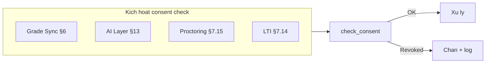

- **§6 Grade Sync:** thêm bước 6 trong pseudocode — `IF NOT check_consent(student, grade_sync_sis): SKIP + log`
- **§13 AI:** cloud proxy chỉ khi `ai_processing` consent active
- **§7.15 Proctoring:** snapshot webcam cần `video_recording`
- **§7.14 LTI:** launch cần `third_party_lti`

### 23.5. API — `erp.api.lms.compliance.*`

| Method | Auth | Mô tả |
|--------|------|--------|
| `list_my_consents` | User/PH | Danh sách consent của user/con |
| `grant_consent` | PH / HS ≥16 | Ký consent (versioned) |
| `revoke_consent` | PH / HS ≥16 | Thu hồi |
| `request_data_export` | User/PH | Yêu cầu export JSON/ZIP học tập |
| `request_data_deletion` | PH / Admin | Yêu cầu xóa khi HS rời trường |
| `list_audit_log` | Compliance Officer / Admin | Tra cứu audit (filter campus) |

Internal (không whitelist): `check_consent(user, consent_type)` — service layer.

### 23.6. Roles

| Role | Quyền |
|------|--------|
| **Compliance Officer** | Duyệt export/deletion request; xem toàn bộ audit log campus |
| **Admin** | Cấu hình `LMS Data Retention Policy` |
| **PH** | Grant/revoke consent cho con; request export |

### 23.7. Retention mặc định (đề xuất)

| Loại dữ liệu | Retention | Action |
|--------------|-----------|--------|
| `LMS Proctoring Recording` | 90 ngày | Delete object MinIO + anonymize metadata |
| `LMS Activity Log` | 2 năm học | Anonymize user_id |
| `LMS Submission` body | Theo campus policy | Archive hoặc delete sau N năm |
| `LMS Audit Log` | 5 năm | Không xóa (compliance) |

Cron: `lms.compliance.apply_retention_policies` — hàng đêm.

---

## 24. Wellbeing & SEL

> **Phase 11** (lồng K-12 Wellspring) · Trending K-12 2026 **G1** — Social-Emotional Learning, safeguarding, sức khỏe tinh thần học sinh.

### 24.1. Mục tiêu

- **Pulse check-in** — HS tự báo mood/energy (không bắt buộc, opt-in campus).
- **Safeguarding** — kênh báo cáo lo ngại (bullying, stress, …) — có thể ẩn danh.
- **Counselor workflow** — counselor xem, đặt lịch hẹn, ghi chú bảo mật.
- **Tài nguyên SEL** — thư viện nội dung theo độ tuổi (mental health, study skills, hotline).

### 24.2. DocTypes

| DocType | Field quan trọng |
|---------|------------------|
| `LMS Wellbeing Pulse` | `student_id`, `submitted_at`, `mood_score` (1–5), `energy_score` (1–5), `free_text`, `flagged`, `reviewed_by`, `campus_id` |
| `LMS Wellbeing Resource` | `title`, `category` (mental_health \| study_skills \| relationships \| hotline), `language`, `content_html`, `external_url`, `age_group`, `is_active` |
| `LMS Safeguarding Report` | `reporter_user` (nullable = anonymous), `concern_type`, `severity` (low \| medium \| high), `description`, `status`, `assigned_counselor`, `confidential_note`, `student_id` (optional) |
| `LMS Counselor Session` | `student_id`, `counselor_user`, `scheduled_at`, `mode` (online \| onsite), `meeting_url`, `notes_encrypted`, `status` |

### 24.3. Auto-flag & escalation

| Rule | Hành động |
|------|-----------|
| `mood_score` ≤ 2 **3 lần liên tiếp** (7 ngày) | `flagged=1` → notify counselor (Redis Stream) |
| Safeguarding `severity=high` | Notify counselor + Admin campus ngay |
| Anonymous report | Không hiện reporter trong UI thường; counselor queue riêng |

**Không** auto-thông báo GVCN chi tiết pulse — tránh stigma; GVCN chỉ thấy aggregate ẩn danh (dashboard).

### 24.4. Privacy & K-12

- **Counselor only** — pulse chi tiết, `notes_encrypted`, safeguarding notes.
- **GVCN / Teacher** — không xem free_text pulse; có thể thấy “HS cần follow-up” nếu counselor assign (tùy campus policy).
- **Observer (PH)** — không xem safeguarding reports của con (trừ khi counselor share).
- Feature flag: `LMS Settings.enable_wellbeing` per campus.
- PH consent: bật wellbeing khi HS < 16 tham gia pulse.

### 24.5. API — `erp.api.lms.wellbeing.*`

| Method | Auth | Mô tả |
|--------|------|--------|
| `submit_pulse` | Student | Gửi check-in |
| `list_resources` | User | Filter `age_group`, `language`, `category` |
| `report_concern` | User (anonymous OK) | Tạo safeguarding report |
| `list_counselor_slots` | Student/PH | Slot trống |
| `book_session` | Student/PH | Đặt lịch counselor |
| `get_wellbeing_dashboard` | Counselor/Admin | Mood trend aggregate (không PII chi tiết nếu < N) |
| `update_safeguarding_status` | Counselor | open → in_review → resolved |

### 24.6. Roles

| Role | Quyền |
|------|--------|
| **Counselor** | Toàn bộ pulse, safeguarding, sessions — trong campus phụ trách |
| **Student** | Submit pulse, report concern, book session |
| **PH** | Book session cho con (nếu policy cho phép) |

### 24.7. UI routes (LMS Portal)

| Route | Role |
|-------|------|
| `/student/wellbeing` | Pulse + resources |
| `/student/wellbeing/report` | Safeguarding form |
| `/counselor/dashboard` | Queue reports + flagged pulses |
| `/counselor/sessions` | Lịch hẹn |

Link từ §18 K-12: wellbeing là mảng đặc thù Wellspring, không có trên Canvas mặc định.

---

## 11. Phụ lục

### 11.1. Glossary

| Thuật ngữ | Ý nghĩa |
|-----------|---------|
| **Course** | Khóa học logic (môn) — có thể nhiều section |
| **Section** | Lớp học phần gắn `SIS Class` |
| **Module** | Đơn vị nội dung có thứ tự trong course |
| **Module Item** | Một mục trong module (video, quiz, …) |
| **Blueprint** | Khóa mẫu nhân bản nội dung |
| **Observer** | Phụ huynh xem read-only trên LMS Portal |
| **LMS Portal** | Frontend `lms.wellspring.edu.vn` — Student + Teacher + Observer |
| **Student Portal** | Không gian `/student/*` trong LMS Portal |
| **HLS** | HTTP Live Streaming — adaptive video |
| **Redis DB /0** | Cache, Socket.IO, notification streams |
| **Redis DB /1** | Frappe background queue (RQ) |
| **Redis DB /2** | LMS media transcode queue (BullMQ) |
| **SEB** | Safe Exam Browser — lockdown browser mã nguồn mở |
| **Proctoring Profile** | Bộ cấu hình giám sát thi (native / SEB / LTI) |
| **Integrity event** | Sự kiện nghi ngờ (đổi tab, thoát fullscreen, …) |
| **Redis DB /3** | AI jobs queue (BullMQ) |
| **Redis DB /4** | Live session state queue |
| **AI Tutor** | Chatbot RAG theo nội dung khóa |
| **SCORM** | Chuẩn gói học liệu e-learning 1.2/2004 |
| **H5P** | Interactive HTML5 content |
| **xAPI / LRS** | Learning Record Store — tracking chuẩn Tin Can |
| **ePortfolio** | Tập hợp sản phẩm học tập HS |
| **Mastery scale** | Thang đánh giá năng lực K-12 |
| **Catalog** | Danh mục khóa tự đăng ký |
| **ND13** | Nghị định 13/2023/NĐ-CP — bảo vệ dữ liệu cá nhân VN |
| **Data Retention** | Chính sách TTL / anonymize / delete theo loại dữ liệu |
| **Data Portability** | Quyền export dữ liệu học tập (ZIP/JSON) |
| **SEL** | Social-Emotional Learning — học kỹ năng cảm xúc xã hội |
| **Pulse** | Check-in mood/energy định kỳ của HS |
| **Safeguarding** | Báo cáo lo ngại an toàn (bullying, stress, …) |
| **Digest** | Gom thông báo gửi 1 lần/ngày hoặc/tuần |
| **Engagement Score** | Chỉ số 0–100 mức tham gia học tập async |
| **Quiet Hours** | Khung giờ không gửi push thông báo |
| **Counselor** | Nhân viên tư vấn tâm lý — role LMS riêng |

### 11.2. So sánh Canvas vs WIS LMS (scope)

| Canvas feature | WIS LMS | Phase |
|----------------|---------|-------|
| Modules | ✓ | 1 |
| Assignments | ✓ | 2 |
| Quizzes | ✓ | 3 |
| New Gradebook | ✓ (weighted) | 2–3 |
| SpeedGrader | ✓ | 3 |
| Rubrics | ✓ | 3 |
| Discussions | ✓ | 4 |
| Blueprint | ✓ | 5 |
| Mastery paths | ✓ | 4 |
| Outcomes | ✓ (SIS link) | 4 |
| Calendar | ✓ merge SIS | 4 |
| Analytics | ✓ | 6 |
| Inbox | ✓ | 6 |
| LTI 1.3 | ✓ | 6 |
| Studio video | ✓ (self-hosted HLS) | 0 |
| Proctoring native | ✓ | 3b |
| Safe Exam Browser | ✓ | 4b |
| LTI AI proctor | ○ tùy chọn | 6b |
| Live class | ✓ | 7 |
| AI tutor / auto-caption | ✓ | 7–12 |
| SCORM / H5P / xAPI | ✓ | 8 |
| Mobile app | ✓ | 9 |
| Credentials / badges | ✓ | 10 |
| Catalog self-enroll | ✓ | 10 |
| ePortfolio | ✓ | 10 |
| K-12 reading log / pacing | ✓ | 11 |
| Wellbeing / SEL / safeguarding | ✓ (Wellspring) | 11 |
| Compliance ND13 / consent | ✓ | 5 |
| Smart notifications / digest | ✓ | 6 |
| Engagement score (async) | ✓ | 6 |

### 11.3. Rủi ro

| Rủi ro | Giảm thiểu |
|--------|------------|
| Scope creep (Canvas = multi-year) | MVP gate từng phase |
| Grade sync conflict SIS | Approval + audit log + no overwrite mặc định |
| Discussion trùng social | LMS native, tách domain |
| Disk MinIO đầy | Alert + lifecycle raw bucket |
| Transcode backlog | VM3 workers / GPU |
| Proctoring false positive | Review queue; không auto-zero điểm |
| SEB chưa cài tại phòng thi | IT image chuẩn + practice quiz |
| AI hallucination / sai điểm | Không auto-post; GV review; local RAG ưu tiên |
| SCORM package lỗi / XSS | Sandbox iframe; scan manifest import |
| Mobile offline conflict | `conflicts_json` trong sync log; UI resolve |
| Scope creep Phase 7–12 | MVP gate; feature flag per campus |
| Wellbeing false positive flag | Counselor review queue; không auto-thông báo GVCN chi tiết |
| Consent thiếu khi sync SIS | `check_consent` hard block + audit log |
| Notification overload | Digest + quiet hours + mute categories |

### 11.4. So sánh media SaaS (tham khảo)

| Tiêu chí | Self-hosted | Managed SaaS |
|----------|-------------|--------------|
| Chi phí dài hạn | VM + disk | Per-minute + egress |
| Data residency | 100% riêng | Vendor |
| Tích hợp SIS | Native Frappe | Adapter |

---

## Changelog

| Ngày | Nội dung |
|------|----------|
| 2026-05-19 | Khởi tạo — media self-hosted, topology 2 VM |
| 2026-05-19 | Mở rộng nền tảng LMS tham chiếu Canvas: module map, data model, SIS integration, grade sync, roadmap phase 0–6 |
| 2026-05-19 | Tách frontend: LMS Portal `lms.wellspring.edu.vn` (Microsoft SSO, Student/Teacher/Observer routes); SIS thuần, không nhúng LMS |
| 2026-05-19 | Redis: máy chủ riêng `172.16.20.120` — DB/0 cache+streams, DB/1 Frappe queue, DB/2 LMS transcode |
| 2026-05-19 | Proctoring: nghiên cứu Canvas/SEB/LTI; lộ trình 3b native, 4b SEB, 6b LTI; DocTypes proctoring |
| 2026-05-20 | Mở rộng Phase 7–12: Live, AI, SCORM/H5P, Mobile, Accessibility, Credentials, K-12; §12–§19; Redis DB /3 /4 |
| 2026-05-20 | Tổng hợp kế hoạch LMS toàn diện vào file này: §0.6–0.7, §3.9–3.11, §20–22; mở rộng §12–§19; kiến trúc AI/Live; roadmap ước tính |
| 2026-05-20 | Bổ sung trending K-12 2026: **G9** Compliance [§23](#23-compliance--data-governance) Phase 5; **G7** Smart Notifications [§7.9](#79-announcements)/[§7.12](#712-analytics) Phase 6; **G1** Wellbeing [§24](#24-wellbeing--sel) Phase 11; tầm nhìn 8→11 nhóm |
