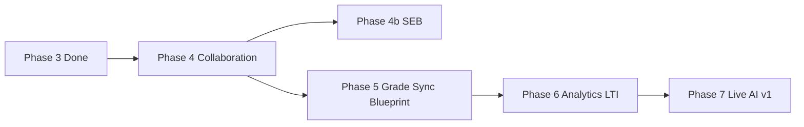

# LMS Phase 4–6 — Đánh giá hiện trạng

> Tài liệu review nội bộ trước khi mở rộng Phase 7–12.  
> Ngày: 2026-05-20

---

## 1. Tóm tắt

| Phase | Trạng thái thiết kế | Trạng thái code BE | DocTypes | API | Ghi chú |
|-------|---------------------|-------------------|----------|-----|---------|
| **0** Media | ✅ Done | ✅ Done | `LMS Video Asset` | `media.*`, `internal.*` | HLS, transcode, playback JWT |
| **1** Course shell | ✅ Done | ✅ Done | 10 DocTypes | `course`, `program`, `module`, `content`, `sync` | Enrollment sync cron 15 phút |
| **2** Assignment | ✅ Done | ✅ Done | 6 DocTypes | `assignment`, `gradebook`, `announcement` | Auto grade column khi tạo assignment |
| **3** Quiz | ✅ Done | ✅ Done | 5 DocTypes | `quiz`, `question` | 6 question types, auto-grade MCQ/T/F |
| **3b** Proctoring | ✅ Spec trong LMS-Design §7.15 | ❌ Chưa | 0 | 0 | Chờ Phase 3b |
| **4** Collaboration | ✅ Spec §7.8–7.12 | ✅ Done | 7 | discussion, group, calendar, outcome, mastery | Merge SIS TKB, mastery sau quiz |
| **4b** SEB | ✅ Spec §7.15.5 | ❌ Chưa | 0 | 0 | Phụ thuộc Phase 3 Quiz runtime |
| **5** Grade sync + Blueprint | ✅ Spec §6, §7.11 | ✅ Done | 5 | grade_sync, blueprint | Report Card / Homeroom / Class Log + audit |
| **6** Analytics, Inbox, LTI | ✅ Spec §7.12–7.14 | ❌ Chưa | 0 | 0 | LTI cần OIDC/JWKS infra |
| **6b** LTI Proctoring | ✅ Spec §7.15.6 | ❌ Chưa | 0 | 0 | Sau Phase 6 LTI |

**Kết luận:** Phase 0–3 đủ điều kiện MVP dạy-học cơ bản. Phase 4–6 **đã thiết kế đầy đủ** trong `LMS-Design.md` nhưng **chưa có DocType/API** — nên hoàn thành theo thứ tự 4 → 4b → 5 → 6 trước khi Phase 7+ (trừ nhu cầu kinh doanh khẩn Live class).

---

## 2. Chi tiết Phase 4 — Collaboration & Outcomes

### 2.1. DocTypes cần tạo (theo LMS-Design §3.6)

| DocType | Mục đích | Phụ thuộc |
|---------|----------|-----------|
| `LMS Discussion` | Forum theo course/section | Phase 1 Course |
| `LMS Discussion Entry` | Threaded replies | Discussion |
| `LMS Group` | Nhóm học tập | Section |
| `LMS Group Membership` | Thành viên nhóm | Group, Enrollment |
| `LMS Calendar Event` | Due, quiz, live session | Course, Section |
| `LMS Outcome` | Chuẩn đầu ra | Link `SIS Sub Curriculum` |
| `LMS Mastery Rule` | Conditional unlock module | Module, Outcome |

### 2.2. API dự kiến

- `erp.api.lms.discussion.*` — CRUD thread, post entry, pin/lock
- `erp.api.lms.group.*` — create, assign members, random split
- `erp.api.lms.calendar.get_merged_calendar` — merge LMS + SIS TKB
- `erp.api.lms.outcome.*` — align wizard, import từ SIS
- `erp.api.lms.mastery.evaluate_unlock` — job sau quiz submit

### 2.3. Rủi ro & checklist trước khi code

- [ ] Đọc doctype `SIS Sub Curriculum`, `SIS Student Timetable` trước khi viết API
- [ ] Xác nhận không trùng `social-service` class feed (đã quyết định LMS native)
- [ ] Notification events: `lms.discussion.reply`, `lms.calendar.reminder`

---

## 3. Chi tiết Phase 4b — Safe Exam Browser

### 3.1. Phụ thuộc

- Phase 3 Quiz attempt runtime ổn định trên LMS Portal
- Middleware verify header `X-SafeExamBrowser-RequestHash`

### 3.2. DocTypes (§3.8 proctoring subset)

- `LMS Proctoring Profile`, `LMS Quiz Proctoring`, `LMS Proctoring Session`, `LMS Proctoring Event`, `LMS Proctoring Flag`

### 3.3. Deliverable MVP

- Generate `.seb` / config URL
- Practice quiz không tính điểm
- Teacher review queue cơ bản

---

## 4. Chi tiết Phase 5 — Grade Sync SIS & Blueprint

### 4.1. DocTypes

| DocType | Mục đích |
|---------|----------|
| `LMS Grade Sync Rule` | Map cột LMS → SIS component |
| `LMS Grade Sync Log` | Audit từng lần push |
| `LMS Blueprint Course` | Template settings |
| `LMS Blueprint Sync Log` | Diff mỗi lần sync |

### 4.2. SIS APIs cần tích hợp (đọc doctype trước)

- `SIS Student Report Card` — `report_card/student_report.py`
- `SIS Class Log Score` — `class_log.py`
- `SIS Homeroom Score Record` — `homeroom_score.py`

### 4.3. Nguyên tắc không được vi phạm

1. Chỉ sync cột `sync_to_sis=1` và đã finalized
2. Conflict → log, không ghi đè mặc định
3. `LMS Settings.enable_grade_sync` per campus

---

## 5. Chi tiết Phase 6 — Analytics, Inbox, LTI

### 5.1. DocTypes

- `LMS Activity Log` (hoặc mở rộng) — page views, video %, submissions
- `LMS Conversation`, `LMS Message` — Inbox
- `LMS External Tool` — LTI 1.3 launch

### 5.2. Analytics MVP metrics

| Metric | Nguồn |
|--------|-------|
| Completion % | `LMS Course Progress` |
| Video watch % | `LMS Content Progress` |
| Submission rate | Assignments |
| Grade distribution | Gradebook aggregate |
| At-risk rule | inactive > N ngày OR score < threshold |

### 5.3. LTI prerequisites

- OIDC login flow
- JWKS endpoint
- Deep linking (optional phase 6.1)

---

## 6. Khuyến nghị thứ tự triển khai

**Ngoại lệ:** Nếu trường cần Live class trước học kỳ mới → chen **Phase 7 (Live only)** song song với Phase 5, không chờ Phase 6.

---

## 7. Gap so với "modern full LMS"

Các nhóm A–H (Live, AI, SCORM, Mobile, Accessibility, Assessment+, Credentials, K-12) được mô tả trong `LMS-Design.md` §12–§19 và `lms-phase-specs.md` — **không thay thế** Phase 4–6 mà **mở rộng sau**.

---

## Changelog

| Ngày | Nội dung |
|------|----------|
| 2026-05-20 | Khởi tạo review Phase 4–6 |
