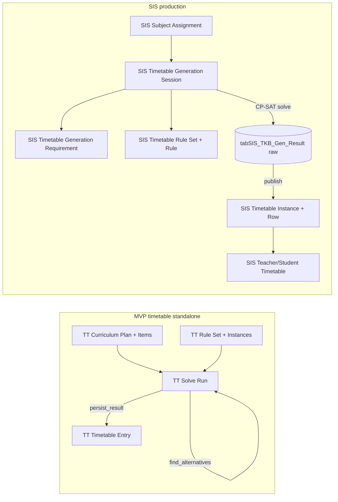
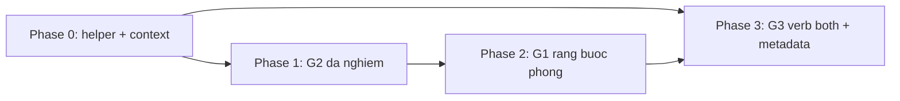

# Phân tích & đề xuất adapt MVP "auto-build-flow" vào hệ thống TKB hiện tại

> Tài liệu phân tích (không thay đổi code). Đối chiếu MVP `Timetable/docs/auto-build-flow.md`
> (app `timetable` standalone, doctype tiền tố `TT_*`) với subsystem auto-generate TKB đã
> hiện thực trong `erp/sis` (`apps/erp/erp/api/erp_sis/timetable/auto_generate/`).

---

## 1. Tóm tắt điều hành

MVP `auto-build-flow.md` mô tả một app Frappe độc lập tên `timetable` với các doctype tiền
tố `TT_*` và một solver CP-SAT (OR-Tools) chia thành 3 nhóm plugin rule
(`hard/` + `soft/` + `convertible/`).

Khảo sát hệ thống hiện tại cho thấy: **bản triển khai sản xuất của chính MVP này đã được port
sang module `sis`**, nằm tại `apps/erp/erp/api/erp_sis/timetable/auto_generate/`. Bản SIS:

- Dùng cùng biến quyết định `x[class, subject, day, period]` và cùng solver CP-SAT.
- Cũng dùng pattern S+V+O như MVP, nhưng đăng ký registry theo **verb** (primitive tái sử dụng)
  thay vì theo **rule** — 19 verb trong `core/verbs/` phục vụ 27 rule (xem mục 3.1). Chiều
  `hard`/`soft`/`convertible` chỉ là thuộc tính `kind`, không phải kiến trúc riêng.
- Có **27 rule mặc định** (`core/default_rules.py`), bộ doctype `SIS *` đầy đủ, frontend React,
  cơ chế draft → publish, và materialized view cho teacher/student.

**Kết luận**: SIS đã hiện thực ~90% nội dung MVP và ở vài điểm còn vượt MVP (đã có
`diagnose_infeasibility`, frontend React, tách draft/publish). Việc "adapt MVP vào hệ thống
hiện tại" **không phải là port lại từ đầu**, mà là lấp **4 gap** còn thiếu so với MVP:

| Gap | Tên | Ưu tiên |
|---|---|---|
| **G1** | Ràng buộc phòng thực thụ (room IntVar + room_type_match là hard) | Cao |
| **G2** | Đa nghiệm — Pareto-tied alternatives (`find_alternatives`) | Cao |
| **G3** | Catalog & metadata rule cho UI (đối chiếu độ đầy đủ) | Trung bình |
| **G4** | Xác nhận tương đương encoding "cặp tiết liên tiếp" khi số tiết/buổi lẻ | Thấp (đã tương đương) |

---

## 2. Bảng mapping khái niệm/doctype MVP ↔ SIS

### 2.1. Mapping doctype

| MVP (`TT_*`) | SIS (production) | Ghi chú khác biệt |
|---|---|---|
| `TT Class` | `SIS Class` | SIS gắn `campus_id` + `school_year_id` + `education_grade` + `academic_program` |
| `TT Subject` (đơn vị xếp) | `SIS Timetable Subject` | SIS tách thêm `SIS Subject` (bản map sang môn thực tế) và `SIS Actual Subject` (phân công GV) |
| `TT Teacher` | `SIS Teacher` (+ child `SIS Teacher Unavailability`) | Tương đương; SIS có `max_periods_per_day/week`, `max_consecutive_periods` |
| `TT Room` | `ERP Administrative Room` | SIS dùng doctype administrative dùng chung toàn ERP |
| `TT Curriculum Plan` + `req: C × S → N` | `SIS Timetable Generation Session` + `SIS Timetable Generation Requirement` | **Khác biệt lớn**: MVP `req` theo **(lớp, môn)**; SIS theo **(khối, môn TKB)** |
| `teacher_of: C × S → T` (chốt trước) | `SIS Subject Assignment` (`class_id`, `actual_subject_id`, `teacher_id`, `weekdays`) | SIS hỗ trợ **nhiều GV**/(lớp,môn) + giới hạn `weekdays` + date range |
| `TT Rule Set` | `SIS Timetable Rule Set` | Master, theo campus, `is_default` |
| `TT Rule Instance` | `SIS Timetable Rule` (child table) | Schema S+V+O: `verb` + `subject_type` + `subject_filter` + `params` + `kind` + `weight` |
| `TT Rule Catalog` | `core/rule_catalog.py` + `core/verb_schemas.py` (code-level) | SIS giữ catalog/metadata trong code thay vì doctype riêng |
| `TT Solve Run` | `SIS Timetable Generation Session` (status machine) + bảng raw `tabSIS_TKB_Gen_Result` (draft) | SIS tách config/run (session) khỏi draft (raw SQL) |
| `TT Solve Run` (variants, `parent_run`) | **(chưa có)** | Đây là **G2** |
| `TT Timetable Entry` | `SIS Timetable Instance` + child `SIS Timetable Instance Row` | SIS có thêm materialized `SIS Teacher Timetable` / `SIS Student Timetable` |
| pinned slot (qua rule) | `SIS Timetable Pinned Slot` (doctype riêng, Beta) | SIS tách doctype riêng + cờ `is_blocking` |

### 2.2. Mapping kiến trúc rule (xác nhận từ `Timetable/docs/rules.md`)

> Lưu ý: **cả hai hệ đều dùng pattern S+V+O** (MVP mô tả ở mục 3.1 của `auto-build-flow.md`,
> SIS để trong `SIS Timetable Rule`). Khác biệt không phải "S+V+O hay không", mà ở **đơn vị
> đăng ký registry**: MVP đăng ký theo **rule** (1 `rule_id` ↔ 1 class), SIS đăng ký theo
> **verb** (1 verb primitive ↔ N rule). Xem mục 3.1.

| MVP | SIS |
|---|---|
| Đơn vị registry = **rule** (1 `rule_id` ↔ 1 handler class) | Đơn vị registry = **verb** (1 primitive, nhiều `rule_id` dùng lại) |
| Tổ chức theo thư mục `solver/hard/* + soft/* + convertible/*` | Tổ chức phẳng `core/verbs/*.py` (`@register_verb`); kind là thuộc tính |
| `apply_as_hard` / `build_soft_penalty` (convertible) | `apply_hard(ctx, subjects, params)` / `build_soft(...) -> list` |
| `subject` + `subject_type` + `object` trong instance | `subject_type` + `subject_filter` (JSON) + `verb` + `params` |
| `TT Subject.is_heavy`, `force_pair` | `SIS Timetable Subject.is_heavy` + `SIS Timetable Generation Requirement.force_pair` |

### 2.3. Luồng dữ liệu hai hệ thống



---

## 3. Khác biệt kiến trúc solver

### 3.1. Mô hình plugin rule — S+V+O ở cả hai, khác ở đơn vị đăng ký

**Cả hai hệ đều có pattern S+V+O.** MVP mô tả ở mục 3.1 của `auto-build-flow.md`
(`TT Rule Instance`: Subject = entity, Verb = predicate, Object = value); SIS để trong
`SIS Timetable Rule` (`subject_type` + `verb` + `params`). Chiều `hard`/`soft`/`convertible`
**chỉ là thuộc tính "kind"** của rule, có mặt ở cả hai — không phải kiến trúc thay thế cho S+V+O:

- MVP thể hiện `kind` bằng cách chia thư mục (`solver/hard|soft|convertible/`) và 2 registry
  `HARD_RULES`/`SOFT_RULES` (convertible đăng ký vào **cả hai**, không phải registry thứ ba).
- SIS thể hiện `kind` bằng field `kind` + `allow_kind_override` trên `SIS Timetable Rule`.

**Khác biệt thực chất nằm ở đơn vị đăng ký của registry — tức mức độ tái sử dụng "verb":**

- **MVP**: đơn vị registry = **một rule**. Một `rule_id` ↔ một handler class. Logic ràng buộc
  và danh tính nghiệp vụ của rule dính liền trong cùng class. `class_no_overlap`,
  `teacher_no_overlap`, `room_no_overlap` là **ba handler riêng**.
- **SIS**: đơn vị registry = **một verb** (phép toán CP-SAT nguyên thuỷ — `core/registry.py`,
  `register_verb(verb_id, supports, kind)`). Một `rule_id` **không** phải class — nó là một dòng
  cấu hình `(verb + subject_type + params)`. **Nhiều `rule_id` dùng lại cùng một verb**; sự khác
  biệt giữa chúng được đẩy từ tầng *code* (subclass) xuống tầng *data* (`params`).

Bằng chứng từ `DEFAULT_RULE_SPECS` ([core/default_rules.py](../core/default_rules.py)) — 27 rule
nhưng chỉ 19 verb, vì nhiều rule chia sẻ chung một verb:

| Verb (primitive) | Các `rule_id` dùng lại | Biệt hoá bằng |
|---|---|---|
| `no_overlap` | `class_no_overlap`, `teacher_no_overlap`, `room_no_overlap` | `subject_type` (class/teacher/room) |
| `at_most_per_scope` | `subject_max_per_day`, `teacher_max_periods_per_day`, `teacher_max_periods_per_week`, `subject_max_n_per_day` | `params.scope` + `params.source` |
| `forbidden_at_slots` | `teacher_unavailable`, `teacher_not_at_slot` | `params.source` |
| `attribute_match` | `room_type_match`, `prefer_home_room` | `params.require` |
| `max_consecutive` | `limit_consecutive_teaching`, `teacher_max_consecutive` | `params.global` vs per-teacher |

**Hệ quả**: cùng một lượng tính năng, SIS cần ít handler hơn (19 verb vs ~27 class) và cho phép
định nghĩa rule mới **chỉ bằng cấu hình** (thêm dòng spec / dòng `SIS Timetable Rule`) nếu verb
đã đủ tổng quát — không phải viết code. Đổi lại, mỗi verb phải viết tổng quát hơn (rẽ nhánh theo
`subject_type`/`params`). Đây là định hướng kiến trúc mà **các đề xuất adapt ở mục 5 sẽ tuân theo**.

### 3.2. Biến quyết định

Cả hai dùng biến chính giống nhau. SIS ([core/variables.py](../core/variables.py)):

```text
x[(class_id, timetable_subject_id, day_of_week, period_idx)] in {0,1}
```

Khác biệt: MVP mô tả thêm **biến phòng** `room[c, σ]` là IntVar (index trong list rooms +
sentinel "không phòng"). SIS **chưa tạo biến phòng** (xem G1) — `variables.py` chỉ build
`room_index_map`/`room_list` nhưng không tạo IntVar quyết định.

### 3.3. Hướng objective

| | MVP | SIS |
|---|---|---|
| Hàm mục tiêu | `model.Minimize(sum(penalty_terms))` | `cp.Maximize(sum(objectives))` ([core/runner.py](../core/runner.py)) |
| Ý nghĩa soft rule | mỗi rule build **penalty** (≥0), nhân weight | mỗi verb build **bonus**, nhân weight |

Khác biệt về dấu này không ảnh hưởng tính đúng đắn, nhưng **cần lưu ý khi adapt G2** (pin
objective): MVP pin `objective == V_min`, SIS sẽ pin `objective == V_max`.

### 3.4. Convertible hard/soft per-instance — `kind` là cấu hình hạng nhất cho giáo vụ

> **Lưu ý quan trọng**: việc mục 3.1 gọi `kind` là "thuộc tính" chỉ nói về mặt *kiến trúc code*
> (không cần registry riêng). Về mặt **nghiệp vụ**, `hard`/`soft` vẫn phải là một **thuộc tính
> cấu hình hạng nhất** để giáo vụ tự setup — tuyệt đối không hardcode trong verb.

MVP đạt khả năng chọn hard/soft bằng class convertible. SIS đạt **tương đương và đã hiện thực
đầy đủ** bằng cơ chế cấu hình 3 tầng — đây chính là bề mặt setup cho giáo vụ:

1. **Tầng Rule Set (mặc định)**: mỗi dòng `SIS Timetable Rule` có field `kind` (`hard`/`soft`),
   `weight`, `enabled`, và `allow_kind_override`. Giáo vụ chỉnh trực tiếp trong rule set builder
   (frontend: `EditRuleSet.tsx`, `RuleParamsForm.tsx`, `InstanceEditor.tsx`).
2. **Tầng Session (override theo phiên)**: `SIS Timetable Generation Session.rule_overrides`
   (JSON) cho phép override `kind`/`weight`/`enabled` riêng cho từng phiên gen mà không sửa rule
   set gốc.
3. **Tầng solve**: `rule_loader.load_rule_set()` nạp cả hai → `RuleSet.effective()`
   ([core/dto.py](../core/dto.py)) áp override rồi mới sinh ràng buộc:

```text
kind = rule.kind
if ov.get("kind") in ("hard", "soft"):   # override từ session
    kind = ov["kind"]
weight = int(ov.get("weight", rule.weight))
```

→ Đây là **tương đương về năng lực** với convertible của MVP — **không cần adapt thêm về mặt
cấu hình**.

**Một lưu ý kỹ thuật (đề xuất rà soát, không bắt buộc)**: hiện `effective()` áp `ov["kind"]`
**không** kiểm tra `allow_kind_override`. Nghĩa là việc "chỉ rule cho phép mới được đổi hard↔soft"
phải được chặn ở tầng API/validation (`rule_set_validation.py` / `rule_api.py`) hoặc ở frontend.
Nếu muốn siết chặt, nên kiểm tra `allow_kind_override` ngay trong `effective()` để đảm bảo nhất
quán dù override đến từ nguồn nào.

#### Ví dụ cụ thể: giáo vụ nới "GV tối đa N tiết/ngày" từ hard sang soft cho tuần thi

Rule `teacher_max_periods_per_day` (verb `at_most_per_scope`) mặc định là **hard**. Trong tuần
thi, giáo vụ muốn cho phép GV dạy quá ngưỡng (vì lịch dày) nên nới thành **soft** — vẫn ưu tiên
không vượt ngưỡng nhưng không cấm tuyệt đối.

**Tầng 1 — Rule Set (mặc định, 1 dòng `SIS Timetable Rule`):**

```jsonc
{
  "rule_id": "teacher_max_periods_per_day",
  "verb": "at_most_per_scope",
  "subject_type": "teacher",
  "kind": "hard",                 // mặc định: cấm tuyệt đối
  "weight": 5,
  "params": { "scope": "day", "source": "teacher.max_periods_per_day" },
  "allow_kind_override": true,    // cho phép phiên gen đổi hard<->soft
  "enabled": true
}
```

**Tầng 2 — Session (override riêng cho phiên "Tuần thi HK1"):**

```jsonc
// SIS Timetable Generation Session.rule_overrides
{
  "teacher_max_periods_per_day": { "kind": "soft", "weight": 8 }
}
```

**Tầng 3 — Solve:** `effective()` sinh ra bản rule đã đổi `kind="soft"`, `weight=8`. Runner định
tuyến theo `kind` ([core/runner.py](../core/runner.py)):

```text
if rule.kind == "hard":
    verb.apply_hard(ctx, subject_set, rule.params)          # -> ctx.model.Add(sum(day_vars) <= limit)
else:
    objectives.extend(verb.build_soft(ctx, subject_set, rule.params, rule.weight))  # -> cộng vào Maximize
```

- Khi **hard**: `at_most_per_scope.apply_hard()` thêm ràng buộc cứng `sum(day_vars) <= limit`.
- Khi **soft**: lẽ ra phải cộng penalty/bonus cho việc vượt ngưỡng vào objective.

**Cảnh báo quan trọng (điều kiện để flip có tác dụng thật)**: cơ chế cấu hình ở trên chỉ đổi
*đường định tuyến*. Nó chỉ thực sự đổi hành vi nếu **verb hiện thực cả hai phía**. Hiện
`at_most_per_scope` mới có `apply_hard()`, **chưa có `build_soft()`** — nên nếu giáo vụ flip rule
này sang soft, kết quả là ràng buộc **biến mất hoàn toàn** (no-op), chứ không phải "ưu tiên mềm".
Tình trạng tương tự với `max_consecutive` (`build_soft()` trả `[]`).

→ **Hệ quả cho việc adapt**: với mỗi rule muốn cho giáo vụ chọn hard/soft (đặt `allow_kind_override=true`),
phải đảm bảo verb tương ứng hiện thực **đủ cả** `apply_hard()` lẫn `build_soft()`. Đây là một
hạng mục nên gộp vào **G3** (rà soát độ đầy đủ của verb/metadata): lập danh sách verb khai báo
`kind="both"` nhưng còn thiếu một phía, và bổ sung phía còn thiếu — đúng theo cách SIS (điền vào
verb có sẵn, không tạo class mới).

#### Tránh "double work": không phải verb nào cũng cần 2 nhánh

Cần phân biệt rõ để khỏi hiểu nhầm rằng mọi verb phải code 2 lần:

| Loại verb (`kind` lúc `register_verb`) | Số nhánh cần code | Ví dụ |
|---|---|---|
| `hard` (bản chất cứng) | chỉ `apply_hard()` | `no_overlap`, `exact_count_per_week`, `forbidden_at_slots` |
| `soft` (bản chất ưu tiên) | chỉ `build_soft()` | `avoid_gap`, `balance_workload`, `prefer_slot_range`, `spread_across_days` |
| `both` (convertible) | cả hai | `at_most_per_scope`, `max_consecutive` |

Đa số verb là hard-only hoặc soft-only → **một nhánh**. Chỉ nhóm `both` mới cần hai.

Và ngay cả với nhóm `both`, **phần đắt nhất (gom đúng tập biến `x[...]` trong phạm vi) là dùng
chung**; chỉ phần đuôi áp dụng là khác:
- hard: `model.Add(sum(vars) <= limit)`
- soft: tạo biến dôi `over >= sum(vars) - limit`, cộng `over * (-weight)` vào objective (SIS `Maximize`).

**Khuyến nghị (triệt tiêu lặp)**: đưa phần đuôi này vào **một helper primitive dùng chung** trong
[core/helpers.py](../core/helpers.py), để mọi verb kiểu "giới hạn" tái dùng — viết một lần, dùng mãi:

```python
def le_limit(ctx, vars_, limit, *, kind, weight, objectives, tag):
    """Ràng buộc sum(vars_) <= limit; áp cứng nếu kind='hard', phạt phần vượt nếu 'soft'."""
    if not vars_:
        return
    if kind == "hard":
        ctx.model.Add(sum(vars_) <= limit)
    else:
        over = ctx.model.NewIntVar(0, len(vars_), f"over_{tag}")
        ctx.model.Add(over >= sum(vars_) - limit)
        objectives.append(over * (-weight))
```

Khi đó verb `both` chỉ còn một đường code (gom biến → gọi `le_limit(..., kind=rule.kind)`), không
còn lặp logic giữa `apply_hard`/`build_soft`. Hạng mục này được đưa vào **G3** bên dưới.

---

## 4. Khác biệt mô hình dữ liệu

### 4.1. Số tiết/tuần: theo lớp (MVP) vs theo khối (SIS)

- **MVP**: `req: C × S → ℕ` — số tiết/tuần định nghĩa cho **từng cặp (lớp, môn)** trong
  `TT Curriculum Item`.
- **SIS**: `SIS Timetable Generation Requirement` định nghĩa `periods_per_week` cho **(khối,
  môn TKB)** — `req_map(inp)` trong [core/helpers.py](../core/helpers.py) khoá theo
  `(education_grade_id, timetable_subject_id)`.

**Hệ quả**: mọi lớp cùng khối dùng chung số tiết/môn. Nếu trường có nhu cầu khác nhau giữa các
lớp cùng khối (lớp chuyên, lớp tăng cường), mô hình SIS hiện tại **không biểu diễn được** ở mức
requirement. Đây là khác biệt thiết kế có chủ đích (giảm số dòng cấu hình), không phải lỗi —
tài liệu nêu để cân nhắc, không bắt buộc adapt.

### 4.2. Giáo viên: đơn (MVP) vs đa (SIS)

- **MVP**: `teacher_of: C × S → T` — đúng **một** GV/(lớp, môn), chốt trước, suy GV từ `x`.
- **SIS**: hỗ trợ **nhiều GV** qua `class_subject_teachers` (map `"{class}|{ts_id}" -> [teacher_ids]`)
  và child table `SIS Timetable Instance Row Teacher`. Khi gom ràng buộc no-overlap GV, SIS gom
  tất cả GV của (lớp, môn).

SIS rộng hơn MVP — không cần adapt.

### 4.3. Nguồn phân công

- **MVP**: phân công GV nằm ngay trong `TT Curriculum Item`.
- **SIS**: tách `SIS Subject Assignment` (`teacher_id` + `class_id` + `actual_subject_id` +
  `weekdays` + date range), join qua `SIS Subject.actual_subject_id` → `timetable_subject_id`.
  `weekdays` cho phép giới hạn GV chỉ dạy một số ngày (`class_subject_weekdays` trong helpers).

SIS rộng hơn MVP — không cần adapt.

---

## 5. Danh sách GAP cần adapt (MVP có, SIS thiếu)

> **Nguyên tắc adapt: theo cách của SIS, không bê nguyên cách "mỗi rule một class" của MVP.**
> Cụ thể:
> - Tái sử dụng/điền vào **verb có sẵn** (`no_overlap`, `attribute_match`, ...) thay vì tạo
>   handler class mới cho từng rule. Biệt hoá hành vi qua `params` + `subject_type`.
> - Rule mới (nếu cần) chỉ là **dòng cấu hình** trong `DEFAULT_RULE_SPECS` /
>   `SIS Timetable Rule`, trỏ vào verb — không phải code mới.
> - Logic không phải "ràng buộc theo S+V+O" (vd vòng lặp đa nghiệm) đặt ở tầng
>   runner/solver, **không** nhồi vào verb.
> - Giữ nguyên cách ly: input qua `data_collector`, draft ở `tabSIS_TKB_Gen_Result`,
>   publish qua `publisher.py`.

### G1 — Ràng buộc phòng thực thụ (ưu tiên Cao)

**Hiện trạng SIS**:
- `no_overlap` cho `room` là **no-op**: trong [core/verbs/no_overlap.py](../core/verbs/no_overlap.py)
  nhánh room chỉ có comment `# room: chưa có biến gán phòng trong CP-SAT — kiểm tra ở extract/diagnostics`.
- `room_type_match` (`attribute_match`, [core/verbs/attribute_match.py](../core/verbs/attribute_match.py)):
  `apply_hard()` là `pass` (chỉ validate trước solve); `build_soft()` chỉ xử lý `room==home_room`.
- Phòng được gán **hậu kỳ** trong [core/extract.py](../core/extract.py) qua `resolve_room_id()`
  ([core/helpers.py](../core/helpers.py)): chọn phòng đầu tiên khớp `room_type_required`, hoặc
  `class_info.room_id`.

**Khác biệt với MVP** (§2.1, §2.3 của `auto-build-flow.md`): MVP mô hình `room[c, σ]` là IntVar và
enforce `room_no_overlap` (mỗi phòng tối đa 1 lớp/slot) + `room_type_match`
(`AddAllowedAssignments([room_var], valid_indices).OnlyEnforceIf(x_var)`) như **ràng buộc cứng
trong solver**.

**Rủi ro của hiện trạng**: vì phòng gán sau khi solve, hai lớp có thể bị gán **trùng phòng**
cùng slot mà solver không hề biết — `room_no_overlap` trên thực tế **không được đảm bảo**.

**Đề xuất (theo cách SIS — điền vào verb có sẵn, không thêm rule class mới)**:
1. Thêm biến phòng `room[(class, day, period)]` là IntVar trong `create_variables()`
   ([core/variables.py](../core/variables.py)), **chỉ tạo khi có rule room được bật** (kiểm tra
   rule set có `no_overlap`/`room` hoặc `attribute_match` với `require=room_type==required`) để
   tránh phình mô hình — đúng tinh thần MVP §2.1.
2. **Điền vào verb `no_overlap` đã có** (giữ nguyên `verb_id`, `rule_id` `room_no_overlap` không
   đổi): hiện thực nhánh `room` (đang là no-op) — với mỗi slot và mỗi room index, tạo indicator
   và `AddAtMostOne`. Không tạo verb/class mới.
3. **Điền vào verb `attribute_match` đã có**: hiện thực `apply_hard()` (đang `pass`) cho
   `require=room_type==required` bằng `AddAllowedAssignments([room_var], valid_indices).OnlyEnforceIf(x_var)`.
   `rule_id` `room_type_match` giữ nguyên.
4. Cập nhật `extract_solution()` ([core/extract.py](../core/extract.py)) đọc giá trị `room_var`
   thay vì gán hậu kỳ qua `resolve_room_id`.

→ Kết quả: **không có doctype mới, không có verb mới, không có rule_id mới** — chỉ hoàn thiện 2
verb đang để trống + thêm biến. Đây là minh hoạ rõ nhất của "adapt theo cách SIS".

**Lưu ý quy mô**: thêm ~`|C| × |slot|` IntVar. Với trường nhỏ (≤20 lớp, 30 slot) là ~600 biến —
chấp nhận được (đúng như MVP §2.2 ước tính).

### G2 — Đa nghiệm (Pareto-tied alternatives) (ưu tiên Cao)

**Hiện trạng SIS**: không có cơ chế sinh biến thể. Một session chỉ tạo 1 draft trong
`tabSIS_TKB_Gen_Result`. Tìm kiếm `variant|alternative|find_alternat|objective_pin|forbid_solution`
trong `auto_generate/` không có kết quả.

**MVP §5**: thuật toán `find_alternatives()`:
- Pin objective `== V_min`.
- Cấm trùng nghiệm cũ + ràng buộc "khác ≥ D tiết": `model.Add(sum(same_vars) <= T - D)`.
- Lưu mỗi alternative thành `TT Solve Run` mới (`parent_run`, `is_variant`, `variant_index`).

**Đề xuất** (giữ kiến trúc SIS):
1. Trong [core/runner.py](../core/runner.py), bổ sung hàm `build_and_solve_variants(inp, rule_set, k, min_diff_ratio)`:
   - Solve lần đầu, lấy `V_max` (lưu ý SIS dùng `Maximize`, nên pin `objective == V_max`).
   - Vòng lặp K-1 lần: thêm ràng buộc pin objective + forbid nghiệm đã có + "khác ≥ D tiết"
     (`sum(same_vars) <= T - D`, `D = ceil(min_diff_ratio * T)`), solve lại đến khi infeasible.
2. Lưu biến thể: vì draft hiện là bảng raw `tabSIS_TKB_Gen_Result` khoá `(session_id, class_id,
   day, column)`, đề xuất **thêm cột `variant_index`** vào bảng draft (qua patch tương tự
   `create_timetable_generation_result_table.py`) thay vì tạo session con — đơn giản hơn và giữ
   cách ly. Preview/publish nhận thêm tham số `variant_index` (default 0 = nghiệm gốc).
3. API: thêm endpoint `generate_variants(session_id, k)` trong
   [api.py](../api.py) và nút "Sinh biến thể" trên `AutoGeneratePage.tsx`.

### G3 — Catalog & metadata rule cho UI (ưu tiên Trung bình)

**Hiện trạng SIS**: catalog/metadata rule nằm trong code (`core/rule_catalog.py`,
`core/verb_schemas.py`) thay vì doctype `TT Rule Catalog`. Frontend đã có `RuleParamsForm.tsx`,
`InstanceEditor.tsx`, `EntityPicker.tsx`.

**Đề xuất**: đối chiếu danh sách verb trong `verb_schemas.py` với bảng rule trong
`Timetable/docs/rules.md` để đảm bảo:
- Mỗi verb có đủ metadata cho UI (nhãn hiển thị, mô tả, schema object/params, đơn vị).
- Các convertible rule của MVP (vd `teacher_not_on_day` — MVP ghi chú "chưa có entry trong
  catalog seed") đã có schema tương ứng trong SIS.
- **Verb khai báo `kind="both"` phải hiện thực đủ cả `apply_hard()` lẫn `build_soft()`** (xem ví
  dụ mục 3.4). Hiện đã phát hiện `at_most_per_scope` và `max_consecutive` khai báo `both`/có
  `build_soft()` rỗng — nếu giáo vụ bật `allow_kind_override` rồi flip sang soft thì ràng buộc
  biến mất thay vì thành mềm. Cần lập danh sách verb thiếu phía soft (hoặc hard) và bổ sung phía
  còn thiếu, hoặc khoá `allow_kind_override=false` cho tới khi đủ.
- **Tạo helper primitive dùng chung để hoàn thiện phía soft mà không lặp code**: thêm
  `le_limit()` (và tương tự `ge_limit()`, `eq_count()` nếu cần) vào [core/helpers.py](../core/helpers.py)
  như mô tả ở mục 3.4. Sau đó refactor `at_most_per_scope`, `max_consecutive` để cả hai nhánh
  gọi chung helper — phần soft "miễn phí" vì dùng lại logic gom biến đã có. Đây là cách triệt
  tiêu "double work" đúng tinh thần SIS (primitive tái sử dụng).

Đây là việc rà soát/bổ sung metadata + hoàn thiện verb một phía qua helper chung,
**không thay đổi kiến trúc solver**. Mức độ adapt phụ thuộc kết quả đối chiếu chi tiết.

### G4 — Encoding "cặp tiết liên tiếp" khi số tiết/buổi lẻ (ưu tiên Thấp — đã tương đương)

**Đối chiếu**: MVP §2.3 chia slot trong buổi thành cặp `(σ_0, σ_1), ...`, ép `x[σ_2k] == x[σ_2k+1]`,
và nếu số tiết/buổi lẻ thì cấm slot cuối.

SIS `consecutive_required` ([core/verbs/consecutive_required.py](../core/verbs/consecutive_required.py))
đã hiện thực **đúng** kỹ thuật này: chia buổi `[(0, half), (half, num)]`, ép `va == vb` theo cặp,
và `if len(slots) % 2 == 1: Add(vl == 0)` cho slot lẻ cuối buổi.

**Kết luận**: đã tương đương. **Không cần adapt.** Ghi nhận để khẳng định tính đầy đủ.

---

## 6. Điểm SIS đã VƯỢT MVP (giữ nguyên, không đụng)

| Hạng mục | MVP | SIS |
|---|---|---|
| Diagnostics infeasible | §7 ghi "roadmap, chưa implement" | **Đã có** `diagnose_infeasibility()` ([core/diagnostics.py](../core/diagnostics.py)) — thử bỏ từng hard rule rồi solve lại để tìm rule xung đột |
| Hiển thị kết quả | Frappe www page server-side (`timetable_view`) | Frontend React (`AutoGeneratePage.tsx`, `WeeklyGridV2.tsx`, rule set builder) |
| Tách draft/publish | persist thẳng vào `TT Timetable Entry` | Tách **draft** (raw SQL `tabSIS_TKB_Gen_Result`) ↔ **publish** (`SIS Timetable Instance` + Row) qua [publisher.py](../publisher.py) |
| Materialized view | không có | `SIS Teacher Timetable` / `SIS Student Timetable` expand theo ngày để query nhanh |
| Phân công GV | 1 GV/(lớp,môn) | Nhiều GV + `weekdays` + date range qua `SIS Subject Assignment` |

---

## 7. Ma trận khuyến nghị ưu tiên

| Gap | Mức độ quan trọng | Độ phức tạp | Khuyến nghị |
|---|---|---|---|
| **G1** Ràng buộc phòng thực thụ | Cao (đảm bảo tính đúng `room_no_overlap`) | Trung bình–Cao (thêm IntVar + sửa extract) | **Adapt** — nếu trường thực sự cần xếp/chia phòng |
| **G2** Đa nghiệm (alternatives) | Cao (giá trị nghiệp vụ: cho user chọn lịch) | Trung bình (thêm vòng lặp solve + cột `variant_index`) | **Adapt** |
| **G3** Catalog & metadata rule | Trung bình (UX cấu hình rule) | Thấp–Trung bình (rà soát metadata) | **Cân nhắc** — làm sau khi đối chiếu chi tiết |
| **G4** Cặp tiết lẻ buổi | Thấp | — (đã tương đương) | **Bỏ qua** — đã hiện thực đúng |

**Thứ tự đề xuất**: G2 (giá trị nghiệp vụ cao, ít rủi ro) → G1 (đảm bảo đúng đắn phòng) →
G3 (polish UX). G4 chỉ ghi nhận.

---

## 8. Kế hoạch thực thi

Kế hoạch chia 4 phase, mỗi phase độc lập triển khai/test/merge được. Tất cả tuân nguyên tắc adapt
ở mục 5: tái dùng verb/registry có sẵn, rule là cấu hình, logic non-S+V+O đặt ở runner/solver,
giữ cách ly draft/publish.

### Nguyên tắc chung

- **Builder cách ly hoàn toàn với TKB chính thức.** Session + draft (`tabSIS_TKB_Gen_Result`)
  là sandbox; **chỉ khi admin confirm (publish)** mới sinh bản ghi `SIS Timetable` /
  `SIS Timetable Instance` / `Row` **mới** — không ghi đè TKB đang dùng (xem
  [publisher.py](../publisher.py): bắt buộc `status == "Completed"`, tạo header mới, xóa draft
  sau khi publish). Mọi thay đổi ở các phase dưới **không được phá vỡ ranh giới này**: kết quả
  solve/biến thể chỉ nằm ở draft cho tới bước publish.
- **Không** sửa kiến trúc solver, không thêm doctype trừ khi nêu rõ.
- Mỗi phase kèm test offline (pytest, không cần bench) trong `core/tests/`.
- Migrate DB bằng patch trong `apps/erp/erp/patches/v1_0/` + đăng ký vào `patches.txt`.
- Đọc DocType JSON trước khi viết API/patch đụng tới field (quy ước dự án).

### Phase 0 — Chuẩn bị nền (helper primitive + test fixtures)

Mục tiêu: dọn nền để các phase sau không lặp code.

| Việc | File | Ghi chú |
|---|---|---|
| Thêm `le_limit()` (+ `ge_limit`, `eq_count` nếu cần) | [core/helpers.py](../core/helpers.py) | Đóng gói "ràng buộc ≤/≥/= áp cứng hoặc phạt mềm" (mục 3.4) |
| Truyền `objectives` vào ngữ cảnh verb | [core/runner.py](../core/runner.py), [core/context.py](../core/context.py) | Để verb `build_soft` (và helper) cộng penalty thống nhất |
| Test helper | `core/tests/test_helpers.py` (mới) | Kiểm tra hard tạo constraint, soft tạo biến dôi + term objective |

Điều kiện hoàn thành: helper có test xanh; chưa đổi hành vi rule nào.

### Phase 1 — G2: Đa nghiệm (ưu tiên cao nhất, rủi ro thấp)

| Việc | File | Ghi chú |
|---|---|---|
| Hàm `build_and_solve_variants(inp, rule_set, k, min_diff_ratio)` | [core/runner.py](../core/runner.py) | Solve gốc → lấy `V_max`; lặp K-1: pin `objective == V_max` + forbid nghiệm cũ + `sum(same_vars) <= T - D` (`D = ceil(min_diff_ratio * T)`); dừng khi infeasible |
| Patch thêm cột `variant_index` (default 0) vào `tabSIS_TKB_Gen_Result` | `apps/erp/erp/patches/v1_0/add_variant_index_to_gen_result.py` (mới) + `patches.txt` | Theo mẫu `create_timetable_generation_result_table.py` |
| Lưu nhiều nghiệm theo `variant_index` | [solver.py](../solver.py) (`_save_results`) | Bulk insert kèm cột mới |
| Endpoint `generate_variants(session_id, k)` | [api.py](../api.py) | `frappe.enqueue` job; cập nhật `solver_stats` |
| Preview/publish nhận `variant_index` | [api.py](../api.py), [publisher.py](../publisher.py) | Default 0 = nghiệm gốc |
| Nút "Sinh biến thể" + chọn biến thể | `frappe-sis-frontend` `AutoGeneratePage.tsx` | Gọi endpoint mới, hiển thị danh sách biến thể |
| Test | `core/tests/test_variants.py` (mới) | Xác nhận K nghiệm khác nhau ≥ D tiết, cùng objective |

Điều kiện hoàn thành: từ 1 session sinh được ≥2 nghiệm cùng `V_max`, khác nhau ≥ ngưỡng; preview/publish chọn đúng biến thể.

### Phase 2 — G1: Ràng buộc phòng thực thụ

| Việc | File | Ghi chú |
|---|---|---|
| Cờ "có cần biến phòng?" (rule room bật) | [core/runner.py](../core/runner.py) | Quét rule set: `no_overlap` subject_type=room HOẶC `attribute_match` require room_type |
| Tạo IntVar `room[(class, day, period)]` có điều kiện | [core/variables.py](../core/variables.py) | Chỉ tạo khi cờ bật; domain = index phòng hợp lệ + sentinel |
| Hiện thực nhánh `room` của `no_overlap` | [core/verbs/no_overlap.py](../core/verbs/no_overlap.py) | Indicator `room_var == r_idx ∧ học` → `AddAtMostOne`/slot |
| Hiện thực `attribute_match.apply_hard` cho room_type | [core/verbs/attribute_match.py](../core/verbs/attribute_match.py) | `AddAllowedAssignments([room_var], valid_idx).OnlyEnforceIf(x_var)` |
| Đọc phòng từ `room_var` | [core/extract.py](../core/extract.py) | Thay `resolve_room_id` hậu kỳ (giữ fallback khi không bật) |
| Test | `core/tests/test_room.py` (mới) | 2 lớp cùng slot không trùng phòng; môn yêu cầu loại phòng được gán đúng |

Điều kiện hoàn thành: `room_no_overlap` được solver đảm bảo (không còn trùng phòng); mô hình không phình khi không bật rule room.

### Phase 3 — G3: Hoàn thiện verb `both` + metadata catalog

| Việc | File | Ghi chú |
|---|---|---|
| Lập danh sách verb `kind="both"` thiếu một phía | (rà soát) `core/verbs/*.py` | Đã biết: `at_most_per_scope`, `max_consecutive` thiếu soft |
| Refactor 2 verb trên dùng `le_limit` (Phase 0) | `core/verbs/at_most_per_scope.py`, `core/verbs/max_consecutive.py` | Gom biến 1 lần, đuôi hard/soft trong helper |
| Siết `allow_kind_override` trong `effective()` | [core/dto.py](../core/dto.py) | Bỏ qua override `kind` nếu rule không cho phép (tùy chọn) |
| Đối chiếu metadata verb với `Timetable/docs/rules.md` | [core/verb_schemas.py](../core/verb_schemas.py), [core/rule_catalog.py](../core/rule_catalog.py) | Bổ sung nhãn/đơn vị/schema còn thiếu |
| Test | `core/tests/test_kind_override.py` (mới) | Flip hard→soft thực sự đổi từ constraint sang penalty (không no-op) |

Điều kiện hoàn thành: mọi rule `allow_kind_override=true` flip được hai chiều có tác dụng thật; metadata đủ cho UI.

### G4 — không có việc

Đã tương đương (mục 5). Chỉ giữ test hiện có `core/tests/test_consecutive_required.py`.

### Sơ đồ thứ tự & phụ thuộc



Phase 0 là tiền đề cho G3; G2 độc lập (làm trước vì giá trị cao, rủi ro thấp); G1 sau G2 để tránh
xung đột khi cùng đụng `extract.py`/`runner.py`.

### Rủi ro & giảm thiểu

| Rủi ro | Giảm thiểu |
|---|---|
| Biến phòng (G1) làm phình mô hình, chậm solve | Chỉ tạo khi rule room bật; benchmark với trường mẫu trước/sau |
| Đa nghiệm (G2) tốn thời gian solve nhiều lần | Giới hạn `k` nhỏ (vd 3-5) + chia sẻ `time_limit` cho từng lần |
| Patch cột `variant_index` trên bảng raw | Default 0, backfill nghiệm hiện có = 0; idempotent |
| Flip kind no-op (G3) gây hiểu nhầm cho giáo vụ | Hoàn thiện verb `both` trước khi mở `allow_kind_override` trên UI |

---

## 9. Phụ lục — tham chiếu file

### Solver core (SIS)

| File | Vai trò |
|---|---|
| `auto_generate/solver.py` | Entry point CP-SAT, lưu `tabSIS_TKB_Gen_Result`, `run_solver()` cho background job |
| `auto_generate/core/runner.py` | Runner S+V+O, `build_and_solve()`, `solve_with_rules()`, objective `Maximize` |
| `auto_generate/core/variables.py` | Tạo biến `x[class, subject, day, period]` (chưa có biến phòng — G1) |
| `auto_generate/core/registry.py` | Verb registry `register_verb`, base class `Verb` |
| `auto_generate/core/default_rules.py` | 27 rule mặc định (`DEFAULT_RULE_SPECS`) |
| `auto_generate/core/extract.py` | Trích solution; gán phòng hậu kỳ (`resolve_room_id`) — G1 |
| `auto_generate/core/helpers.py` | `req_map` (khoá theo grade), `class_subject_weekdays`, `resolve_room_id` |
| `auto_generate/core/diagnostics.py` | `diagnose_infeasibility()` (vượt MVP §7) |
| `auto_generate/core/verbs/no_overlap.py` | `no_overlap` cho class/teacher; room là no-op — G1 |
| `auto_generate/core/verbs/attribute_match.py` | `room_type_match` (hard = pass), `room==home_room` (soft) — G1 |
| `auto_generate/core/verbs/consecutive_required.py` | Cặp tiết liên tiếp + slot lẻ cuối buổi — G4 (đã đúng) |
| `auto_generate/data_collector.py` | Thu thập input từ session + doctype |
| `auto_generate/publisher.py` | Publish draft → Instance/Row + sync materialized view |
| `auto_generate/api.py` | REST API (create/validate/generate/preview/publish/discard/diagnose) |
| `auto_generate/rule_loader.py` | Load Rule Set từ DB → DTO |

### Doctype SIS liên quan

`SIS Timetable Generation Session`, `SIS Timetable Generation Requirement`,
`SIS Timetable Rule Set`, `SIS Timetable Rule`, `SIS Timetable Pinned Slot`,
`SIS Timetable`, `SIS Timetable Instance`, `SIS Timetable Instance Row`,
`SIS Timetable Instance Row Teacher`, `SIS Timetable Subject`, `SIS Subject`,
`SIS Actual Subject`, `SIS Subject Assignment`, `SIS Teacher`, `SIS Teacher Unavailability`,
`SIS Timetable Column`, `SIS Schedule`, `SIS Teacher Timetable`, `SIS Student Timetable`.

### Tài liệu MVP nguồn

- `Timetable/docs/auto-build-flow.md` — luồng solver tổng thể.
- `Timetable/docs/rules.md` — danh sách rule + mapping TT → SIS (mục "Port sang SIS").
- `Timetable/docs/doctypes.md`, `Timetable/docs/architecture.md`.
