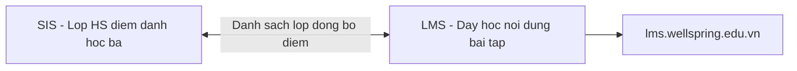
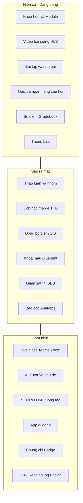
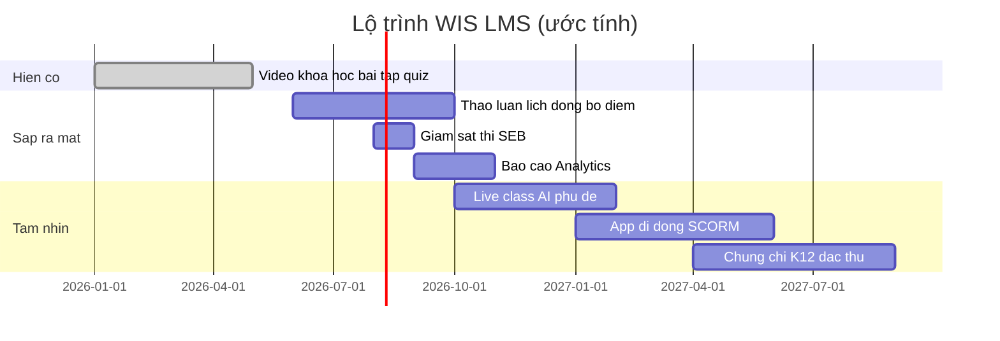

# WIS LMS — Nền tảng học tập số Wellspring

> **Tài liệu giới thiệu** dành cho Ban giám hiệu, Tổ trưởng chuyên môn, Giáo viên, Phụ huynh và Học sinh.  
> Không chứa hướng dẫn kỹ thuật — chi tiết hệ thống xem [`LMS-Design.md`](LMS-Design.md).

**Truy cập:** [https://lms.wellspring.edu.vn](https://lms.wellspring.edu.vn)  
**Đăng nhập:** Tài khoản Microsoft của trường (cùng email đã dùng cho Office 365)

---

## Mục lục

1. [Giới thiệu — WIS LMS là gì?](#1-giới-thiệu--wis-lms-là-gì)
2. [Lợi ích theo vai trò](#2-lợi-ích-theo-vai-trò)
3. [Toàn cảnh tính năng](#3-toàn-cảnh-tính-năng)
4. [Tính năng chi tiết](#4-tính-năng-chi-tiết)
5. [Tình huống sử dụng thực tế](#5-tình-huống-sử-dụng-thực-tế)
6. [Trải nghiệm theo từng vai trò](#6-trải-nghiệm-theo-từng-vai-trò)
7. [An toàn, bảo mật & quyền riêng tư](#7-an-toàn-bảo-mật--quyền-riêng-tư)
8. [Tích hợp & mở rộng](#8-tích-hợp--mở-rộng)
9. [So sánh với các nền tảng phổ biến](#9-so-sánh-với-các-nền-tảng-phổ-biến)
10. [Lộ trình triển khai](#10-lộ-trình-triển-khai)
11. [Câu hỏi thường gặp (FAQ)](#11-câu-hỏi-thường-gặp-faq)
12. [Hỗ trợ & đào tạo](#12-hỗ-trợ--đào-tạo)
- [Phụ lục: Thuật ngữ](#phụ-lục-thuật-ngữ)

---

## 1. Giới thiệu — WIS LMS là gì?

### WIS LMS là gì?

**WIS LMS** (Learning Management System — Hệ thống quản lý học tập) là **lớp học số** của trường Wellspring, xây dựng trên nền hệ thống **SIS** (quản lý học sinh, lớp, điểm, học bạ) mà trường đang dùng.

Giáo viên có thể:
- Tổ chức bài học theo **tuần / chủ đề** (gọi là **Module**)
- Gắn **video bài giảng**, tài liệu đọc, bài tập, bài kiểm tra
- Chấm điểm, gửi thông báo, theo dõi tiến độ từng học sinh

Học sinh có thể:
- Vào một cổng duy nhất để xem bài, nộp bài, làm quiz, xem điểm
- Học trên máy tính hoặc (sắp tới) trên điện thoại

Phụ huynh có thể:
- Theo dõi tiến độ học tập của con ở chế độ **chỉ xem** (không nộp bài, không làm thay)

### Vấn đề hiện tại mà LMS giải quyết

| Vấn đề | Cách LMS hỗ trợ |
|--------|-----------------|
| Học liệu rời rạc (Drive, Zalo, email, giấy) | Một khóa học — một nơi: video, bài đọc, bài tập |
| Điểm bài tập LMS và điểm học bạ tách rời | Đồng bộ có chọn lọc sang SIS sau khi giáo viên chốt điểm |
| Danh sách lớp cập nhật thủ công | Tự đồng bộ học sinh từ SIS mỗi 15 phút |
| Video nặng, khó xem trên mạng yếu | Video phát **HLS** (tự điều chỉnh chất lượng), lưu trên máy chủ trường |
| Thi online dễ gian lận | Giám sát thi nhiều lớp: từ cảnh báo chuyển tab đến trình duyệt khóa (SEB) |
| Không có lớp học trực tuyến thống nhất | Tích hợp Teams / Zoom ngay trong lịch khóa học (sắp ra mắt) |

### Tầm nhìn

WIS LMS hướng tới **nền tảng học tập toàn diện** cho trường K-12 quốc tế: không chỉ “đặt bài trên web” mà còn có **lớp live**, **trợ lý AI**, **học liệu tương tác**, **chứng chỉ**, **ứng dụng di động** — tất cả gắn chặt với dữ liệu SIS của trường.

> **Lưu ý:** LMS và SIS là **hai ứng dụng riêng**. Giáo viên làm việc hành chính (điểm danh, học bạ) trên SIS; dạy học nội dung trên LMS. Hai hệ thống liên kết với nhau, không trùng lặp giao diện.

---

## 2. Lợi ích theo vai trò

### Cho Ban giám hiệu

- **Một nguồn dữ liệu:** Học sinh, lớp, môn lấy từ SIS — không nhập lại danh sách.
- **Kiểm soát chất lượng:** Báo cáo tiến độ, tỷ lệ nộp bài, học sinh có nguy cơ chậm tiến độ (sắp ra mắt).
- **Dữ liệu trong trường:** Video và bài thi lưu trên hạ tầng Wellspring, không phụ thuộc Google/Microsoft cho nội dung khóa học.
- **Lộ trình rõ:** Triển khai từng giai đoạn, không “big bang” một lần.

### Cho Tổ trưởng chuyên môn

- **Khóa mẫu (Blueprint):** Soạn một khóa chuẩn, nhân bản sang 6–8 lớp cùng khối — đồng bộ chương trình giữa các lớp.
- **Chuẩn đầu ra (Outcomes):** Gắn tiêu chí đánh giá với khung chương trình SIS.
- **Đồng bộ điểm:** Điểm formative trên LMS có thể đẩy vào Class Log / học bạ sau quy trình duyệt.

### Cho Giáo viên

- **Tiết kiệm thời gian:** Giao bài, thu bài, chấm điểm, gửi thông báo trong một màn hình.
- **SpeedGrader:** Xem bài nộp liên tiếp, chấm nhanh kèm rubric (tiêu chí chấm).
- **Quiz tự chấm:** Trắc nghiệm chấm tự động; tự luận chấm tay hoặc gợi ý từ AI (tầm nhìn).
- **Video chất lượng cao:** Upload một lần, học sinh xem mượt trên nhiều thiết bị.

### Cho Học sinh

- **Một cổng học tập:** Biết hôm nay học gì, hạn nộp bài nào, điểm bao nhiêu.
- **Học theo tiến độ:** Module mở dần — hoàn thành bài trước mới mở bài sau (nếu giáo viên bật).
- **Phản hồi nhanh:** Thông báo khi có điểm mới, deadline sắp tới.
- **Cá nhân hóa (tầm nhìn):** AI Tutor giải thích thêm, phụ đề video, học offline trên app.

### Cho Phụ huynh

- **Minh bạch:** Xem con đang học module nào, tiến độ bao nhiêu phần trăm.
- **Không làm thay con:** Chế độ Observer — chỉ xem, không nộp bài, không thấy đáp án bài thi đang diễn ra.
- **Một tài khoản Microsoft:** Đăng nhập giống email trường đã cấp.

---

## 3. Toàn cảnh tính năng

### Sơ đồ tổng quan

### Bảng tính năng theo nhóm

| Nhóm | Tính năng chính | Trạng thái |
|------|-----------------|------------|
| **Khóa học & nội dung** | Course, Section, Module, Page, File, Video | [Hiện có] |
| **Bài tập & chấm điểm** | Assignment, Submission, Gradebook, Rubric | [Hiện có] |
| **Kiểm tra** | Quiz, Question Bank, 6 loại câu hỏi | [Hiện có] |
| **Cộng tác** | Discussion, Group, Calendar, Announcement | [Sắp ra mắt] |
| **Đồng bộ SIS** | Enrollment, Grade sync, Blueprint | [Sắp ra mắt] |
| **Giám sát thi** | Integrity log, Safe Exam Browser | [Sắp ra mắt] |
| **Lớp trực tuyến** | Teams, Zoom, ghi hình, điểm danh live | [Tầm nhìn] |
| **AI** | Tutor, phụ đề tự động, gợi ý chấm bài | [Tầm nhìn] |
| **Học liệu chuẩn** | SCORM, H5P tương tác | [Tầm nhìn] |
| **Di động** | App HS / GV / PH, học offline | [Tầm nhìn] |
| **Chứng chỉ & danh mục** | Certificate, Badge, Catalog tự đăng ký | [Tầm nhìn] |
| **K-12 Wellspring** | Reading log, Pacing, PH-GV meeting | [Tầm nhìn] |
| **Tuân thủ dữ liệu (ND13)** | Consent PH, export dữ liệu, audit | [Sắp ra mắt] |
| **Thông báo thông minh** | Digest hàng ngày, giờ yên lặng | [Sắp ra mắt] |
| **Sức khỏe tinh thần (SEL)** | Pulse check-in, counselor, safeguarding | [Tầm nhìn] |

**Chú thích trạng thái:**
- **[Hiện có]** — Đã triển khai backend, sẵn sàng qua LMS Portal
- **[Sắp ra mắt]** — Đã thiết kế, đang lên lịch triển khai (ước tính 2026)
- **[Tầm nhìn]** — Trong roadmap dài hạn sau khi hoàn tính năng cốt lõi

---

## 4. Tính năng chi tiết

Mỗi mục gồm: **Mô tả** → **Lợi ích** → **Ví dụ tình huống**.

---

### 4.1. Khóa học & Module (Course, Section, Module)

**Mô tả**  
Mỗi **môn học** trên LMS là một **Khóa học (Course)**. Mỗi **lớp** (8A1, 8A2…) là một **Lớp học phần (Section)** gắn với lớp trên SIS. Trong khóa, giáo viên sắp xếp bài học thành các **Module** (vd. Tuần 1, Tuần 2) — mỗi module chứa video, bài đọc, bài tập, quiz.

**Lợi ích**
- Học sinh thấy lộ trình rõ ràng, không lạc trong hàng chục file rời.
- Giáo viên mở khóa từng phần theo tuần (publish / unlock).
- Có thể bắt học sinh hoàn thành bài trước mới mở bài sau.

**Ví dụ**  
Cô Lan dạy Toán 8 — tạo khóa “Toán 8 - Học kỳ II”, gắn 4 section (8A1–8A4). Tuần 1: Module “Phương trình bậc nhất” gồm video 15 phút, 1 trang tóm tắt, 1 bài tập về nhà.

*Chi tiết kỹ thuật: [LMS-Design.md §7.1](LMS-Design.md)* · **[Hiện có]**

---

### 4.2. Học liệu (Page, File, Video, SCORM, H5P)

**Mô tả**  
- **Trang (Page):** Bài đọc, syllabus, hướng dẫn — soạn như Word trên web.  
- **Tệp (File):** PDF, slide, tài liệu đính kèm.  
- **Video:** Bài giảng quay sẵn — phát chất lượng tự động (360p / 720p / 1080p).  
- **SCORM / H5P (tầm nhìn):** Gói học liệu tương tác mua từ nhà xuất bản hoặc tự làm.

**Lợi ích**
- Video không lag vì lưu trên máy chủ trường, không upload lên YouTube công khai.
- Một video dùng cho nhiều lớp, nhiều năm.
- Học liệu tương tác (H5P) tăng hứng thú học tập.

**Ví dụ**  
Thầy Minh upload video “Giới thiệu Dao động điều hòa” 40 phút. Hệ thống tự xử lý; học sinh 8A1 xem trên điện thoại 4G vẫn mượt nhờ chất lượng thấp tự chuyển.

*Chi tiết kỹ thuật: [LMS-Design.md §9](LMS-Design.md)* · **Video [Hiện có]** · **SCORM/H5P [Tầm nhìn]**

---

### 4.3. Bài tập & nộp bài (Assignment)

**Mô tả**  
Giáo viên tạo **bài tập** có hạn nộp, điểm tối đa. Học sinh nộp bài dạng: văn bản, file, link, hoặc (sắp tới) video/audio. Giáo viên chấm và nhận xét; điểm tự vào **sổ điểm (Gradebook)**.

**Lợi ích**
- Không thu bài qua email/Zalo — có nhật ký ai nộp, nộp muộn.
- Chấm hàng loạt nhanh với SpeedGrader.
- Trừ điểm nộp muộn theo quy định (sắp ra mắt).

**Ví dụ**  
HS nộp bài “Báo cáo thí nghiệm” trước 23:59 Chủ nhật. Thứ Hai cô xem 32 bài trên một màn hình, chấm điểm + comment “Cần bổ sung phần kết luận”.

*Chi tiết kỹ thuật: [LMS-Design.md §7.4](LMS-Design.md)* · **[Hiện có]**

---

### 4.4. Kiểm tra & đánh giá (Quiz, Question Bank)

**Mô tả**  
**Quiz** là bài kiểm tra trên máy: trắc nghiệm, đúng/sai, điền ngắn, tự luận, ghép cặp, số học. **Ngân hàng câu hỏi** giúp giáo viên lưu câu dùng lại nhiều năm; mỗi lần thi có thể xáo câu / xáo đáp án.

**Lợi ích**
- Trắc nghiệm chấm tức thì — học sinh biết kết quả ngay (nếu GV cho phép).
- Giới hạn thời gian — hết giờ tự nộp bài.
- Giảm lộ đề nhờ ngân hàng câu lớn + random.

**Ví dụ**  
Kiểm tra 15 phút 10 câu Toán: GV bật timer, shuffle câu. 28/30 HS làm xong; 2 câu tự luận GV chấm tay trong 10 phút.

*Chi tiết kỹ thuật: [LMS-Design.md §7.5](LMS-Design.md)* · **[Hiện có]** · **15+ loại câu [Tầm nhìn]**

---

### 4.5. Sổ điểm & đồng bộ học bạ (Gradebook, Grade Sync)

**Mô tả**  
**Gradebook** là bảng điểm lớp: mỗi cột là một bài tập, quiz, hoặc cột điểm tay. Có trọng số nhóm (vd. 30% vườn ươm + 70% thi). Điểm có thể **ẩn (mute)** cho đến khi GV công bố.

**Đồng bộ SIS (sắp ra mắt):** Sau khi GV chốt điểm, điểm formative có thể đẩy sang **Class Log** hoặc **học bạ** trên SIS — có người duyệt, có nhật ký.

**Lợi ích**
- HS và PH thấy điểm đã công bố, không thấy điểm nháp.
- BGH kiểm soát: không tự động ghi đè điểm SIS.
- Giảm nhập điểm hai lần (LMS + SIS).

**Ví dụ**  
Điểm quiz Tuần 5 đồng bộ sang Class Log môn Toán sau khi Tổ trưởng duyệt — PH thấy trên parent-portal và học bạ thống nhất.

*Chi tiết kỹ thuật: [LMS-Design.md §6](LMS-Design.md)* · **Gradebook [Hiện có]** · **Sync SIS [Sắp ra mắt]**

---

### 4.6. Giám sát thi (Proctoring)

**Mô tả**  
Cho bài thi quan trọng (giữa kỳ, cuối kỳ), LMS hỗ trợ nhiều mức bảo mật:
1. **Cơ bản:** Mã vào đề, giới hạn thời gian, xáo câu, ghi nhận chuyển tab.
2. **SEB (Safe Exam Browser):** Học sinh chỉ mở được trình duyệt thi — không mở tab khác (phòng máy).
3. **LTI Proctoring (tùy chọn):** Camera + AI cảnh báo (cần consent phụ huynh).

**Lợi ích**
- Tăng độ tin cậy thi tại trường và thi online.
- GV có báo cáo “hành vi đáng chú ý” để review, không tự động trừ điểm oan.

**Ví dụ**  
Thi Toán cuối kỳ tại phòng máy: HS mở file `.seb`, làm bài 90 phút. Hệ thống ghi 2 lần rời tab — GV xem và hỏi HS sau giờ thi.

*Chi tiết kỹ thuật: [LMS-Design.md §7.15](LMS-Design.md)* · **[Sắp ra mắt]**

---

### 4.7. Thảo luận & nhóm học (Discussion, Group, Inbox)

**Mô tả**  
- **Thảo luận:** Diễn đàn theo chủ đề trong khóa — HS đăng, GV moderat. Có thể tính điểm thảo luận.  
- **Nhóm:** Chia nhóm cho bài tập nhóm — một nhóm nộp một bài.  
- **Hộp thư (Inbox):** Nhắn tin trong phạm vi khóa (sắp ra mắt).

**Lợi ích**
- Thay thế nhóm Zalo lớp cho nội dung học tập chính thức.
- GV kiểm soát nội dung, pin bài quan trọng.

**Ví dụ**  
Module “Văn học nước ngoài”: HS thảo luận “Ý nghĩa hình ảnh lá cờ trong truyện” — GV pin 2 bài hay làm mẫu.

*Chi tiết kỹ thuật: [LMS-Design.md §7.8–7.10](LMS-Design.md)* · **[Sắp ra mắt]**

---

### 4.8. Lịch & thông báo (Calendar, Announcement)

**Mô tả**  
- **Thông báo:** GV đăng tin khóa học — “Nhắc nộp bài Tuần 3”, “Đổi lịch kiểm tra”.  
- **Lịch:** Hiển thị deadline bài tập, quiz **và** tiết học trên thời khóa biểu SIS (một màn hình).

**Lợi ích**
- HS không bỏ lỡ deadline.
- Push thông báo qua app thông báo trường (khi bật).
- **Thông báo thông minh:** gom tin không khẩn vào **bản tóm tắt sáng**; tôn trọng **giờ yên lặng** (không làm phiền HS ban đêm).

**Ví dụ**  
Sáng thứ Hai HS mở LMS thấy: 10:00 tiết Anh (SIS), 23:59 hạn nộp bài Khoa học (LMS). Thay vì 8 push đêm, HS nhận **1 digest lúc 7:00** gom deadline và thông báo lớp.

*Chi tiết kỹ thuật: [LMS-Design.md §7.9](LMS-Design.md)* · **Announcement [Hiện có]** · **Smart digest [Sắp ra mắt]** · **Calendar merge [Sắp ra mắt]**

---

### 4.9. Lớp học trực tuyến (Live Class)

**Mô tả**  
Giáo viên tạo **buổi học trực tuyến** gắn khóa học — tích hợp **Microsoft Teams** (ưu tiên), Zoom, hoặc Google Meet. Học sinh bấm “Tham gia” từ LMS. Buổi học có thể **ghi hình** và đưa vào module như video bài giảng.

**Lợi ích**
- Ngày nghỉ bão / HS ốm vẫn học được.
- Một link thống nhất — không gửi link Teams rời qua chat.
- Điểm danh live có thể đồng bộ SIS.

**Ví dụ**  
Mưa bão không đến trường: GV mở live 45 phút trên Teams từ LMS; 25/28 HS tham gia; recording gắn vào Module Tuần 7.

*Chi tiết kỹ thuật: [LMS-Design.md §12](LMS-Design.md)* · **[Tầm nhìn]**

---

### 4.10. AI trợ giảng (AI Tutor, phụ đề, gợi ý chấm)

**Mô tả**  
- **AI Tutor:** Học sinh hỏi trong khóa — AI trả lời dựa trên bài giảng, không bịa đề thi.  
- **Phụ đề tự động:** Video có phụ đề tiếng Việt/Anh.  
- **Gợi ý chấm tự luận:** AI đề xuất điểm theo rubric — **giáo viên quyết định cuối**, không tự ghi điểm.

**Lợi ích**
- HS ôn tập ngoài giờ có “người hỏi” 24/7 (trong phạm vi nội dung khóa).
- GV tiết kiệm thời gian chấm tự luận dài.
- Dữ liệu ưu tiên xử lý trên máy chủ trường.

**Ví dụ**  
HS xem video Vật lý, bật phụ đề, hỏi AI Tutor “Giải thích định luật II Newton bằng ví dụ đời sống” — nhận câu trả lời kèm trích dẫn đoạn video.

*Chi tiết kỹ thuật: [LMS-Design.md §13](LMS-Design.md)* · **[Tầm nhìn]**

---

### 4.11. Tiêu chuẩn nội dung (SCORM, H5P)

**Mô tả**  
Nhập **gói học liệu chuẩn** (SCORM) từ nhà xuất bản hoặc tạo **bài tương tác H5P** (kéo thả, video tương tác, trắc nghiệm nhúng).

**Lợi ích**
- Tận dụng tài nguyên đã mua (sách điện tử, lab ảo).
- Bài học sinh động hơn slide tĩnh.

**Ví dụ**  
Bộ STEM mua SCORM “Thí nghiệm ảo mạch điện” — upload một lần, gắn vào Module Tuần 4 cho cả khối 9.

*Chi tiết kỹ thuật: [LMS-Design.md §14](LMS-Design.md)* · **[Tầm nhìn]**

---

### 4.12. Ứng dụng di động (Mobile App)

**Mô tả**  
Ứng dụng riêng cho **học sinh**, **giáo viên**, **phụ huynh** — xem khóa, làm quiz, nộp bài, nhận thông báo. Hỗ trợ **tải bài học offline** khi mạng yếu.

**Lợi ích**
- PH và HS dùng điện thoại quen thuộc, không bắt buộc laptop.
- Thông báo deadline ngay trên màn hình khóa.

**Ví dụ**  
Trên xe bus, HS xem lại video đã tải sẵn; về nhà WiFi tự đồng bộ tiến độ “đã xem 80%”.

*Chi tiết kỹ thuật: [LMS-Design.md §15](LMS-Design.md)* · **[Tầm nhìn]**

---

### 4.13. Chứng chỉ, huy hiệu & ePortfolio

**Mô tả**  
- **Chứng chỉ:** Tự cấp khi hoàn thành khóa (CLB, ngoại khóa, PD giáo viên) — PDF có mã xác minh.  
- **Huy hiệu (Badge):** Ghi nhận thành tích nhỏ.  
- **ePortfolio:** Học sinh gom bài hay, chia sẻ link cho PH / trường đại học (tầm nhìn).

**Lợi ích**
- Ghi nhận học tập ngoài chương trình chính.
- Minh bạch chứng chỉ — ai cũng verify được online.

**Ví dụ**  
Khóa “Lập trình Python cơ bản” 8 tuần — HS đạt 80% hoàn thành nhận chứng chỉ PDF tự động.

*Chi tiết kỹ thuật: [LMS-Design.md §17](LMS-Design.md)* · **[Tầm nhìn]**

---

### 4.14. Catalog & ngoại khóa tự đăng ký

**Mô tả**  
Danh mục khóa **ngoại khóa / CLB / PD** — học sinh hoặc giáo viên **đăng ký online**, có duyệt, có danh sách chờ khi hết chỗ.

**Lợi ích**
- Giảm form giấy, Excel đăng ký CLB.
- Kiểm soát sĩ số từ đầu.

**Ví dụ**  
CLB Robotics mở 30 suất — 45 HS đăng ký; 30 được duyệt, 15 vào waitlist.

*Chi tiết kỹ thuật: [LMS-Design.md §17](LMS-Design.md)* · **[Tầm nhìn]**

---

### 4.15. Bảng năng lực (Outcomes & Mastery)

**Mô tả**  
Gắn **chuẩn đầu ra** (Outcomes) với bài học và điểm. Hỗ trợ thang **Mastery** (Bắt đầu → Thành thạo) song song điểm số 10.

**Lợi ích**
- Tổ CM thấy lớp nào yếu tiêu chí nào.
- Phù hợp đánh giá theo năng lực K-12.

**Ví dụ**  
Outcome “Giải phương trình bậc nhất” — 70% lớp 8A1 đạt Mastery sau Tuần 4.

*Chi tiết kỹ thuật: [LMS-Design.md §7.8](LMS-Design.md)* · **[Sắp ra mắt]**

---

### 4.16. Khóa mẫu (Blueprint)

**Mô tả**  
Tổ trưởng soạn **một khóa mẫu** — nhân bản nội dung (module, bài tập, quiz) sang tất cả lớp cùng khối. Đổi nội dung mẫu → đồng bộ xuống lớp (tùy cấu hình khóa).

**Lợi ích**
- 6 lớp Tiếng Anh 8 học cùng một chương trình, không lệch tuần.
- GV lớp chỉ chỉnh phần riêng nếu cần.

**Ví dụ**  
Tổ Tiếng Anh cập nhật quiz Tuần 6 trên khóa mẫu — sync sang 8A1–8A6 trong một đêm.

*Chi tiết kỹ thuật: [LMS-Design.md §7.11](LMS-Design.md)* · **[Sắp ra mắt]**

---

### 4.17. Analytics & cảnh báo sớm

**Mô tả**  
Bảng điều khiển cho GV và BGH: % hoàn thành, tỷ lệ xem video, học sinh không đăng nhập N ngày, điểm thấp hơn trung bình lớp. **Điểm tham gia (Engagement Score)** tổng hợp đăng nhập, xem video, nộp đúng hạn, thảo luận — kể cả khi không có lớp live.

**Lợi ích**
- Can thiệp sớm với HS có nguy cơ.
- Nhìn được HS “im lặng” trên LMS dù vẫn đi học trên lớp.
- BGH có số liệu chất lượng dạy-học số.

**Ví dụ**  
Cuối tuần 3, GV nhận danh sách 5 HS chưa mở Module 2 — gọi PH trao đổi.

*Chi tiết kỹ thuật: [LMS-Design.md §7.12](LMS-Design.md)* · **[Sắp ra mắt]**

---

### 4.18. Tính năng K-12 đặc thù Wellspring

**Mô tả**  
- **Nhật ký đọc (Reading log):** HS ghi sách đọc, số trang, cảm nhận.  
- **Kế hoạch tuần (Pacing guide):** GV lên kế hoạch dạy theo tuần.  
- **Đặt lịch PH–GV:** Phụ huynh đặt slot họp (online/trực tiếp).  
- **Gamification (tùy chọn):** Điểm thưởng, huy hiệu — GV bật/tắt theo lớp.
- **Sức khỏe tinh thần:** xem [§4.21 Wellbeing](#421-sức-khỏe-tinh-thần--sel-wellbeing).

**Lợi ích**
- Phù hợp văn hóa đọc sách, họp PH của trường.
- Không áp đặt “game hóa” toàn trường — tùy từng khóa.

**Ví dụ**  
Tiểu học bật reading log — mỗi tuần HS ghi 2 cuốn sách; GV gửi nhận xét ngắn.

*Chi tiết kỹ thuật: [LMS-Design.md §18](LMS-Design.md)* · **[Tầm nhìn]**

---

### 4.19. Khả năng tiếp cận & đa ngôn ngữ

**Mô tả**  
Giao diện **tiếng Việt và tiếng Anh**. Video có **phụ đề**. Hỗ trợ người khiếm thị: phím tắt, độ tương phản cao, font dễ đọc (dyslexic). Đọc to nội dung trang bài (TTS).

**Lợi ích**
- HS quốc tế và PH nước ngoài dùng được.
- Tuân thủ tiêu chuẩn accessibility trường quốc tế.

**Ví dụ**  
HS song ngữ bật phụ đề EN cho video GV giảng tiếng Việt — ôn tập thuật ngữ.

*Chi tiết kỹ thuật: [LMS-Design.md §16](LMS-Design.md)* · **i18n [Sắp ra mắt FE]** · **Captions [Tầm nhìn]**

---

### 4.20. Tích hợp SIS Wellspring

**Mô tả**  
LMS **không thay** SIS — hai hệ bổ sung:
- **Tự lấy danh sách lớp** từ SIS (học sinh vào / ra lớp).
- **Gắn khóa với môn và lớp SIS.**
- **Lịch học** hiển thị chung tiết SIS + deadline LMS.
- **Điểm** đồng bộ có chọn lọc sang học bạ / Class Log.

**Lợi ích**
- Một hồ sơ học sinh — không nhập trùng.
- PH vẫn dùng parent-portal quen thuộc; thêm link “Xem LMS” khi cần.

**Ví dụ**  
HS chuyển từ 8A1 sang 8A2 trên SIS — sau tối đa 15 phút LMS cập nhật enrollment, GV 8A2 thấy HS trong roster.

*Chi tiết kỹ thuật: [LMS-Design.md §5](LMS-Design.md)* · **Enrollment sync [Hiện có]**

---

### 4.21. Sức khỏe tinh thần & SEL (Wellbeing)

**Mô tả**  
- **Pulse check-in:** HS tự đánh giá tâm trạng / năng lượng (1–5) — không bắt buộc, tùy campus bật.  
- **Tài nguyên SEL:** bài đọc, hotline, kỹ năng học tập theo độ tuổi.  
- **Safeguarding:** kênh báo lo ngại (bắt nạt, stress, …) — có thể **ẩn danh**.  
- **Counselor:** đặt lịch hẹn tư vấn; ghi chú chỉ counselor xem.

**Lợi ích**
- Phát hiện sớm HS cần hỗ trợ — không chỉ dựa vào điểm số.
- Tách biệt với chat lớp — bảo mật, không stigma công khai.

**Ví dụ**  
HS gửi pulse 3 ngày mood thấp — counselor nhận nhắc, mời hẹn online; GVCN không thấy chi tiết free text.

*Chi tiết kỹ thuật: [LMS-Design.md §24](LMS-Design.md)* · **[Tầm nhìn Phase 11]**

---

### 4.22. Thông báo thông minh (Smart Notifications)

**Mô tả**  
Mỗi người cấu hình: nhận **ngay** hay **gom digest** (sáng/tuần), kênh (app/email), **giờ yên lặng**, tắt loại tin (điểm, deadline, thảo luận). Thông báo **khẩn** của GV vẫn đến ngay.

**Lợi ích**
- Giảm “notification fatigue” — HS không tắt hết thông báo quan trọng.
- PH/GV kiểm soát tần suất phù hợp gia đình.

**Ví dụ**  
PH chọn digest **7:00 sáng** — một email tóm tắt 5 deadline con trong tuần.

*Chi tiết kỹ thuật: [LMS-Design.md §7.9](LMS-Design.md)* · **[Sắp ra mắt Phase 6]**

---

### 4.23. Tuân thủ dữ liệu & quyền PH (Compliance ND13)

**Mô tả**  
- **Consent (đồng ý):** PH ký cho con khi dùng AI, ghi hình thi, đồng bộ điểm SIS, công cụ LTI bên thứ ba — **thu hồi bất cứ lúc nào**.  
- **Export dữ liệu:** yêu cầu tải bản sao bài học, điểm LMS.  
- **Audit:** trường tra cứu ai đồng bộ điểm, ai duyệt export.

**Lợi ích**
- Tuân thủ **Nghị định 13/2023** và chính sách trường quốc tế.
- Minh bạch với PH — không sync điểm khi chưa đồng ý.

**Ví dụ**  
PH thu hồi consent đồng bộ điểm — LMS **không đẩy** điểm mới sang SIS; GV thấy cảnh báo trên màn hình sync.

*Chi tiết kỹ thuật: [LMS-Design.md §23](LMS-Design.md)* · **[Sắp ra mắt Phase 5]**

---

## 5. Tình huống sử dụng thực tế

### Tình huống 1: GV Toán — bài tập tuần & đồng bộ Class Log

Cô Hương giao 1 assignment Tuần 3 (10 điểm), hạn Chủ nhật. Thứ Hai dùng SpeedGrader chấm 34 bài trong 40 phút. Cuối tuần, điểm quiz được Tổ trưởng duyệt đồng bộ sang Class Log — PH thấy trên hệ thống SIS thống nhất.

### Tình huống 2: Tổ Tiếng Anh — Blueprint 6 lớp khối 8

Tổ soạn khóa mẫu “English 8 — Semester 2”, sync sang 8A1–8A6. Mỗi GV lớp thêm discussion riêng; nội dung core (quiz, video) đồng nhất — BGH yên tâm cùng chuẩn đầu ra.

### Tình huống 3: Thi cuối kỳ tại phòng máy — Safe Exam Browser

40 HS thi Tin học 60 phút. Phòng IT cài SEB chuẩn. HS mở file cấu hình SEB → làm quiz trên LMS. Không ai mở được trình duyệt khác. GV review 3 cảnh báo “rời tab” sau giờ thi.

### Tình huống 4: Ngày nghỉ bão — Live + Recording

Không đến trường 2 ngày. GV tạo Teams meeting từ LMS; HS join từ điện thoại. Recording tự gắn Module “Tuần dự phòng” — HS vắng xem lại.

### Tình huống 5: HS xem video có phụ đề & hỏi AI Tutor

Buổi tối, Nam xem lại bài Vật lý 20 phút (đã xem 60% buổi sáng). Bật phụ đề, hỏi AI Tutor câu khó — nhận giải thích trước khi ngủ, không cần nhắn GV lúc 11h.

### Tình huống 6: Phụ huynh theo dõi tiến độ trên mobile

Chị Lan đăng nhập app PH (tầm nhìn), thấy con hoàn thành 4/6 module Tuần 5, quiz chưa làm — nhắc con trước deadline thứ Sáu.

### Tình huống 7: BGH — báo cáo học sinh có nguy cơ

Đầu tháng, BGH xem dashboard: 12 HS toàn trường không đăng nhập LMS > 7 ngày, 8 HS điểm trung bình quiz < 5 — GVCN được nhắc hỗ trợ sớm.

---

## 6. Trải nghiệm theo từng vai trò

### Học sinh — một ngày học với LMS

| Thời điểm | Việc làm trên LMS |
|-----------|-------------------|
| Sáng | Đăng nhập Microsoft → Dashboard: 2 deadline hôm nay, tiến độ khóa Toán 65% |
| Tiết 1 | GV chiếu link module — xem video 12 phút trên lớp |
| Trưa | Làm quiz 10 câu 15 phút trên điện thoại — biết điểm ngay |
| Chiều | Nộp assignment (file PDF báo cáo) |
| Tối | Xem thông báo GV: “Sửa bài theo comment” — nộp lại lần 2 |

### Giáo viên — chuẩn bị tiết & chấm bài

| Việc | Công cụ LMS |
|------|-------------|
| Đầu tuần | Publish Module mới, đăng announcement |
| Trong tiết | Mở video / page cho HS |
| Sau tiết | Xem ai chưa xem video (analytics — sắp ra mắt) |
| Cuối tuần | SpeedGrader + cập nhật gradebook, mute/unmute điểm |

### Phụ huynh — Observer Portal

- Đăng nhập `lms.wellspring.edu.vn/observer`
- Chọn con (nếu nhiều HS)
- Xem: module đã mở, % hoàn thành, thông báo GV, lịch khóa
- **Không** thấy: đáp án quiz đang diễn ra, bài thi chưa chấm (nếu GV ẩn điểm)

### Ban giám hiệu — dashboard chỉ huy

- Tỷ lệ GV active / khóa published
- Engagement theo khối, theo môn
- Học sinh at-risk (sắp ra mắt)
- Nhật ký đồng bộ điểm SIS (audit)

---

## 7. An toàn, bảo mật & quyền riêng tư

### Đăng nhập & phân quyền

- Đăng nhập **Microsoft** của trường (khuyến nghị bật MFA).
- Mỗi người chỉ thấy khóa mình được ghi danh (học sinh) hoặc dạy (giáo viên).
- Phụ huynh chỉ xem khóa của con — vai trò **Observer**.

### Dữ liệu lưu ở đâu?

- Thông tin học sinh master: **SIS** (MariaDB trường).
- Nội dung khóa, điểm LMS, bài nộp: **máy chủ Wellspring** (self-hosted).
- Video: lưu MinIO nội bộ, không public ra internet.

### Camera & ghi hình thi

- Chỉ bật cho bài thi **high-stakes** khi trường có chính sách và thông báo PH.
- Recording lưu tối đa theo TTL (vd. 90 ngày), chỉ GV môn + Admin xem.
- **Observer không xem** recording giám sát thi.

### Tuân thủ pháp luật Việt Nam (ND13)

- Tuân thủ **Nghị định 13/2023/NĐ-CP** — bảo vệ dữ liệu cá nhân.
- Thu thập dữ liệu có mục đích giáo dục rõ ràng; ghi **audit** thao tác nhạy cảm.
- HS dưới 16 tuổi: **consent PH** trước AI, ghi hình thi, đồng bộ điểm SIS, LTI bên thứ ba.
- PH có quyền **xem, export, thu hồi consent** — xem [§4.23](#423-tuân-thủ-dữ-liệu--quyền-ph-compliance-nd13).
- Wellbeing / safeguarding: chỉ **counselor** xem chi tiết — không public trên social lớp.

---

## 8. Tích hợp & mở rộng

| Hệ thống | Cách tích hợp |
|----------|----------------|
| **SIS Wellspring** | Roster, lớp, môn, TKB, đồng bộ điểm |
| **parent-portal** | Link “Xem LMS” → Observer; không nhúng UI LMS |
| **Microsoft 365** | SSO, Teams live, Bookings (PH-GV) |
| **notification-service** | Push thông báo deadline, điểm mới |
| **LTI (sắp tới)** | Công cụ bên thứ ba: sách điện tử, proctoring |

---

## 9. So sánh với các nền tảng phổ biến

| Tiêu chí | WIS LMS | Google Classroom | Canvas | Moodle |
|----------|---------|------------------|--------|--------|
| Gắn SIS Wellspring | **Native** | Không | Cần tích hợp | Cần tích hợp |
| Video self-hosted | **Có** | YouTube/Drive | Studio/SaaS | Plugin |
| Đồng bộ học bạ SIS | **Có (có duyệt)** | Không | Tùy tích hợp | Không |
| Thi an toàn (SEB) | **Có (roadmap)** | Hạn chế | Có (partner) | Plugin |
| AI Tutor nội dung khóa | **Có (roadmap)** | Gemini rời | Canvas AI | Plugin |
| Chi phí license LMS | **Hạ tầng trường** | Miễn phí* | Cao | Miễn phí/OSS |
| Phù hợp K-12 VN | **Thiết kế cho WIS** | Tốt cho giao bài | Mạnh đại học | Cần IT cấu hình |
| Wellbeing / SEL | **Có (roadmap)** | Không | Hạn chế | Plugin |
| ND13 / consent PH | **Có (roadmap)** | N/A | FERPA (US) | Tùy cấu hình |
| Smart notification digest | **Có (roadmap)** | Cơ bản | Có | Plugin |

\* Google Classroom miễn phí nhưng dữ liệu trên Google Cloud; không thay thế học bạ SIS.

**Kết luận:** WIS LMS không nhằm thay Google Classroom cho giao bài nhanh ngày một — mà là **nền tảng dài hạn** của trường: một hệ thống, một dữ liệu, từ dạy học đến điểm số chính thức.

---

## 10. Lộ trình triển khai

Timeline đơn giản cho BGH và GV — không dùng thuật ngữ kỹ thuật.

### Đã có — dùng được hôm nay

- Đăng nhập Microsoft, vào khóa học
- Module: video, trang, file
- Bài tập, nộp bài, chấm điểm, sổ điểm
- Quiz, ngân hàng câu hỏi
- Thông báo khóa học
- Đồng bộ danh sách lớp từ SIS

### Sắp ra mắt (ước tính 2026)

- Thảo luận, nhóm, lịch merge thời khóa biểu
- Đồng bộ điểm sang Class Log / học bạ (có duyệt)
- Khóa mẫu Blueprint cho tổ chuyên môn
- Giám sát thi (cảnh báo chuyển tab + SEB)
- Báo cáo tiến độ, học sinh cần hỗ trợ

### Tầm nhìn (2027+)

- Lớp học trực tuyến Teams/Zoom trong LMS
- AI Tutor, phụ đề video tự động
- App điện thoại học sinh / giáo viên / phụ huynh
- SCORM, H5P, chứng chỉ, catalog CLB
- Reading log, pacing guide, gamification tùy chọn

> Lịch chi tiết từng phase có thể điều chỉnh theo nhu cầu trường (vd. ưu tiên Live class trước nếu học kỳ mới cần dạy online).

---

## 11. Câu hỏi thường gặp (FAQ)

### LMS có thay thế Google Classroom không?

LMS **bổ sung và thay thế dần** cho phần khóa học chính thức có cấu trúc (module, điểm, đồng bộ SIS). GV vẫn có thể dùng Classroom cho hoạt động nhỏ lẻ nếu muốn — nhưng khóa chính thức nên nằm trên LMS để thống nhất dữ liệu.

### Học sinh không có máy tính ở nhà thì sao?

- LMS chạy trên **trình duyệt** — điện thoại cũng được (giao diện responsive).
- **App mobile (tầm nhìn)** hỗ trợ học offline một phần.
- Trường có thể bố trí phòng máy / cho mượn thiết bị cho bài bắt buộc online.

### Phụ huynh có phải tạo tài khoản riêng?

Dùng **email Microsoft** trường đã cấp (cùng tenant với con). Không tạo username/password riêng LMS. Nếu chưa có email PH, IT trường cấp theo quy trình SIS.

### Dữ liệu có bị chia sẻ ra bên ngoài không?

Nội dung khóa và video nằm trên **máy chủ trường**. Chỉ khi bật tính năng AI cloud (tùy chọn, có audit) hoặc LTI bên thứ ba thì một phần dữ liệu mới ra ngoài — theo chính sách từng campus.

### Nếu hệ thống lỗi đúng giờ thi thì sao?

- Có **grace period** và quy trình **thi lại / gia hạn** do GV quyết định.
- Thi high-stakes nên có **đề dự phòng** (giấy hoặc file offline) theo quy chế trường.
- IT có kênh hỗ trợ ưu tiên giờ thi (xem mục 12).

### Giáo viên có phải học lại từ đầu không?

Không. Giao diện tham chiếu Canvas — quen **Module + Assignment + Quiz** là đủ 80% tác vụ. Tập huấn 2–3 buổi + video hướng dẫn ngắn.

### Điểm trên LMS có tự vào học bạ không?

**Không tự động.** Chỉ cột điểm được GV chọn + chốt + (nếu bật) duyệt mới đồng bộ sang SIS. Tránh ghi đè nhầm điểm đã nhập tay.

### PH có thấy đáp án bài thi của con không?

**Không** — khi quiz đang diễn ra hoặc GV chưa công bố đáp án. Observer chỉ xem tiến độ và điểm đã **publish**.

---

## 12. Hỗ trợ & đào tạo

### Kênh hỗ trợ

| Kênh | Dùng khi |
|------|----------|
| **IT Helpdesk trường** | Không đăng nhập được, lỗi upload video |
| **Tổ trưởng / Coach LMS** | Cách tạo khóa, quiz, đồng bộ điểm |
| **Email hỗ trợ LMS** | lms-support@wellspring.edu.vn *(placeholder — cập nhật khi go-live)* |

### Tài liệu nhanh (sẽ bổ sung)

| Tài liệu | Đối tượng |
|----------|-----------|
| Cheat sheet GV — 1 trang | Giáo viên |
| Hướng dẫn PH Observer | Phụ huynh |
| Video 5 phút: Đăng nhập & vào khóa | Học sinh |

### Lịch tập huấn đề xuất

| Buổi | Nội dung | Đối tượng |
|------|----------|-----------|
| 1 | Đăng nhập, module, video, assignment | GV môn |
| 2 | Quiz, gradebook, announcement | GV môn |
| 3 | Blueprint, đồng bộ điểm SIS | Tổ trưởng |
| 4 | Observer, PH theo dõi con | GVCN + PH |

---

## Phụ lục: Thuật ngữ

| Thuật ngữ | Giải thích đơn giản |
|-----------|---------------------|
| **LMS** | Hệ thống quản lý học tập — nơi dạy và học nội dung |
| **SIS** | Hệ thống thông tin học sinh — lớp, điểm danh, học bạ |
| **Course (Khóa học)** | Môn học logic, vd. “Toán 8” |
| **Section (Lớp học phần)** | Một lớp cụ thể, vd. “Toán 8 — 8A1” |
| **Module** | Nhóm bài theo tuần/chủ đề trong khóa |
| **Assignment (Bài tập)** | Bài HS nộp file/văn bản để chấm |
| **Quiz** | Bài kiểm tra trắc nghiệm/tự luận trên máy |
| **Gradebook (Sổ điểm)** | Bảng tổng hợp điểm các bài |
| **Blueprint (Khóa mẫu)** | Khóa chuẩn để copy sang nhiều lớp |
| **Observer** | Vai trò phụ huynh — chỉ xem |
| **Rubric** | Bảng tiêu chí chấm điểm từng mức |
| **Outcome** | Chuẩn đầu ra / năng lực cần đạt |
| **HLS** | Công nghệ phát video tự đổi chất lượng theo mạng |
| **SEB** | Trình duyệt thi an toàn — khóa máy chỉ làm bài |
| **SCORM** | Định dạng gói bài học e-learning chuẩn ngành |
| **H5P** | Công cụ tạo bài tương tác (kéo thả, video tương tác) |
| **AI Tutor** | Trợ lý chat hỏi đáp theo nội dung khóa |
| **ePortfolio** | Tập hồ sơ bài làm hay của học sinh |
| **Catalog** | Danh mục khóa tự đăng ký (CLB, ngoại khóa) |
| **SEL** | Học kỹ năng cảm xúc – xã hội |
| **Pulse** | Tự check-in tâm trạng định kỳ |
| **Safeguarding** | Báo cáo lo ngại an toàn HS |
| **Digest** | Gom nhiều thông báo gửi một lần |
| **Consent** | Đồng ý của PH/HS trước xử lý dữ liệu nhạy cảm |
| **ND13** | Nghị định bảo vệ dữ liệu cá nhân Việt Nam |

---

## Liên hệ & tài liệu kỹ thuật

| Nhu cầu | Tài liệu |
|---------|----------|
| Hiểu hệ thống sâu (IT, dev) | [`LMS-Design.md`](LMS-Design.md) |
| API cho tích hợp | [`lms-api.md`](lms-api.md) |
| Brochure (file này) | `lms.md` |

---

## Lịch sử cập nhật

| Ngày | Nội dung |
|------|----------|
| 2026-05-20 | Khởi tạo brochure — tính năng Phase 0–3 [Hiện có], Phase 4–6 [Sắp ra mắt], Phase 7–12 [Tầm nhìn] |
| 2026-05-20 | Bổ sung §4.21 Wellbeing, §4.22 Smart Notifications, §4.23 Compliance ND13; cập nhật §7 an toàn |

---

*Wellspring International School — WIS LMS · Tài liệu nội bộ · Phiên bản 1.0*
